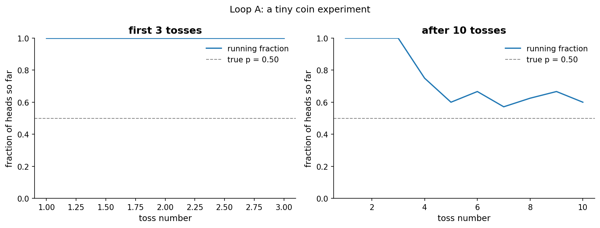
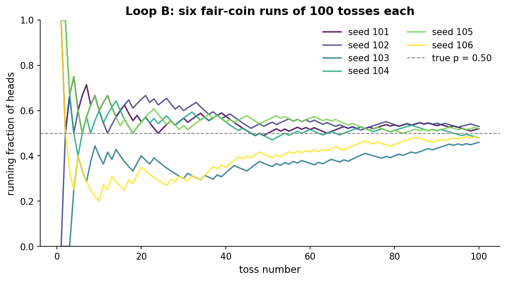
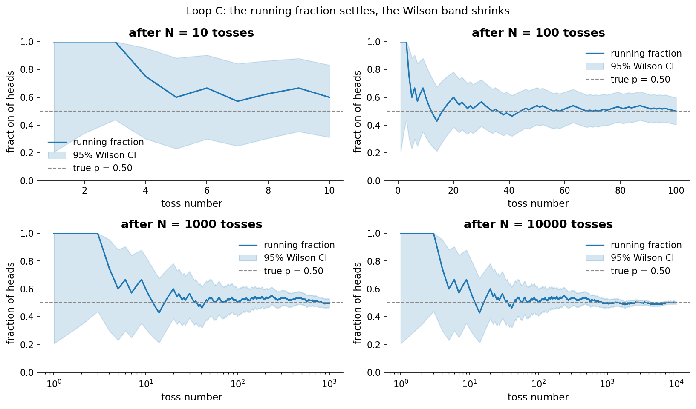
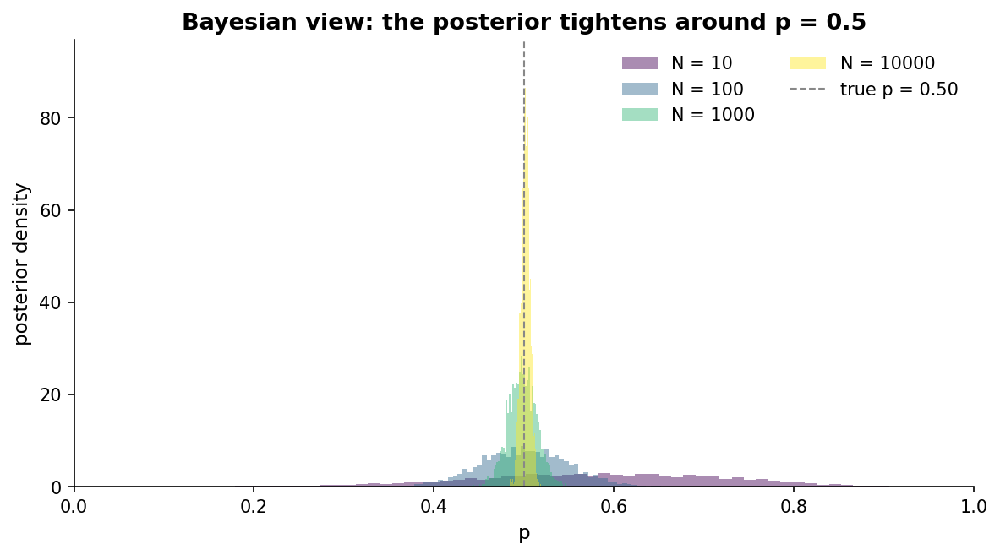
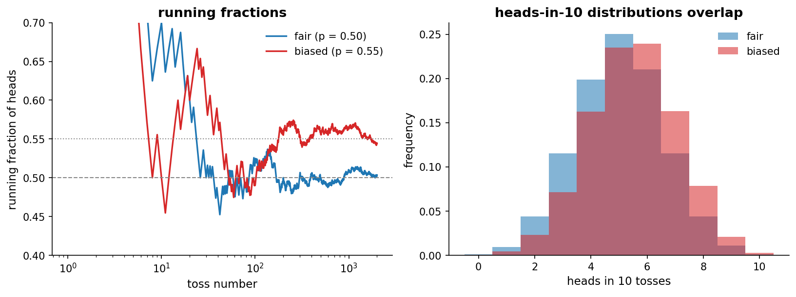
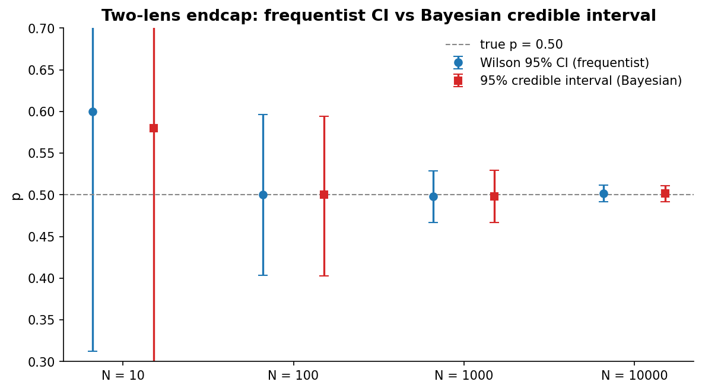

# Chapter 1: The coin

- Pick up a coin. Toss it. Heads. Toss it again. Heads. One more. Heads.
- Three in a row. You stop.
- Is the coin fair?
- You already have a hunch, but it is just a hunch. Let us slow down and watch it form, because the moves we make for this single coin, in this very ordinary moment, are the same moves we will make later for billion-dollar product launches and clinical trials. The coin is not the point. The way we *think* about the coin is the point.
- Two ways of thinking
  - We will use two lenses for the rest of this book, and we may as well introduce them now. They are not rivals. They answer slightly different questions and we want both answers in our pocket.
  - The frequentist lens asks: "if the coin really were fair, how often would I see something this extreme?". It refuses to talk about belief; it talks about hypothetical replays of the universe.
  - The Bayesian lens asks: "given what I started thinking and what I just saw, how should my belief about the coin change?". It puts numbers on belief.
  - Most of the time the two lenses agree on what to *do*. When they disagree, we want to understand why. From Chapter 1 onward we will run both lenses on every question we care about.
- Notation we will use for the rest of the book
  - p is the true (unknown) heads rate of the coin.
  - p_hat is the sample estimate of p, i.e. heads divided by total tosses.
  - P(p > 0.5) is the posterior tail mass: the Bayesian probability that the coin leans heads, given the data and prior.
  - These three symbols carry through every later chapter. When a chapter says "p_hat = 0.53" it means the same thing it does here.

# Loop A: tossing a few times

- Try something small
  - Three tosses. We get heads, heads, heads.
- Observe
  - All three came up heads.
- Ideate
  - The coin might be rigged. Or it might be fair and we got unlucky.
- Frequentist take
  - If the coin were fair, the chance of three heads in a row is (1/2)^3 = 1/8 = 0.125. So one time in eight, a perfectly fair coin will fool you with HHH at the start. That is not "rare". You would not bet your house on the coin being rigged after three tosses. The frequentist's answer to "is this surprising?" is "not really".
- Bayesian take
  - We start from a flat belief. Every value of p between 0 and 1 is equally plausible: a Beta(1, 1) prior, which is just the uniform distribution. After observing HHH, the posterior is Beta(4, 1). Its mean is 0.8 and the posterior probability that p > 0.5 is about 0.94.
  - That sounds confident, almost too confident. The reason is the prior: we *let* the coin be possibly very unfair before we even started. With only three tosses, three heads pulls the belief hard toward p = 1. A more skeptical prior (e.g. Beta(50, 50)) would barely budge.
- Question
  - We are not sure yet. Both lenses agree we should not be sure yet. So toss it more.
- Try more
  - Seven more tosses: T, T, H, T, H, H, T. (Recorded with seed 2 in the data.) Total: 6 heads in 10.
- Compare
  - Frequentist: under a fair coin, 6 or more heads in 10 tosses happens with probability about 0.38. The two-sided exact binomial p-value is 0.754. We are not even mildly surprised.
  - Bayesian: posterior moves to Beta(7, 5). The mean is now 0.58. The probability that p > 0.5 has dropped to 0.73. The answer to "is the coin biased toward heads?" went from 94% sure-it-is to 73% lean-toward-it (we are still using a coarse "p > 0.5" notion of bias, chapter 2 will sharpen this with a region of practical equivalence). Three extra tosses pulled belief back hard.
- Hunch
  - Small samples lie. Both lenses say so, in their own dialects. Do not trust 3 tosses, or even 10.
- 

# Loop B: tossing a hundred times, several seeds

- Try more
  - We toss a fair coin 100 times. We record the running fraction of heads after every toss. Then we redo the whole experiment from a fresh starting point. Six independent runs in total, six different seeds.
- Observe
  - Every run wobbles wildly at the start. Some of them sit above 0.6 for the first 30 tosses. Others dip below 0.4 for a stretch. By around toss 50 they have all tightened up, and by 100 most of them are within a hair of 0.5, but not on it. One run lands at 0.46, another at 0.53. None of the six is "exactly fair" in 100 tosses.
  - 
- Question
  - If a perfectly fair coin can give 0.46 or 0.53 in 100 tosses, what counts as "close to fair"? Where do we draw the line?
- Frequentist take
  - "Close to fair" is exactly the question that turns into a *confidence interval* in the next chapters. For instance, a Wilson interval at N = 100 with 50 heads is roughly [0.40, 0.60], the closest run in the figure (53/100) gives [0.43, 0.62]. Anywhere in there is consistent with fair.
- Bayesian take
  - The same data, with a Beta(1, 1) prior, gives a posterior centered on 0.50 with a 95% credible interval of [0.40, 0.60]. Same numbers. (At larger N, for any reasonable prior with support across (0, 1), the data dominate and the two intervals converge. We will see them diverge in interesting cases later, especially when the prior is informative or N is small.)
- Hunch
  - Both lenses tell us the same thing in different words: 100 tosses is enough to get inside about a 10-percentage-point envelope around the truth, but not closer.

# Loop C: tossing thousands of times

- Try more
  - One long run. 10,000 tosses of a fair coin, with the running fraction recorded after every toss. We zoom in at four moments: N = 10, 100, 1000, 10000.
- Observe
  - At N = 10, the running fraction is 0.60 and the Wilson interval is [0.31, 0.83]. We could not rule out anything between "slightly tails-biased" and "almost always heads".
  - At N = 100, the fraction is exactly 0.50 and the Wilson interval has tightened to [0.40, 0.60].
  - At N = 1000, the fraction is 0.498 and the Wilson interval is [0.47, 0.53].
  - At N = 10000, the fraction is 0.502 and the Wilson interval is [0.49, 0.51].
  - 
- Compare
  - The Bayesian posterior on p, computed with PyMC and a Beta(1, 1) prior, tightens in lockstep with the Wilson interval. We can plot the four posteriors on the same axes. The wide one is N = 10. The almost-pointy one is N = 10,000.
  - 
- Probe an edge case
  - "But what if my long run had a long stretch of heads in the middle? Could I be fooled?" Yes, and that is the next subtlety. Look back at Loop B. Several of those runs spend dozens of tosses noticeably above 0.5. If we had stopped at toss 30 instead of toss 100, we would have called the coin biased. The lesson is not "more tosses", it is that *the moment we choose to stop* matters too. This is the optional-stopping problem, chapter 3 quantifies it under power, chapter 18 under decision rules. This is a topic we will come back to in chapter 3 (power and sample size) and with more force in chapter 18 (would we ship differently in a frequentist vs Bayesian world?).
- Hunch
  - With enough tosses, both lenses converge on the same tight answer. With few tosses, they can both fool you. The number of tosses, and where you stop, do most of the work.

# Loop D: a fair coin and a biased one, side by side

- Try
  - We make two coins. One is fair, p = 0.50. The other is *slightly* biased, p = 0.55. We toss each of them 2,000 times.
- Observe
  - The fair coin lands on 1,007 heads in 2,000 tosses (50.4%). The biased coin lands on 1,089 (54.4%). On the running-fraction plot, after a long settling-in, the two curves track at clearly different levels.
  - But here is the unsettling part. If we look at distributions of heads in 10-toss batches drawn from each coin, the histograms overlap heavily. A 6-out-of-10 is more likely under p = 0.55, but it is also extremely common under p = 0.50.
  - 
- Frequentist take
  - At N = 10, no reasonable test has appreciable power to distinguish a 0.50 coin from a 0.55 coin. The tests just are not powerful enough. We will quantify this in chapter 3 as *statistical power*.
- Bayesian take
  - At N = 10 our posteriors on p for the two coins are huge overlapping blobs. The data is mostly the prior. We have not learned much.
- Two-lens endcap
  - For the long fair-coin sequence (the same one used in Loop C), frequentist Wilson intervals and Bayesian credible intervals at N = 10, 100, 1000, 10000 line up almost on top of each other. They tell the same story: at small N, "is it fair?" is unanswerable. At large N, both lenses agree it is fair.
  - 
- Hunch
  - To detect a small bias we need *a lot* of tosses. To call a coin fair "for sure", we need a lot of tosses too. Either way, the number of tosses we need is not a feeling. It is a calculation.

# The big question that opens Chapter 2

- We started with HHH and were not sure. We got to 6/10 and were less sure. We got to 5017/10000 and were very sure indeed.
- But suppose someone hands us 6 heads in 10 tosses and says "is this rigged?". We answered with hand-waving in this chapter. The frequentist said "p-value is 0.75, not rare". The Bayesian said "posterior probability that p > 0.5 is 0.73". These are different *answers* to almost the same *question*.
- In Chapter 2 we make those answers precise. We meet the null hypothesis. We meet the p-value. We meet type I and type II errors. We meet the posterior probability that p > 0.5 and the Bayes factor. And we figure out exactly what each lens means when it claims "I am 95% sure".
- Big question: how sure can I really be, and what does each lens mean by "sure"?

# Notebook and data

- Companion notebook: [`notebook.ipynb`](notebook.ipynb)
- Generation script (deterministic, seeded): [`generate.py`](generate.py)
- Data and PyMC traces: under [`data/`](data/)
