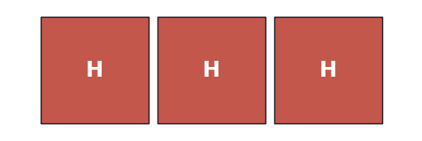
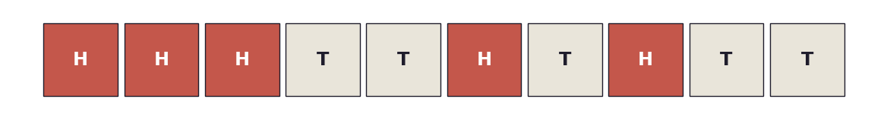
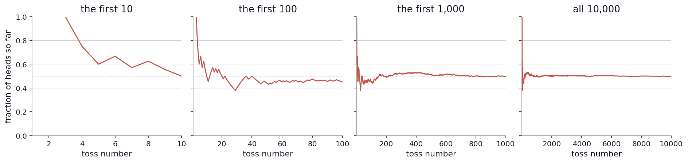
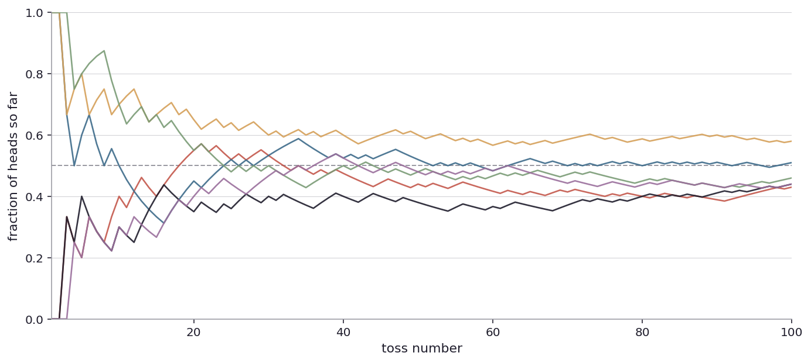
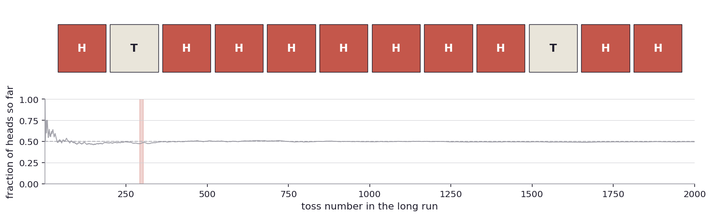
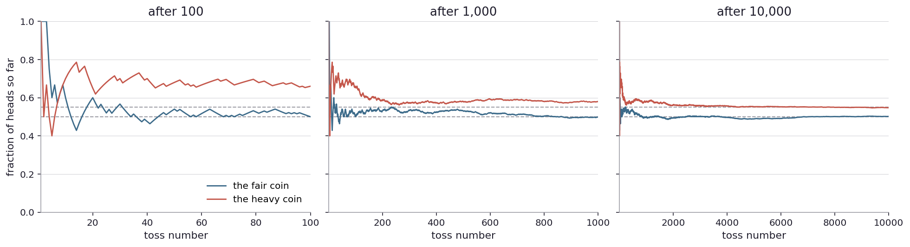

# The coin

Have you ever considered if any coin is fair at all?

It is not a question I usually ask. I have been using coins my whole life. So has everyone I know. To call heads or tails when my brother and I argued about who gets the front seat. To decide who buys the beer when nobody can remember whose round it is. To pay for things, before I started using cards. I have never once stopped and wondered whether the coin I was using was actually fair. No one I know has, either.

But coins are not built to be fair. That is not their job. A quarter is designed to be a piece of money: the right size, the right weight, the right metal, the right pattern stamped on each side so the machine at the toll booth can recognize it. The fact that you can also flip it to make a random choice is, sort of, an accident. A coin happens to be roughly symmetric, so when it tumbles in the air, neither side has an obvious advantage. Roughly.

Roughly. That word starts to sit oddly. Coins are made by machines, and machines have tolerances. A coin can be a tiny bit heavier on one side, a little thicker on its rim, a little more worn from years in pockets. None of that would matter for a vending machine. But for flipping?

Think about how often a coin gets used to flip. The football referee at the start of every match holds up a coin for the captains. Sometimes it is a regular coin from his pocket. Sometimes it is a special ceremonial one with the league logo. Has anyone ever checked which one is fairer? I have watched probably a hundred coin tosses on television and never once heard a commentator raise the question. The toss happens, the captain calls, and the game starts.

My brother and I called coin tosses for thirty years growing up. Front seat. Last cookie. Who has to take the bins out. If, somehow, the coins around the house were one half of one percent heavy on heads, and I always called heads, and my brother always called tails, I would have won maybe two extra times a year. Sixty extra wins over the entire span of growing up. I would never have noticed. My brother would never have noticed either. There would have been streaks on both sides, all of it chalked up to luck, all of it forgotten by the next morning. Sixty extra wins disappear into the noise of life.

The same worry applies to the cheap dice I bought with a friend at a gas station for a road trip. I rolled those dice for two days, maybe a thousand times. If they had been a few percent skewed toward some face, would I have been able to tell? I do not think so. Cheap molded plastic cannot all be perfect cubes with perfectly uniform density. They are made for a kid's board game. They are good enough for that. But "good enough for a board game" and "fair enough that I would bet my paycheck on them" are not necessarily the same thing.

So the question I have apparently been carrying around without ever asking, quietly, my whole life, is this. Are the coins and dice I have been using actually fair? Or are they just close enough to fair that I would never notice if they were not? And what is the difference?

I cannot answer this question by looking. Looking at a coin tells me nothing about how it lands. Tilting it, weighing it on a fingertip, comparing it to the coin in my other pocket, all of that would still miss a small bias. The only way I know to check whether a coin is fair is to actually use it.

So I take a coin out of my pocket. I flip it.

It lands heads.

I flip it again. Heads.

Once more. Heads again.

Three heads in a row. Now the abstract worry I have been sitting with has a concrete piece of evidence stuck to it, and the evidence is, at first glance, slightly weird.

My instinct, immediately, is that this coin is biased. Even though I just spent the last several minutes convincing myself that physical inspection cannot tell, and that I would never notice a small bias anyway, the streak of three still feels like it means something. The instinct is hard to silence. It is also exactly what someone with no statistical training would feel. So my reaction is not really telling me anything about the coin. It is telling me how my brain reacts to streaks.

The pushback on the instinct is the same as ever. Three heads in a row is one out of eight equally likely outcomes if the coin is fair. One in eight things happen all the time. The bus arrives the same minute I do. An old friend texts out of the blue. I check the time and it is exactly 3:33. So the data is consistent with this coin being fair. It is also consistent with this coin being slightly heavy on heads. With three tosses, those two stories cannot be told apart. The data is too thin.

So I do the only thing the data is asking for, which is keep flipping.

Seven more tosses. T, T, H, T, H, T, T. Now I have ten tosses total, and five of them are heads.

There is the strip of ten. The first three are uniformly red, the rest are mixed. I feel a small, slightly silly relief. Whatever was going on at the start, the coin has steadied. Five heads in ten is closer to "what I expected." Whatever that means.

But this is precisely where I get suspicious of myself. I am doing something to the data without being honest about it. Imagine for a moment I had not stopped to look after the first three tosses. I had just done the ten in one go and ended up with five heads, no opening streak to fixate on, just five and five mixed in whatever order. Would I have felt anything? Probably not. I would have shrugged and moved on. So really my reaction is: the coin is weird if it does something that surprises me along the way, and unweird if it does not. The data is the same. Only my pacing through it has changed. That is not a serious procedure for deciding anything.

There is a more honest version of the question hiding here. What do I mean when I say a coin is fair?

Let me try the obvious answer first. A fair coin is one that lands heads half the time and tails half the time. That sounds right. But it cannot be exactly right, because no actual run of tosses will land exactly half on each side. If a million people each tossed a fair coin ten times, only about a quarter of them would land at five heads exactly. The other three quarters would split between four-or-six, three-or-seven, two-or-eight, and so on. Every one of those million people was using a fair coin. Most of them did not see exactly five heads. None of their results would mean their coin was unfair.

So "exactly half" cannot be the test. Maybe "close to half" then. But how close? In ten tosses, three heads can happen with a fair coin. Two heads can happen with a fair coin. In a hundred thousand tosses, on the other hand, three thousand heads simply cannot happen with a fair coin in any reasonable sense of the word. Somewhere in between there is a line, but the line moves with how many tosses I did. I can already feel that "fair" is not really one fixed thing. It is a thing that depends on what else I am willing to count.

A friend wanders past and asks what I am up to. I explain. She says, you are looking for the wrong thing. Fair does not mean you will see heads half the time in any particular run. Fair means that if you tossed it forever, the fraction of heads would be exactly one half.

I push back. Fine, but I cannot toss it forever. The question must have a useable form.

She shrugs. Then for any specific number of tosses, you will get approximately one half. The more you toss, the closer you get to exactly one half. That is what fair means in practice.

This is more useful. It is also slippery, because "approximately" is doing a lot of work. But it gives me something to do, which is to toss the coin and watch.

So I toss it a lot.

I toss it ten times. Then I keep going to one hundred. Then to one thousand. Then to ten thousand. After every toss I record the fraction of heads I have seen so far, and I draw the line.

In honesty, I do not actually toss a coin ten thousand times by hand. I simulate it on a computer, with a random number generator that is "proven" to be "fair". The quotation marks in that sentence are doing real work, and I will come back to all of those words later. For now, the scale: ten thousand tosses by hand, at maybe two seconds per toss including marking down the result, would be five and a half hours of nothing but flipping, plus another half hour to tally it all up. So I let the machine do it. ([Run the simulator yourself](play/running_fraction.py) if you want to change the bias, the seed, or the number of tosses.)

This is the picture of one specific run of the same coin I have been holding. Across the four panels I am watching the same toss sequence at different lengths. Read it from left to right.

In the first panel I see the first ten tosses. The line is jagged and meaningful. Every single toss moves it by ten percentage points or so. There is nothing useful to read from a single point on this curve. Coming off the three opening heads the line starts pinned at the top. Then the run I already laid out drags it down toss by toss until it lands at exactly five out of ten by the end.

In the second panel I see one hundred tosses. The line has steadied. It still wobbles, but each new toss can move it by only a percentage point or two now. It spends most of its time in a band roughly between thirty-five and sixty percent. By the hundredth toss, the fraction of heads is around forty-five percent.

In the third, one thousand tosses. The line has flattened further. I can almost squint and see a horizontal limit. It hovers somewhere very close to one half but it is not exactly there. Toss by toss the line moves by about a tenth of a percentage point.

In the fourth, ten thousand tosses, the line is essentially indistinguishable from horizontal, and it is sitting at very close to one half. Forty-nine point nine percent at the last toss, more or less.

So the friend's claim has a picture. The fraction is settling. Slowly, but settling. I did not have to assume anything about the coin to see it. I only had to be patient.

Now an unease creeps in. I have drawn one specific line. What if I had started over?

I toss the coin again, but now I do this six different times, each time with a fresh start, all going to one hundred tosses.

Six lines from six different runs. Each one starts somewhere arbitrary, depending on whether I happened to get heads or tails in the first few tosses. By toss twenty or so they are all behaving roughly similarly, all trying to find their way toward the half-line. By toss one hundred most of them are close to fifty, but not all of them. The highest line ended at fifty-eight percent. The lowest at forty-three. Three of the six finished below forty-six percent. Only one of the six finished within five percentage points of fifty exactly.

This is interesting and slightly disquieting. If I had only run one of these and gotten the lowest line, I might have been suspicious of the coin. I would have tossed a fair coin a hundred times, gotten forty-three heads, and felt genuinely uncertain about whether something was off. ([Try more runs of the same fair coin yourself](play/many_seeds.py) and see how often the final fraction lands far from fifty.)

So the question of whether a coin is fair is not really, strictly, a question about the coin alone. It is at least partly a question about me, the observer, and how willing I am to accept what is in front of me. Three heads in a row meant nothing once I tossed seven more. Forty-three heads in one hundred would mean nothing if I tossed a few thousand more. But until I toss the next batch, I have to make some decision with what I have.

While I sit with this, an unhelpful thought lands. I could play a trick on myself. I could take any one of the long runs I have already done, sweep through it looking for a stretch of, say, twelve tosses that came up mostly heads, and put up a picture of just that stretch. I would shout, the coin is biased, look at this. And I would have evidence.

Let me actually do this. I take a long run of two thousand tosses with the coin, and I sweep through every twelve-toss window in it, looking for one with at least ten heads. The first such window starts around toss two hundred and ninety. Here it is on top, and underneath I show where in the long run it sits.

There it is. Ten heads, two tails, in twelve tosses, drawn from a coin I myself know to be fair. The window does not lie about its contents. It lies about where it came from. The lower panel is the same coin's running fraction across all two thousand tosses, with the cherry-picked window highlighted. The line spends practically the entire run hovering at the half mark. The window I picked is a tiny flicker on top of a very long, very flat line that says exactly what I expected. If someone showed me only the window I would absolutely conclude the coin was biased toward heads. And I would be wrong. ([Find your own cherry-picked window in a different long fair run](play/cherry_picking.py) by changing the seed.)

So the rule I am slowly building is something like this. It is not enough to look at part of the data. I have to look at all of it. And ideally the data I look at should be data I collected without choosing in advance which part to keep.

This rule of thumb feels almost too obvious to bother saying. It is one of those obvious things people forget the moment they want to be right about something. Anyone who has ever cited a single survey number, or a single year of weather, or one quarter's earnings, has done some version of this. I will come back to it in many forms.

Now I want to do something different. I want to compare. Up until now I have been looking at one coin and asking whether it is fair. But fairness, on its own, is hard to feel. So I want to set up a second coin, biased to land heads more often than tails, and watch them side by side.

This raises a question I had not really thought about. How do I actually make a biased coin in real life? My first instinct is to add mass to one side. A blob of putty on the heads side, say. That should make the coin land tails more often, on the theory that the heavier side wants to be down. The reverse if I put the putty on tails.

It turns out this barely works. A coin flipped properly tumbles through dozens of rotations in the air, and the rotations wash out most small biases. Persi Diaconis and his collaborators measured this carefully and found that even substantially weighted coins flip almost evenly. The bias from a flipped coin mostly comes from initial conditions, which side starts up and how the wrist throws it, not from the coin's geometry. Shaving the rim affects air resistance more than balance, and the rotations dilute that effect too. The place where geometry really matters is spinning a coin on its edge, or tipping a die rather than rolling it. For tipping or spinning, even small physical differences shift the odds noticeably.

So when I say "a biased coin" in what follows, I am being slightly loose with the physics. I do not really mean a physical coin I could buy. I mean a process whose long-run fraction of heads is not exactly half. That process could be a substantially weighted coin (probably tipped on its edge instead of flipped), a rigged digital random number generator, or just a sequence I generated to come up heads fifty-five percent of the time. The mathematics is the same in each case. The story is about the long-run fraction, not about the metalwork. With that caveat noted, I will keep calling the second coin "biased" or "weighted toward heads" to keep the prose readable.

I set up a second coin, biased to land heads fifty-five percent of the time. Then I toss both coins for ten thousand tosses each and watch the fractions. ([Try other bias combinations](play/compare_two_coins.py) yourself, including subtle ones like 0.50 versus 0.501.)

The blue line is the fair coin, the red line is the biased one. Read each panel left to right because the X-axis here is toss number: time moves rightward.

After the first one hundred tosses, the two lines are jumbled. The biased one happens to be on top, but only because it had a lucky stretch early. There is no point in this initial stretch where, if I had been handed only the data, I could have said which coin was the biased one with any confidence.

By a thousand tosses, the lines have separated. The biased one is hovering just above its true value of fifty-five. The fair one is hovering just below fifty. They are clearly different now, and the gap is roughly five percentage points, which is the right answer.

By ten thousand, both lines are nearly flat, the biased one at fifty-five, the fair one at fifty. I can read it off the chart without effort. The fair coin's final fraction is fifty point one seven percent. The biased coin's is fifty-four point seven six. Both are very close to their true values.

So a fair coin and a coin biased five percentage points toward heads are jumbled at the very start, look different but uncertain by a few hundred tosses, become plainly different by a thousand, and indisputable by ten thousand. The picture sorts them out gradually as the data piles up.

What about a coin that is just a tenth of a percent heavy? With ten thousand tosses, the fair coin's final fraction would be hovering around fifty percent, give or take a few tenths. The slightly-heavy coin would be hovering around fifty point one. The two are not separable by eye on the kind of chart I just drew. I would need many more tosses, maybe a million, before the two lines would clearly part.

So fair-or-not is not really the right question either. The right question is something more like fair-or-how-much-not. A coin can be perfectly fair, or it can be heavy on heads by an amount I could not distinguish from fair if I tossed it only a thousand times. Both of these things can be true at once. Which one matters depends on what I am going to do with the coin. If I am deciding the kickoff in a football match, a tenth of a percent does not matter. If I am running a casino, a tenth of a percent matters quite a lot. The data has not changed. The stakes have.

Sitting with this, I notice something odd, and I will only mention it briefly because I do not yet have the tools to do it justice. There are at least two different questions I have been mixing up the whole time. One of them is, "if the coin were fair, how surprising is what I just saw?" The other is, "given what I just saw, what should I now believe about the coin?" They sound the same. They are not. The first asks something about a hypothetical fair coin and how it behaves. The second asks something about this coin, the actual one in my hand, and what I now believe about it. I will need both views going forward. The next chapter starts taking the first one apart, and the chapter after that the second. For now, just notice they are different, even when they seem to be saying the same thing.

That is enough philosophy for now. Back to the coin.

I have established a few things, mostly by failing at simpler versions of the question. Fair cannot mean "exactly half." That is too strict. Fair can mean "approximately half" only if I say what I mean by approximately, and that depends on how many tosses I have done. The fraction of heads settles toward a true value the more I toss, slowly, and ten thousand tosses are enough to read it off a chart. Different runs of the same coin look surprisingly different at small numbers of tosses, so I have to be careful about reasoning from a single run. Cherry-picking a window of a long sequence will lie to me, and the lie comes from me, not from the data. A coin that is a little biased and a fair coin look the same at small N and different at large N, so the question is not really "is this coin fair" but "given how much data I have, what could this coin reasonably be?" There are at least two slightly different questions I can ask about the same data, and they are not the same question even when their answers point the same way.

I started with a coin in my hand and ended with something close to a worldview. This is, vaguely, what the rest of the book is about. I will not always be tossing coins, but mostly will.

Look up from the coin for a moment. The question I have been asking, is this thing real or is it luck, and how would I tell, is the question behind almost every consequential argument I have ever heard. Did this drug help the patients, or were they getting better anyway? Is the climate warming faster than it used to, or am I just paying more attention to the warm years? Was the election fair, or did the unusual margin in one district mean something? When a friend tells me she has had three bad bosses in a row and the universe must hate her, she is in the same place I just was: looking at a tiny streak and reaching for a story. The coin is the simplest possible version of that argument. Every time I dress it up, with patients, voters, ballots, atmospheric measurements, the same mistakes lie in wait. Cherry-picking. Reading too much into a short streak. Asking "is it fair" when the real question is "fair-by-how-much, and do I have enough data to tell." If I can stay honest with the coin in my hand, I have a chance of staying honest about the things that actually matter.

There is a question that has been hovering over everything I just did. I have ducked it more than once. It is the question I cannot put off any longer. Not just about the coin. About anything.

How sure am I, really?
