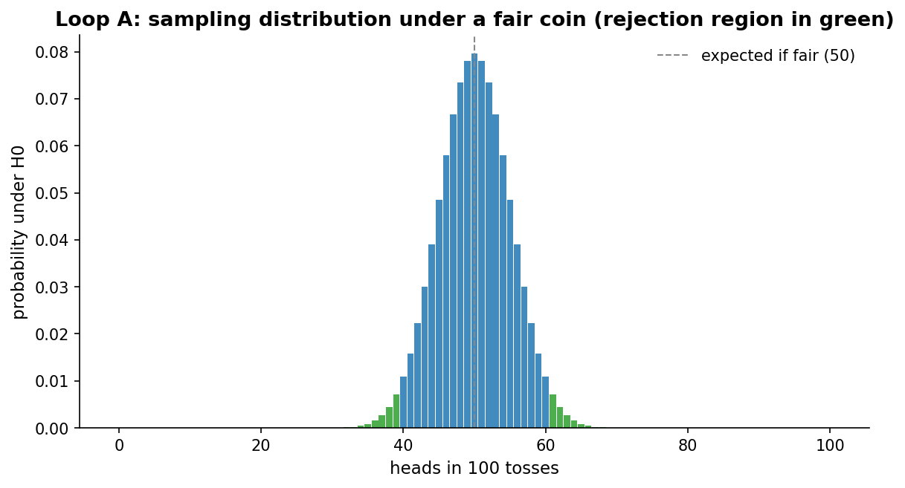
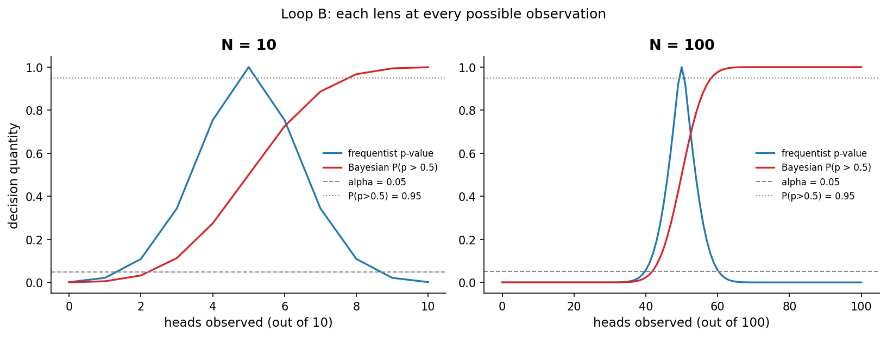
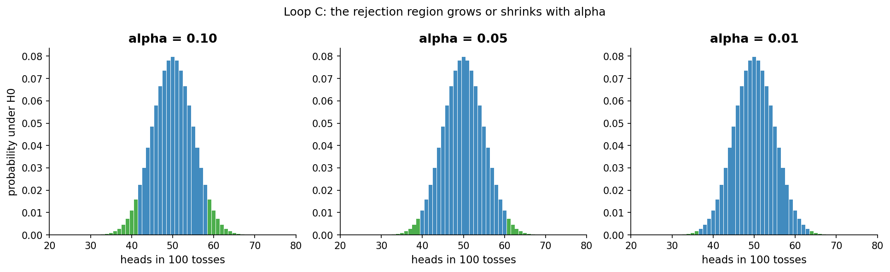
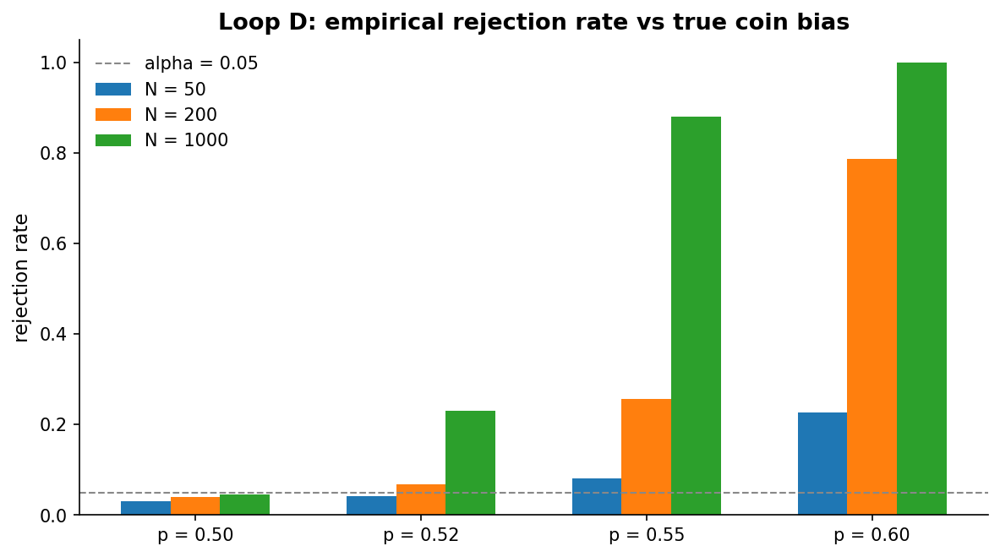

# Chapter 2: How sure can I be?

- Carried from Chapter 1
  - We asked: how sure can I really be, and what does each lens mean by "sure"? In Chapter 1 we hand-waved with two different answers. We saw 6 heads in 10 tosses. The frequentist said "p-value is 0.75, not rare". The Bayesian said "posterior probability that p > 0.5 is about 0.73". Two different answers to almost the same question. Now we make them precise.
- We never know "for sure". That is the punchline. Both lenses live with that and turn it into something we can act on. Each lens does it differently, and seeing both side by side is the only way to feel the difference.

# Loop A: what does "fair" actually look like?

- Try
  - We pretend the coin is fair. We toss it 100 times. We count heads. We do that thousands of times in our head and ask: which counts are common, which are rare?
- Observe
  - The distribution is the binomial. It is centered at 50, with most of the mass between 40 and 60. Counts at or below 39 or at or above 61 happen only about 3.5% of the time combined. That is the tail mass we will call "rejection region" once we set alpha = 0.05, it is below the 5% budget because no integer cutoff hits it exactly.
  - 
- Frequentist take
  - That picture is a sampling distribution under the null hypothesis H0: p = 0.5. The green bars are the rejection region: counts so unusual that, if H0 were true, we'd see them less than 5% of the time. Anything in green and we say "reject". A two-sided alpha = 0.05 test on N = 100 rejects at k <= 39 or k >= 61 (roughly outside [40, 60]).
  - The threshold is called alpha. It's a knob. We turn it down to 0.01 and demand more extreme evidence; we turn it up to 0.10 and accept weaker evidence.
  - The thing we will misunderstand all the time: alpha is an *upper bound* on the false-positive rate. If the coin really is fair, at most a fraction alpha of experiments will mislead us into saying "rigged". For a discrete test like the binomial it is often strictly less. It is not the probability the coin is rigged given our data. The Bayesian is going to enjoy this distinction.
- Bayesian take
  - Same data, different framing. We don't ask "is it surprising under H0?" We ask "given a starting belief about p and what I just saw, what should I believe now?" With a flat Beta(1,1) prior and 50 heads in 100, the posterior is Beta(51, 51), centered exactly at 0.5, with about a 95% credible interval of [0.40, 0.60]. With 60 heads, posterior Beta(61, 41), center 0.598, the posterior probability that p > 0.5 is around 0.97.
- Hunch
  - The two lenses are converging on the same kinds of statements at the same observations, but they call them different names.

# Loop B: the same observations, both lenses

- Try
  - For every possible number of heads from 0 to N, compute both: the frequentist p-value (against H0: p = 0.5) and the Bayesian posterior P(p > 0.5) (with a flat prior). Plot both as functions of the observed count.
- Observe
  - At N = 10, the curves are jagged. Different observations switch us across the alpha = 0.05 line at different places than across the P > 0.95 line. At small N the two lenses *can* disagree.
  - At N = 100 the boundaries roughly coincide, but only because we paired a *two-sided* frequentist test (which spends alpha equally on both tails) with a *one-sided* posterior probability (P(p > 0.5)). They are answering different questions, that they cross their respective thresholds at nearby observations is a feature of the symmetric prior, not a general law. The right Bayesian counterpart to a two-sided test is something like 2 * min(P(p < 0.5), P(p > 0.5)) or comparing the credible interval to the value 0.5.
  - 
- Compare
  - At small N: the prior matters. The Bayesian has assumed a uniform prior, which is not quite the same as "I have no information". A different prior would shift the curve. Meanwhile the frequentist has implicitly committed to "the coin is fair until proven otherwise", and the test only ever fails to reject H0, it never accepts it. Different default assumptions, different answers.
  - At large N: the data dominates. Both lenses say roughly the same thing.
  - Side note: a third Bayesian quantity, the Bayes factor, compares H0 to H1 directly as a ratio of evidence. We will meet it in Chapter 6, when we formalize the Bayesian framework end-to-end.
- Probe an edge case
  - "What if I really do believe the coin is probably fair?" Then a Beta(50, 50) prior is honest. With 6/10 we barely budge. With 60/100 we move noticeably. With 600/1000 we're as convinced as the frequentist.
  - "What if I believe it's probably rigged low?" Beta(2, 8) is a strong prior that says "I expect heads-rate around 0.2". With 6/10 the posterior is Beta(8, 12), mean 0.4 and P(p > 0.5) about 0.18: the data drags belief up but the prior anchors it below 0.5. With enough N the data dominates and we agree with the flat-prior result.
- Hunch
  - Both lenses can say "I am 95% sure". But "sure of what?" is different: the frequentist is sure that *if H0 were true* we wouldn't see this data; the Bayesian assigns 95% posterior probability that p sits inside a particular interval (given the prior and model). Same number, different statement.

# Loop C: alpha is a knob

- Try
  - Same N = 100 sampling distribution, three different rejection thresholds: alpha = 0.10, 0.05, 0.01.
- Observe
  - At alpha = 0.10 we reject at k <= 41 or k >= 59 (roughly outside [42, 58]). At 0.05, k <= 39 or k >= 61 (outside [40, 60]). At 0.01, k <= 36 or k >= 64 (outside [37, 63]).
  - 
- Question
  - Which alpha is "right"? There is no abstract answer. Strict thresholds (0.01) reduce false positives but pay for them with missed real effects. Loose thresholds (0.10) catch more real effects but ship more junk.
- Bayesian counterpart
  - The same knob in Bayesian dress is the credible-interval level (95%, 99%) and the action threshold ("ship if posterior probability of beneficial effect > 95%"). Same trade-off, different control surface.

# Loop D: stress-test our decision rule

- Try
  - Simulate 2,000 experiments under each of four truths (p = 0.50, 0.52, 0.55, 0.60), at each of three sample sizes (N = 50, 200, 1000). Count how often the test rejects H0: p = 0.5 at alpha = 0.05.
- Observe
  - Under p = 0.50 we reject 3-5% of the time (the discrete two-sided exact test is slightly conservative, so the type I error rate **is at most alpha**, not exactly alpha. Here we see roughly 3-5% rather than exactly 5%, because no integer cutoff hits 5% exactly).
  - When the truth is slightly biased (p = 0.52), we reject in 4% at N=50, 7% at N=200, 23% at N=1000. The signal is small; even at N=1000 we miss it more than three quarters of the time.
  - At p = 0.55: 8%, 26%, 88%. At p = 0.60: 23%, 79%, ~100%.
  - 
- Hunch
  - "How often will I be fooled?" depends on three things: alpha, N, and the truth. Alpha controls the false-positive rate. N + truth controls the true-positive rate.
  - The thing we did not control: when is the *truth* worth catching? p = 0.501 is technically biased. We don't care.

# The big question that opens Chapter 3

- We have a knob (alpha) and we have a sample size. Together they determine how often we ship the right answer.
- But they don't tell us how big a sample we *should* collect for an effect we *care* about. If a 1pp lift matters, how many tosses do I need? That's power. That's Chapter 3.
- Big question: how do I plan the experiment so that, when an effect this big is real, my test will actually catch it?

# Notebook and data

- Companion notebook: [`notebook.ipynb`](notebook.ipynb)
- Generation script: [`generate.py`](generate.py)
- Reproducibility: data sidecars and the cross-cutting [`/data/manifest.yaml`](../../data/manifest.yaml)
