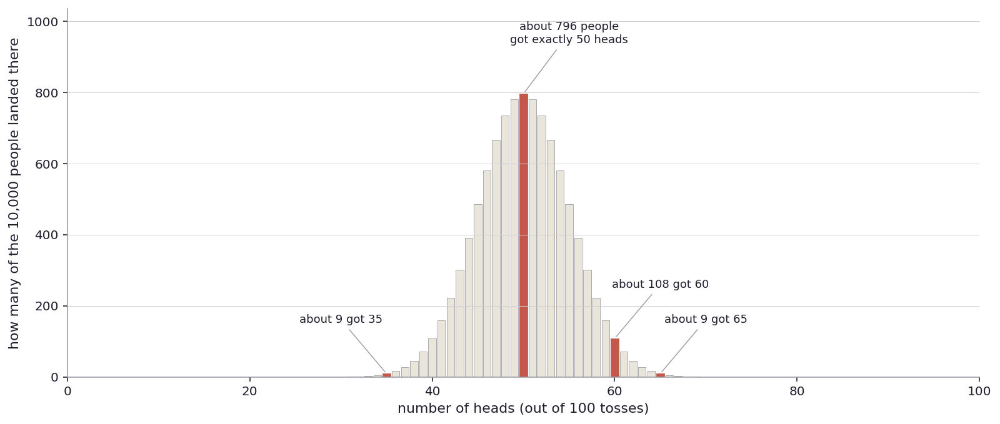
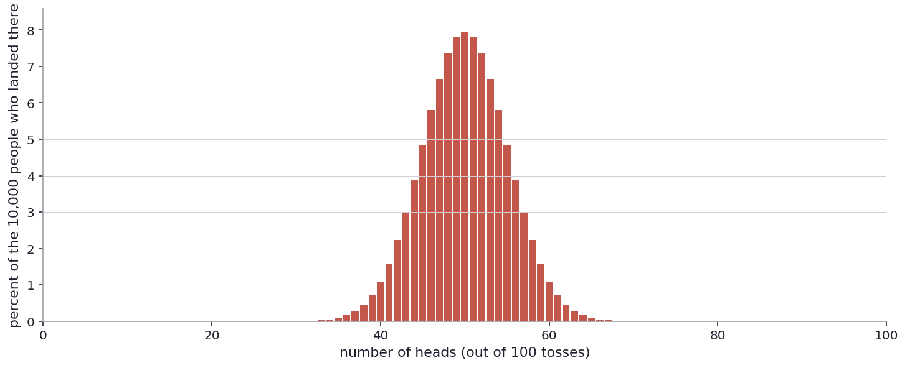
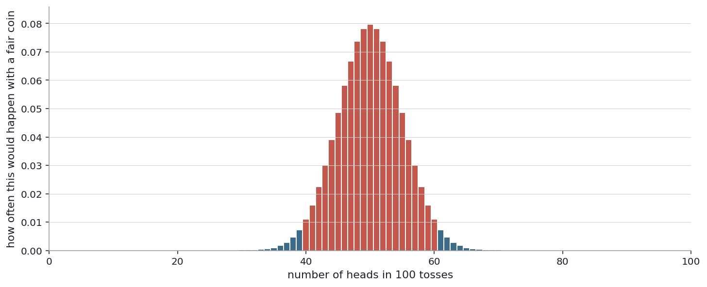
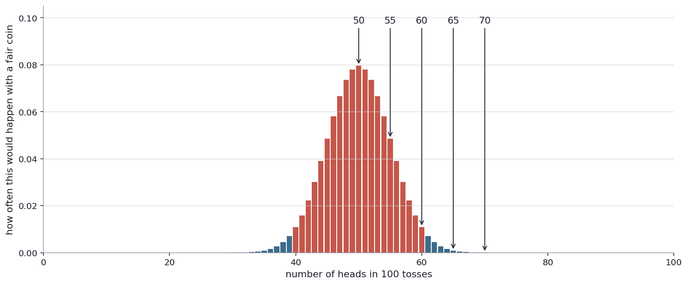
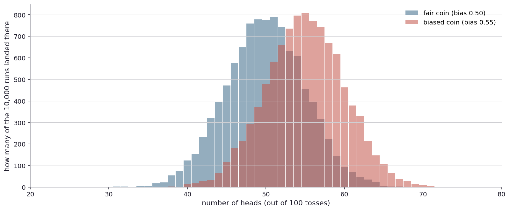
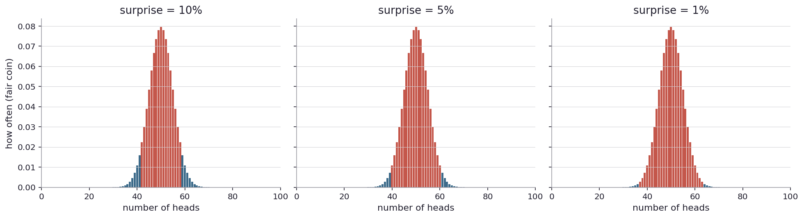
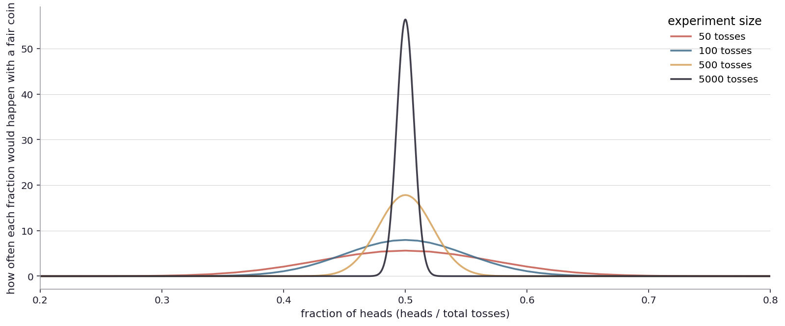
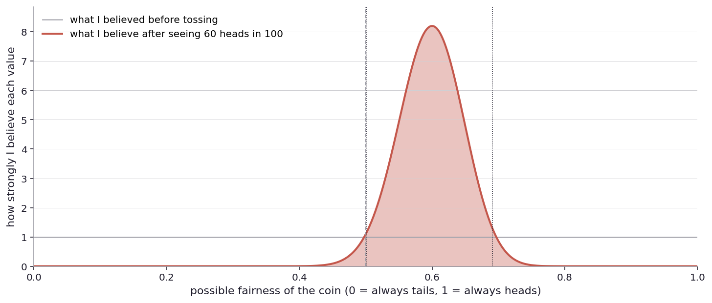
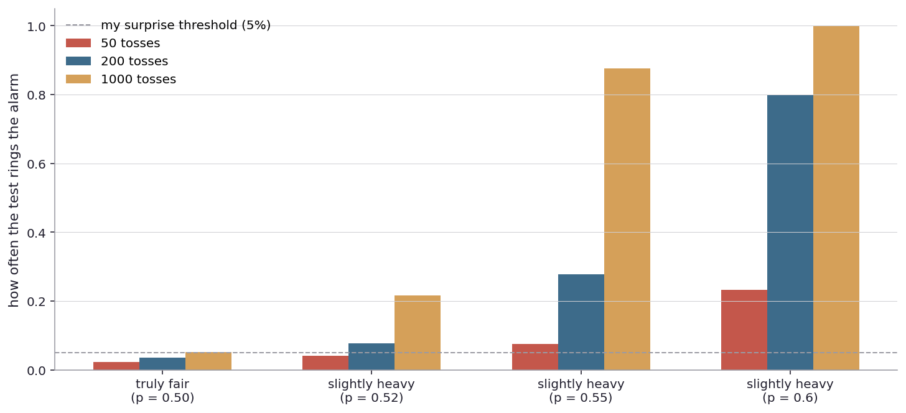

# How sure am I

I left the last chapter holding a coin and a question. How sure am I, really, that this coin is fair? And, since the coin was a stand-in for everything more serious, how sure am I about anything that comes from data?

It is a question I have always quietly avoided. There are too many places it leads.

When I read in the morning that a new study shows coffee drinkers live two years longer than non-drinkers, I do not stop to ask how sure the researchers are. I just absorb the headline, raise my coffee, and go on with my day. When the doctor at my last visit told me a screening test is "ninety-five percent accurate", I nodded as though those words meant something specific. Ninety-five percent of what? Ninety-five percent of healthy people get told they are healthy? Ninety-five percent of sick people get told they are sick? I never asked. I took the slip and went home. When the weather forecast says there is a seventy percent chance of rain tomorrow, I take an umbrella, vaguely. When a jury returns a guilty verdict beyond reasonable doubt, the system behind that verdict is built on something. I have never asked what.

Each of these phrases is, in its own field, an attempt to answer the question I am sitting with. How sure are you? Each of them has a threshold buried inside it. Each of them has, somewhere up the chain, a person who decided what counted as "sure enough".

This is uncomfortable. I remember being a teenager who did not like eggplants. Yes, I know, but I was a teenager. I used to tell my mom, did you know studies show eggplant causes cancer? She would believe me for a second, just a second, and then I would burst out laughing and she would throw the kitchen towel from her hand at me. The newspaper writes "studies show" because the press release said it, the press release said it because the abstract said it, the abstract said it because some statistic passed the threshold the journal expects. Somewhere at the bottom of that chain is a number, and that number is the only thing actually doing the work of "sure". I want to see what the number is, and what it means, and whether to trust it.

The cleanest place to look is back where I left off. The coin. The question I had at the end of Chapter 1 was: I saw three heads in a row, then five out of ten, then the running fraction settled near a half over thousands of tosses. At each stage, how sure was I that the coin was fair? When does "the data is consistent with a fair coin" become "the data convinces me this coin is fair"? When does a long streak stop being noise and start being a sign? Where exactly is the line between "I do not know" and "I think I know"?

These questions hide a number I have never bothered to define. Most of statistics, I am starting to suspect, is about staring at that number until it gives up its secrets.

So back to the coin.

I have an instinct that I want to make precise. The instinct is something like: if a fair coin lands heads about half the time, then any number of heads near fifty out of a hundred is fine, and any number far from fifty is suspicious. The instinct is correct. The trick is in the words "near" and "far".

Here is one way to make this precise. I cannot toss a coin a hundred times in a hundred different parallel universes to see what the spread of outcomes would look like. But I can imagine doing that, and let a computer do the imagining for me. So let me set up an experiment in my head, and a smaller one in the simulator.

Imagine ten thousand people. Each is given the same fair coin. Each one tosses it a hundred times and writes down how many heads they got. Some end up with fifty heads. Some with forty-nine, some with fifty-one. A few with surprising numbers, like thirty-five or sixty-five. None of them did anything different from each other. They all used the same coin in the same way. The variation is purely chance. The same fair coin, tossed again, produces a different sequence each time, and over a hundred tosses those sequences pile up to different totals. ([Try this yourself](play/many_people_tossing.py): change the coin's bias, the number of tosses, the size of the crowd.)

Now imagine I collect all ten thousand of their results. About 796 of them ended up with exactly fifty heads. About 780 with forty-nine or fifty-one. About 660 with forty-eight or fifty-two. About 108 with sixty heads. About nine with sixty-five. About nine with thirty-five. Two or three with thirty. Practically none with twenty-five. Zero with ten or with ninety. The further out from fifty you look, the rarer the result.

If I stack these counts up as bars, with the horizontal axis being "number of heads" and the vertical axis being "how many of the ten thousand people landed there", the picture looks like this.

This picture is the answer to what I asked. Each bar is a number of heads. The height of the bar is how many people, out of ten thousand, ended up with that number. The four red bars are highlighted just so I have specific anchors to talk about. Most of the people are crowded near fifty heads, where the bars are tallest. Out at the edges, the bars are tiny.

Look at the bar at thirty-five. About nine people got that. Out of ten thousand. With a fair coin. So a fair coin can absolutely produce thirty-five heads in a hundred tosses. It just does so rarely. If one person tossed the coin a hundred times and got thirty-five heads, I would not be looking at evidence of bias. I would be looking at one of those nine people's results. The data alone does not tell me which.

That is the first useful caveat. The picture is about how often each result happens, not about which results are impossible.

Now I want to make this picture a little more proper-looking. Instead of saying "about 796 of the ten thousand people got fifty heads", I can say "about eight percent of the people got fifty heads". Same chart, but the vertical axis is now percent of the ten thousand. The shape is identical because all I did was divide everything by ten thousand.

Same picture. I will use this percentage version from here on, because it does not depend on the size of the imagined crowd. The shape would look the same with a million people.

Now, the question I started with. What counts as "near" fifty, and what counts as "far"? I want a rule.

Here is one way to draw the line. I look at the picture and ask: how big should the middle hump be? How much of the bell should I call "unsurprising"?

If I say the middle hump is eighty percent of the bell, that leaves twenty percent in the two thin tails. So one in five fair-coin runs would land in the surprise zone. That feels too aggressive: I would be calling fair coins surprising five times out of every twenty-five, which is quite a lot of false alarms.

I bump it up. Maybe ninety percent in the middle. Now ten percent of fair-coin runs land in the surprise zone. Better, but still I would be raising the alarm on roughly one in ten honest coins.

I keep going. Ninety-five percent in the middle, five percent in the tails. Now I would only be fooled by a fair coin one in twenty times. That feels reasonable for a lot of everyday situations.

A friend who works in a casino confirms this number. He says ninety-five percent is what most fields use as the default standard for surprising. A different friend, a physicist, says I am being far too loose. In his world, results have to be in the top one-in-three-and-a-half-million tier to be called surprising. He calls it "five sigma". I am not sure if his standard means the same thing as mine, or something subtly different. I suspect it depends on the situation. Fields with high stakes and many opportunities for false discoveries (particle physics, drug approvals) push the threshold extremely tight. Casual fields, looser.

I am not going to settle this here. For now, I will use ninety-five percent in the middle, five percent in the tails, while admitting that this number is a convention, not a law of nature. If the stakes were higher, I would tighten it. For getting started, ninety-five is fine.

So I add up the bars in the middle of the picture, working outward from the peak, until I have accounted for ninety-five percent of the area. Whatever bars are left over, on either side, become the tails. I shade those tails in.

The blue tails are what I will call the surprise zone. If I tossed a fair coin a hundred times and the number of heads landed in one of those blue tails, I would have something to think about. The exact cutoffs in this picture land at thirty-nine and below, or sixty-one and above. Forty heads is in the inner zone. Thirty-nine is in the surprise zone. Sixty heads is in the inner zone. Sixty-one is in the surprise zone. ([Try a different threshold yourself](play/threshold_knob.py): tighten it to one percent or loosen to ten percent and see how the cutoffs move.)

The rule is now concrete. Take the observation. Find where it lands. If it is in the blue surprise zone, conclude the coin is probably not fair. If it is in the red unsurprising zone, conclude... something. I will get to that.

I take a few possible observations and put them on the chart.

Fifty heads is at the peak. Exactly what fair would predict. No surprise.

Fifty-five heads is well inside the unsurprising zone. To the right of center, but not enough to clear the threshold. Fair coins do that often.

Sixty heads is also inside the unsurprising zone, just barely. It is right at the inner edge of the bell.

Sixty-five heads is in the surprise zone. The bar is small but visible, and it is in the blue. A fair coin lands there less than five percent of the time.

Seventy heads is deep in the surprise zone. A fair coin lands at seventy heads in a hundred tosses extremely rarely, well under one percent. If I saw seventy heads in real life, I would not be writing the next paragraph. I would be examining the coin.

So the chart turns my instinct into a rule. But notice something. I said "sixty heads is just inside the unsurprising zone". Does that mean if I see sixty heads I should conclude my coin is fair? It does not. And the cleanest way to see why is to look at what happens with a coin that I know is biased.

A short detour, since I have been hand-waving about biased coins. What does it even mean for the simulator to give me one? And could I make one of these in real life if I tried?

The simulator does it the easy way. Inside the computer there is something called a random number generator. I will not go into how it actually produces randomness (that is a whole separate world of math). What it does, on demand, is produce a fresh number between zero and one with no preference for any value. Sometimes 0.314, sometimes 0.872, sometimes 0.491. Every number from zero to one is equally likely.

To simulate a fair coin toss, I ask the generator for a number and call the result heads if the number is above 0.5, tails if it is below. Since the generator has no preference, half of the numbers come out above 0.5, and so I get heads half the time. That is a fair coin.

To simulate a coin biased toward heads at fifty-five percent, I just move the threshold. Same rule: heads if the number is above the threshold, tails if below. But now the threshold is 0.45, not 0.5. The interval above 0.45 covers fifty-five percent of the unit interval, so the chance of heads is exactly 0.55. Lower threshold means more heads. Higher threshold means more tails. (To make the coin land tails fifty-five percent of the time, I would move the threshold up to 0.55 instead, leaving only forty-five percent of the interval above it.) Move the threshold anywhere from zero to one and I get any biased coin I want, perfectly. This is the kind of biased coin the math really wants. A process whose long-run fraction of heads is exactly the parameter I dialed.

Real life is not so cooperative. I covered this briefly in Chapter 1. Properly flipped coins resist physical bias because the spin of a flip averages out small asymmetries. A blob of putty on the heads side of a quarter, then flipped normally, does almost nothing. Persi Diaconis has spent a serious chunk of a research career proving this carefully. The intuitive method (make one side heavier) is, surprisingly, the wrong one.

If I really want a biased coin at home, the methods that work are sneakier than just adding mass:

- Bend the coin slightly into a cup shape. A bent coin tossed onto a flat surface lands on the convex side significantly more often than chance. The bend can be small. A pair of pliers and a quarter is enough. The bend works because it changes how the coin lands, which is the part the spin of the toss cannot wash out.
- Spin the coin on its edge instead of flipping it. Edge-spinning is much more sensitive to small mass asymmetries than flipping. A typical penny spun on its edge falls one way more often than the other, because the relief on the heads side has a different depth than the relief on the tails side. Articles about this report numbers as high as eighty percent for some coins.
- Replace one side. The magic-shop two-headed coin. Bias of exactly one. This is mostly a metalwork trick rather than a physics one, but it does the job. Pickpocketing magicians have been using these for centuries.

The simulator does none of this physical work. It picks numbers against a threshold, and the long-run fraction is exactly what I dialed in. The math does not know the difference between a digital threshold and a bent piece of metal. Both produce a process with the same long-run fraction. Both will produce the same kind of histogram if I run them ten thousand times each. The metalwork only matters when I want to run the experiment with my own hands.

Back to the simulated biased coin.

I set up a second imagined crowd of ten thousand people. This time, each of them is given a coin that is biased toward heads. The coin is rigged (in the simulator's threshold-shifting way) to land heads fifty-five percent of the time, not fifty. Each person tosses the coin a hundred times and writes down how many heads. I lay both crowds, the fair one and the biased one, on the same chart.

The blue bars are the fair-coin crowd. The red bars are the biased-coin crowd. The two distributions are clearly different. The biased one is shifted to the right by a few heads. Its peak is at fifty-five rather than fifty.

But look at the overlap. The two distributions overlap heavily. Most of the biased-coin people, with their actual rigged coin, ended up with results that fall inside the fair-coin's unsurprising zone. A biased-coin person who got fifty-three heads and a fair-coin person who got fifty-three heads look identical on this chart. They produced the same number with different coins. The data, in those overlapping bars, does not say which coin produced it.

This is what "do not conclude anything" means in practice. If I see fifty-three heads, I cannot point to that result and say the coin is fair. A biased coin produces fifty-three heads quite often too. The chart's red zone is not the zone where the coin is fair. It is the zone where the data is not strong enough to say. A biased coin can absolutely live in the red zone and look like a fair coin from the outside.

The rule, then, has an asymmetry I should be honest about. When the data lands in the surprise zone, the rule lets me conclude something: this is probably not a fair coin. When the data lands in the unsurprising zone, the rule does not let me conclude anything. The coin might be fair. It might be slightly biased. It might be biased in ways the data is too thin to see.

Now I understand the rule better. It catches obviously-not-fair coins and stays silent on the rest.

The threshold I picked, five percent in the tails, is a knob. The cutoff position depends on it. I could have picked ten percent and the surprise zone would expand, or one percent and it would shrink. The trade-off is real either way: a tighter threshold means fewer false alarms but more missed real biases, and looser means more alarms (some false) but better catch rate on real biases.

Three panels of the same chart, with the tails painted at three different sizes. On the left, ten percent in the tails: wider surprise zone, more alarms but more false ones. In the middle, my default of five percent. On the right, one percent: a much narrower surprise zone, fewer false alarms, but the coin really has to be unusual before I will react.

There is an obvious next question. Why not push the threshold all the way to zero? Why not demand zero false alarms? The answer is hidden in the picture. With zero percent in the tails, the surprise zone is empty: there is no number of heads, no matter how extreme, that I would call surprising, because every possible result has some non-zero probability under a fair coin. An empty surprise zone means the rule never fires. Even when the coin is genuinely biased. So a zero false-alarm rate is the same thing as a zero detection rate. The threshold is the price I pay for the rule to fire at all. I cannot have detection without occasionally being fooled by chance. The question is just how much I am willing to pay. And there is no abstract answer to that.

There is only the question: given what I am about to do with the answer, which mistake costs me more? For deciding who buys the next round of beer, ten percent is fine. The cost of a false alarm is laughing at a fair coin. For approving a drug for the entire population, one percent might still be too loose. The cost of a false alarm is approving a useless/harmful treatment, and the cost of missing a real one is depriving sick people of a working drug. The threshold should match the stakes. This is the honest meaning of the number people quote when they say "p less than zero point zero five". It is a budget for being fooled by chance. It is not a measure of truth.

There is one more thing I want to look at while I am still on the surprise picture. The hump in the middle has a width. That width depends on how many tosses I do.

If I had only tossed the coin fifty times instead of a hundred, the picture of "what fair predicts" would be wider as a fraction of total tosses. If I had tossed five thousand times, much narrower.

Four humps on the same chart, all centered at the fair-coin fraction of one half. The widest hump is the smallest experiment, fifty tosses. The narrowest is five thousand. The vertical axis is normalized so each curve has the same total area underneath it. That makes the four curves comparable on one chart, but it also means I should not read the absolute heights as anything meaningful. What matters is the WIDTH. As I do more tosses, the spread of outcomes around the true fraction shrinks. That is just the math of averaging more things together. The same shrinking happens with averages of any noisy quantity: take more measurements, the average of the measurements gets less noisy.

What does this mean for my rule? With fifty tosses, the surprise zone is wide, and "fair" and "biased toward fifty-five percent" overlap so much that no rule can tell them apart at fifty tosses. With five thousand tosses, the surprise zone is narrow, and "fair" and "biased toward fifty-five percent" almost do not overlap at all. The same bias becomes detectable as I gather more data. This is not magic. It is what averaging does.

There is something else I have been ducking. The whole picture above starts from "pretend the coin is fair, and ask what would happen". That is one direction of question. There is another direction, and it nags at me.

Instead of asking what I would see if the coin were fair, I can ask the inverse. Given that I just saw, say, sixty heads in a hundred, what should I now believe about the coin? Notice this is a different question. The first one starts from a hypothetical fair coin and predicts outcomes. The second starts from the actual outcome and reasons backward to the coin. They feel like they should give the same answer. They do not always.

To take the second question seriously, I need a way to think about "the coin's bias" as something that could be many things. Suppose I do not know whether my coin is fair or biased or how biased it might be. Suppose, before I tossed it, I had no information at all. Then any bias from zero (always tails) to one (always heads) was equally plausible to me. This is the strange-sounding starting point, and I want to be honest that it is strange. A real person would never actually believe a coin is equally likely to be a never-heads coin as a fair coin. But "no information" is a useful blank slate. I will see what the data does to it, and then I can also see what happens when I start from a less blank slate.

Here is one way to ground the picture. Imagine a thousand different coins, each with a different true bias from zero to one. The first coin is rigged for one in a thousand heads. The next, two in a thousand. And so on, all the way up to a coin that lands heads every time. I draw a coin at random from this collection, without knowing which one I got, and toss it a hundred times. I get sixty heads. The question is: of the thousand coins, which one did I probably draw?

The answer is a curve. Coins with bias around 0.6 would produce sixty heads most often, by far. Coins with bias 0.5 would produce sixty heads sometimes, but rarely (about 1.1 percent of the time). Coins with bias 0.7 would produce sixty heads sometimes too, but also rarely. Coins with bias 0.4 or 0.8 would almost never produce sixty heads. Coins with bias 0.1 or 0.95 essentially never. ([Try other observations](play/belief_curve.py) and see how the curve shifts. What does it look like for 6 heads in 10 tosses, versus 600 heads in 1000?)

So, after seeing sixty heads in a hundred tosses, my best guess for the coin's true bias is around 0.6. But I am not sure. The data narrows the field but does not pin a single number. The picture below shows the relative likelihood of each bias having been the source.

The horizontal axis is the bias the coin could have, from zero to one. The vertical axis is how strongly I now believe each value, on a relative scale. The absolute height of the curve is not very meaningful by itself. What matters is the SHAPE: where the bulk of belief sits, and how wide the belief is. The flat gray line at the bottom is what I believed before tossing the coin: every value of bias was equally plausible (the strange blank-slate starting point). The warm shape on top is what I believe after seeing sixty heads.

The shape is centered just above sixty percent. That is what the data points at, taken at face value. But the shape is not a spike. It is a hump with width. Using the same convention I have been using in this chapter, where ninety-five percent of the area should count as "plausible" and five percent as "implausible", the middle ninety-five percent of the hump runs from about fifty-point-two percent to about sixty-nine percent. That is the band of bias values the data finds plausible.

Notice something. The number fifty sits just outside the lower edge of the band, by less than half a percentage point. The data does just barely rule out that the coin is fair, at the ninety-five percent level. It says the coin is probably between fifty-and-a-bit percent and sixty-nine percent heads. "Fair" is right at the boundary. I am leaning toward biased, but only just. If I had used a stricter convention (ninety-nine percent of the area as plausible), the band would be wider and would include fifty. The conclusion changes with the threshold, just as before.

Now I have two answers to "is this coin fair?" given my observation of sixty heads in a hundred. Two different answers, from two different ways of asking.

Way one. I asked what fair would predict, painted in the surprise zone, and looked at where sixty landed. Sixty was in the unsurprising zone, just barely. So the rule did not let me call the coin biased.

Way two. I asked what I should now believe. The belief curve is centered at sixty, with fifty sitting just outside the lower edge of the plausible band. So I lean toward biased, but only by a hair, and I would gladly admit I could still be wrong.

These are not in conflict, but they are different sentences. The first is about a procedure: I followed a rule and the rule did not flag this. The second is about my state of mind: my belief moved a little.

This split shows up in places I would not expect, dressed in different clothes. In a courtroom, the first sentence sounds like "the prosecution did not meet the burden of proof". The defendant is innocent until proven guilty. The state has to bring evidence strong enough to convince the jury beyond reasonable doubt, and absent that, the defendant goes free, even if many jurors privately think they did it. That is the same shape as my first rule: the coin is presumed fair until the data is strong enough to overturn the presumption, and weak data leaves the presumption alone. The state has the burden, not the defendant. The fair coin has the benefit of the doubt.

The second sentence, in the courtroom, sounds more like a juror's quiet hunch. They lean toward guilty without being sure. That hunch does not, by itself, convict anyone. It might guide what questions they want answered next, or what evidence they want to see. The hunch is a state of mind. The verdict is a procedure. They can disagree without either being wrong.

I will need both views going forward, and the rest of the book runs them side by side. Each one fails differently. The first fails me when I want to actually believe something rather than merely fail to reject it. The phrase "the test did not reject" is not the same as "the test believes the null is true", and pretending it is leads to bad decisions. The second fails me when I want to make a clean public decision that does not depend on what I happened to believe before. My prior is mine, not yours, and my belief curve depends on it.

People get extremely excited about picking a side here. Frequentist or Bayesian. The argument has been going on for a hundred years and shows no sign of ending. I am not interested in that argument, at least not as a winner-versus-loser. Different situations call for different questions. Some of the time, "what would the data look like if the coin were fair?" is the right question, because the decision I have to make is about a procedure that other people have to trust. Some of the time, "what should I now believe?" is the right question, because the decision is mine to make and my prior is part of the situation. Most of the time, honestly, neither question is the right one, and I have to keep digging until I find what I am actually trying to decide.

The point of all this writing is to get better at choosing the right question, not to argue for the right method. The method is downstream of the question. People who skip the question end up answering the wrong one well, which is worse than answering the right one badly.

Back to the practical view. Before I leave the coin, I want to see how often my rule will fool me when I run it for real, across various truths and sample sizes. So I run a lot of fake experiments.

Suppose the coin is genuinely fair. I toss it a hundred times. I apply my rule, the surprise zone at five percent. I record whether the rule rang the alarm. I do this a thousand times. Then I do the same with a coin that is slightly biased, fifty-two percent heads. Then with one at fifty-five. Then sixty. And I do all of this at three different sample sizes: fifty tosses, two hundred tosses, a thousand tosses. Each combination of truth and sample size gets a thousand experiments. ([Run this yourself](play/rule_fooling_rate.py) with any combination of bias, sample size, and threshold.)

The vertical axis is "fraction of experiments that triggered the alarm". The horizontal axis groups by the true bias of the coin. Within each group, the three colored bars are the three different sample sizes.

Read the leftmost group first. The coin is fair, the truth I am testing against. The rule rang the alarm about five percent of the time at every sample size. That is exactly what the threshold is supposed to do. It is the budget for false alarms, and the rule lives within its budget regardless of how much data I collect. More data does not give me more false alarms here, because the threshold itself is the gate. The five-percent fraction is built into the rule.

Now read the next group, the slightly-biased coin (fifty-two percent heads). At fifty tosses, the rule almost never catches the bias. At two hundred, slightly more often. At a thousand, around twenty percent. The rule starts catching the bias as I collect more data. This is what the narrowing-hump picture earlier predicted. With more tosses, the unsurprising zone shrinks (in fraction-of-tosses terms) and so a small bias can no longer hide inside it.

The next group, fifty-five percent biased, the rule catches the bias most of the time at a thousand tosses. The rightmost group, sixty percent biased, the rule almost always catches it at a thousand tosses. Bigger biases need less data to detect. Smaller biases need much more.

So the lesson is that whether the rule catches a real bias depends on three things at once: how big the bias is, how many tosses I have, how strict my threshold is. A small bias hidden in a small experiment looks indistinguishable from a fair coin. The middle of the chart is where most of real life lives.

([Pin the bias at fifty-two percent](play/rule_fooling_rate.py) and try varying the sample size and the threshold to find the combination where the rule reliably catches it. If you have ever wondered why drug trials enroll thousands of patients, this is the kind of math behind it.)

Now look up from the coin.

A drug trial gives a few hundred patients the drug, a few hundred a placebo, and counts who got better. The result lands on a chart that looks a lot like the ones I have been drawing. If the drug does nothing, the result will probably land in the unsurprising zone. If the drug does something, the result will probably land in the surprise zone, with probability that depends on how much the drug helps and how many patients were enrolled. The trial designer has to pick a sample size large enough that a real drug effect lands convincingly in the surprise zone, and a threshold strict enough that fluke results do not. The same trade-off I just walked through, in serious clothes.

A jury hears evidence and asks: if the defendant were actually innocent, how likely is this pile of evidence? If the answer is "extremely unlikely", the jury convicts. The threshold is "beyond reasonable doubt", which is much stricter than five percent, because the cost of a false conviction is enormous. The structure is the same machinery in different clothes. The unsurprising zone is "evidence consistent with innocence". The surprise zone is "evidence so strong that innocence becomes implausible". The jury sits inside the surprise-zone picture, with the cutoff drawn very far out.

A weather forecast says seventy percent chance of rain. Behind that headline, a model has been run a thousand times under tomorrow's atmospheric conditions, and seven hundred of those runs produced rain. The forecast is the fraction. Nothing more. It is a kind of belief curve, like the one I drew for the coin's bias, but for tomorrow's weather. It does not say that it will rain. It says how much of the imagined-tomorrow space is rainy.

A medical test returns positive for a disease that affects one in a thousand people. The test is "ninety-five percent accurate", meaning that ninety-five percent of healthy people get correctly told they are healthy. Five percent of healthy people, by mistake, get told they are sick. Now think about what happens when I take the test. Most people are healthy (999 out of 1000). Of those 999, 5 percent (about 50) get a false positive. Of the one sick person, the test correctly says "sick" most of the time. So out of 1001 tests, you get about 51 positive results, but only one of them is really a sick person. Most positives are therefore false positives, even with the test working as designed. The number on the slip is doing different work than the patient thinks it is. The "ninety-five percent accurate" sounds reassuring, but for a rare disease the math says most of the alarms are false. The same machinery, again, in different clothes, with different stakes.

In each of these places, someone is asking how sure they are, picking a threshold, running a procedure, and acting on the result. In each of them, the procedure can fool them in two ways: it can cry wolf, or it can miss real things. The threshold is a knob with consequences in both directions, and there is no setting that makes both errors go away at once.

So I now have a much better picture of "how sure am I". It is not a single number. It is a procedure with a knob, a sample size, and an answer that is honest about what it cannot rule out.

But I noticed something during the rejection-rate chart that I do not yet know how to handle. With the slightly biased coin at fifty-two percent, with only fifty or two hundred tosses, the rule almost never caught the bias. The bias was real. The rule still missed it. The data was simply too thin for the rule to fire.

This is the next question. If I care about catching a small bias, if I am a drug company that wants to know whether a new pill helps two extra patients out of a hundred, how many tosses, how many patients, do I need? My rule has a threshold for false alarms (five percent). It does not have a threshold for catching real things. Where does that come from?

How big a sample do I need to catch the things that matter?
