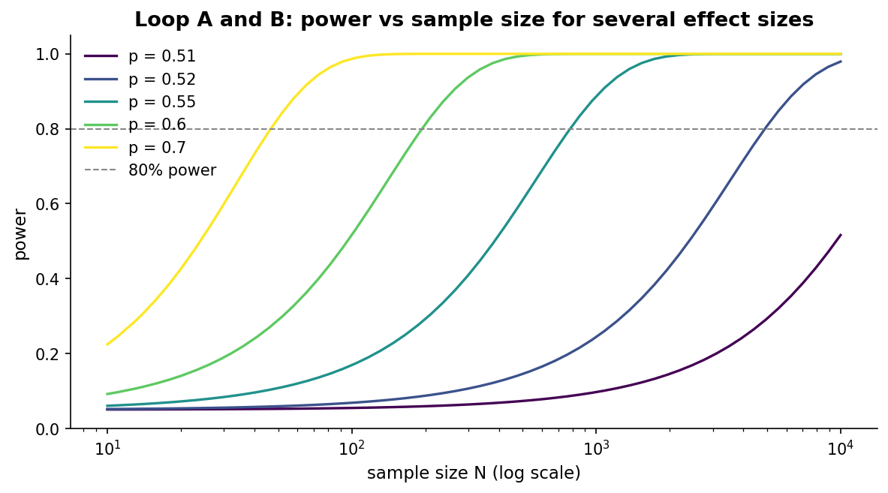
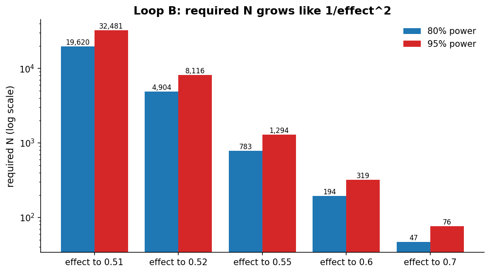
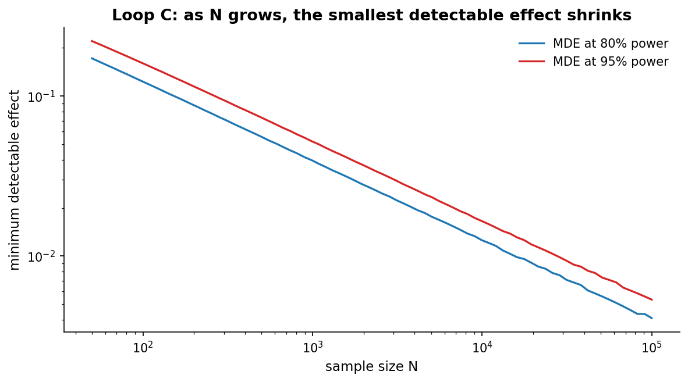
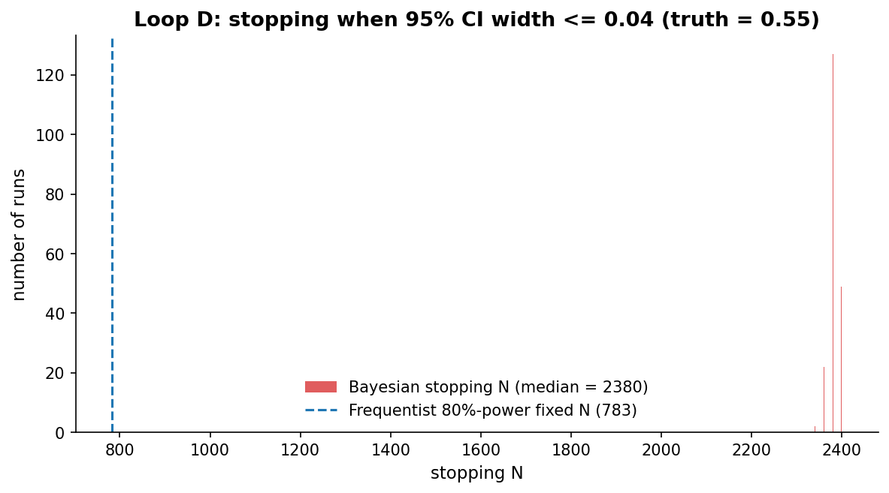

# Chapter 3: What if it's biased? (Power and sample size)

- Carried from Chapter 2
  - We figured out the rejection rule. We watched it catch larger biases more reliably and small biases almost never. Now: how big does N need to be to *plan* on catching a particular bias?

# Loop A: power as a function of N

- Try
  - Pick a true bias we'd like to catch (say p = 0.55 vs the null p = 0.5). For each N from 10 to 10,000, compute the probability that our two-sided alpha = 0.05 test rejects H0 if the truth is p = 0.55.
- Observe
  - At N = 100 we catch it about 17% of the time. Most of the time we miss. At N = 1000 we catch it 88% of the time. At N = 10,000 we catch it essentially every time.
  - 
- Vocabulary
  - That probability is *power*. It is 1 minus the false-negative rate (type II error, beta). 80% power is conventional. 95% if you really cannot afford to miss.
  - Note the asymmetry: a strict alpha drives down false positives but does NOT drive up power. Power is set by N + the size of the effect we want to detect, not by alpha alone.
- Probe an edge case
  - Small effects on the same plot. p = 0.51 is a tiny bias. Even at N = 10,000 we catch it just over half the time (power around 0.52). p = 0.70 is a huge bias, N = 50 already gives us decent power.

# Loop B: sample size scales like 1/effect^2

- Try
  - Invert the question. For each candidate truth, what is the smallest N at which we have 80% power? At 95% power?
- Observe
  - p = 0.51 needs about 19,600 tosses for 80% power. p = 0.52 needs about 4,900. p = 0.55 needs about 780. p = 0.60 needs about 200. p = 0.70 needs about 50.
  - Halving the effect roughly quadruples the required N. This is the 1/effect^2 rule of thumb everyone quotes.
  - 
- Hunch
  - This is why huge tech companies care about sample size. Their effects are tiny. A 0.5pp lift on a 5% baseline is real money, and detecting it needs gigantic Ns.

# Loop C: the inverse question (MDE)

- Try
  - What if N is given (we have a one-week experiment, traffic budget is fixed) and we want to know "what effects could this experiment realistically detect?". That's the minimum detectable effect, the MDE.
- Observe
  - At N = 100 we can reliably detect effects of about 12 percentage points. At N = 1000 about 4pp. At N = 10,000 about 1.3pp. At N = 100,000 about 0.4pp. (These are one-sided MDEs at alpha = 0.05, the convention used by `mde()` in `expkit.power.binomial`. The two-sided counterparts are slightly larger, roughly 13.9pp, 4.4pp, 1.4pp, 0.5pp.)
  - 
- Hunch
  - MDE and required-N are two questions, same machinery. The frequentist views them through the same lens.

# Loop D: the Bayesian flavor of "how long should I run?"

- Try
  - The frequentist plans N up front and stops there. The Bayesian can plan to stop when the posterior is precise enough, "stop when the 95% credible interval has width <= 0.04". Run 200 such experiments where the truth is p = 0.55 and record the stopping N.
- Observe
  - The distribution of stopping Ns is tight. Median is 2380, with all stops landing between 2340 and 2400. The granularity is an artifact of the rule: we only check the posterior every 20 tosses, so every stop is a multiple of 20. A finer check (every toss) would smooth the histogram out, but the typical stopping N would not change much.
  - 
- Compare
  - The natural comparison is *frequentist precision* for the same target. The fixed N for a 95% CI of width 0.04 around p ~ 0.55 is roughly n approx 4 z^2 p(1-p) / w^2 = 4 (1.96)^2 (0.2475) / (0.04)^2 ~ 2377. The Bayesian rule lands in the same place (median 2380) because the two frameworks are answering the same question: how many tosses to pin p down to plus/minus 0.02.
  - The frequentist 80%-power fixed N of 783 is *not* the same question. That N is "how many tosses to reject H0: p = 0.5 against truth p = 0.55 with 80% probability", which is a hypothesis-test target, not a precision target. With 783 tosses the 95% CI half-width is roughly 0.035, much wider than 0.02. Apples and oranges.
  - The Bayesian stopping rule is *adaptive*: it uses the evidence as it accrues. It can stop earlier when data are unusually informative, later when borderline. With 200 runs at truth = 0.55 and a CI-width target the variance of the stopping time is small. Make the truth closer to 0.5, or shrink the target width, and the spread of stopping Ns widens.
  - The frequentist version of adaptive testing exists, group sequential tests with alpha-spending, but it is more involved and pays for the early-look option in alpha.
- Edge case
  - What if I let myself "peek" without alpha-spending and stop the first time p < 0.05? I will reject far more than 5% of the time even when the truth is fair. This is "p-hacking by peeking" and it breaks the frequentist guarantee.
  - The Bayesian posterior is invariant to the stopping rule for *parameter estimation*: the posterior mean, the credible interval, and the posterior probability of any interval are the same whether you fixed N up front or stopped on the data. This is the likelihood principle. It does not extend to every Bayesian quantity: a Bayes factor against a point null can still depend on prior choice in a sequential design, so a Bayes-factor stopping rule is not automatically safe. Use a posterior-precision or posterior-probability criterion and the invariance holds.
- Method note
  - Loops A through C all use `normal_approx_power`, which is the normal approximation to the test statistic. Loop D's stopping rule uses the exact Beta posterior (Beta(1+heads, 1+tails)). They are different machinery answering different questions. When comparing against `simulate_rejection_rate` (which uses scipy.stats.binomtest) expect small numerical drift versus the normal approximation.

# The big question that opens Chapter 4

- We have been using "the test" as if there's only one test. But there are several: exact binomial, normal-approximation z, chi-square, Fisher exact, t-test on the fraction, plus Bayesian variants. They are all looking at the same evidence. When do they agree? When do they tell different stories?
- Big question: same data, multiple tests -- when do they reach different conclusions?

# Notebook and data

- Companion notebook: [`notebook.ipynb`](notebook.ipynb)
- Generation script: [`generate.py`](generate.py)
