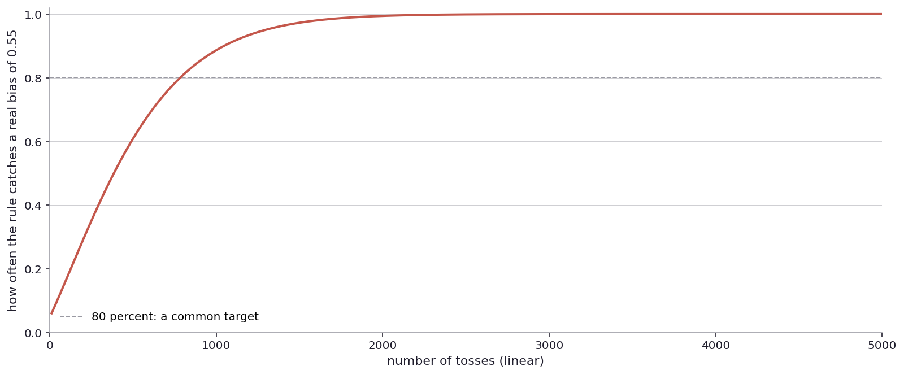
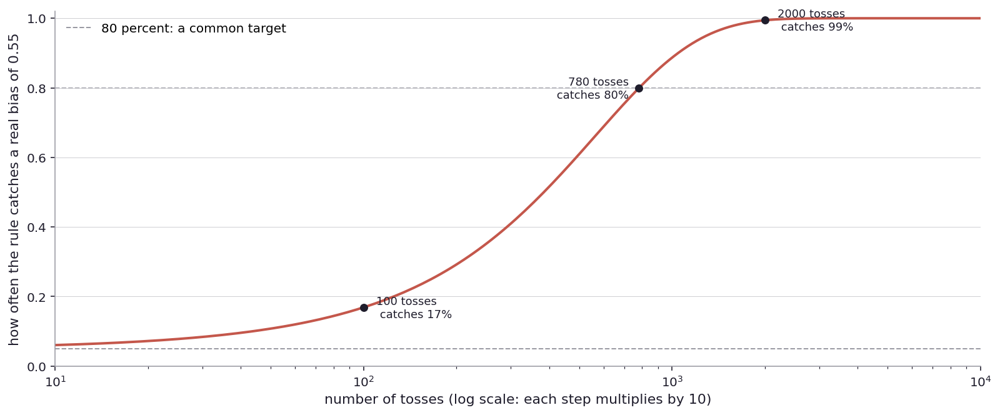
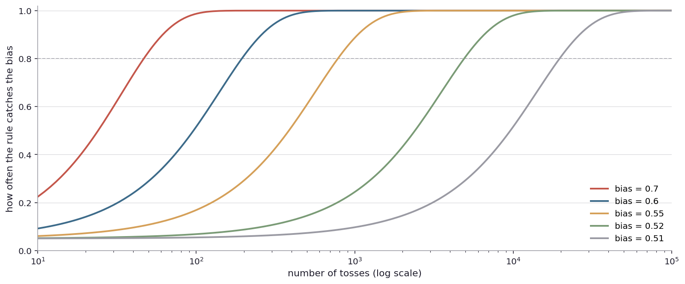
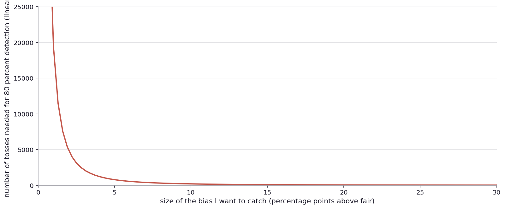
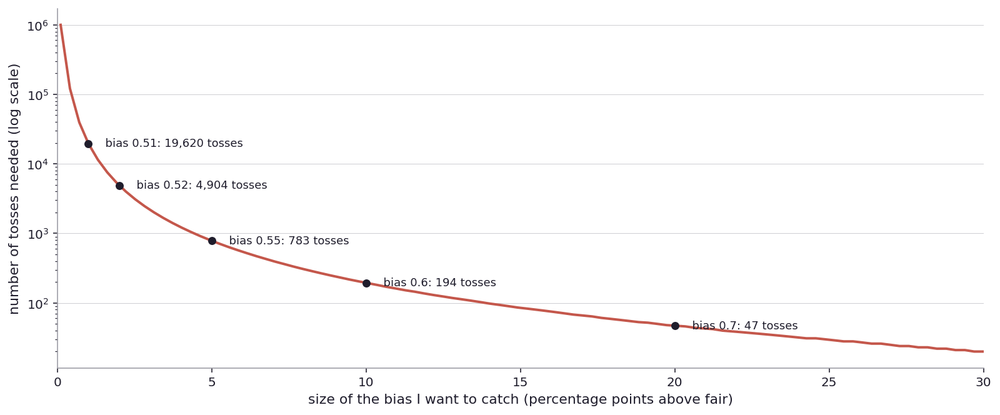
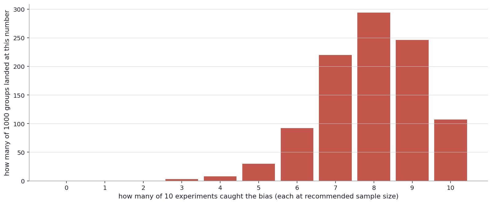
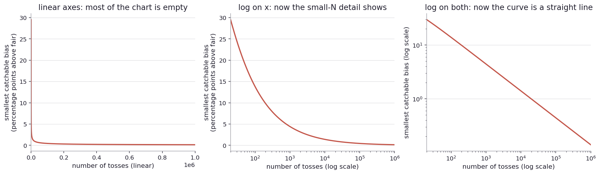
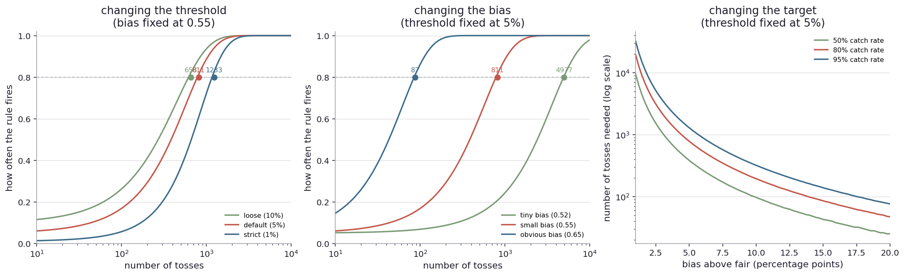
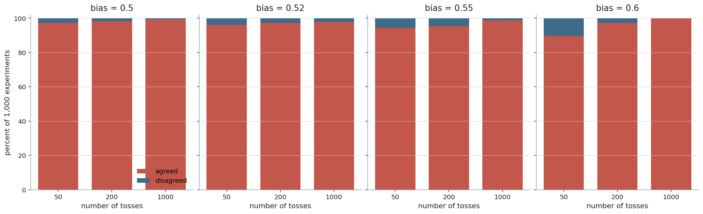

# How many coin tosses do I need?

I left the last chapter with a problem.

By that point I had built a rule for "is this coin fair". The rule said: imagine ten thousand people each tossing a fair coin a hundred times, draw the picture of how many heads each one ended up with, paint in the most extreme five percent of outcomes as the surprise zone, and use that as the line. If my actual coin's result lands in the surprise zone, I call it biased. Otherwise I do not call anything.

The rule had a clean property: a fair coin will land in the surprise zone exactly five percent of the time. So the rule is fooled by chance only one time in twenty.

But I noticed something uncomfortable. The rule does not tell me a coin is fair. It only tells me when a coin is too unfair to ignore. With a hundred tosses, a coin biased at fifty-two percent heads is almost completely indistinguishable from a fair coin: most of the time, its result lands inside the unsurprising zone, and the rule stays quiet. So the most I can ever say with my rule, given a particular sample size, is "this coin is not more unfair than some tolerance I can compute". The strength of "fair" depends on how much data I have.

So now the question is mine to ask. If I want to be sure the coin is not, say, biased by more than two percent in either direction, how many times do I have to toss it? For a specific bias I would actually care about, how many tosses, how many patients, how many users do I need before I can rely on the rule to fire?

This is a real question that real institutions answer all the time, and the answers vary wildly.

A drug trial for a new heart medication might enroll three thousand patients. A trial for a treatment for a very rare disease might enroll forty. The difference is not arbitrary. It comes from how big the expected benefit is, how rare the disease is, how much the trial sponsor can afford, and how stringent the regulator is. Somebody, somewhere, sat down and thought: with these many patients, an effect of this size will land in the surprise zone with this probability. They worked it out.

A political poll typically calls about a thousand people. Read the small print on the next presidential poll and somewhere it will say "margin of error plus or minus three percentage points". Three points is roughly what a thousand-person poll buys you. Why a thousand and not a hundred or ten thousand? Let me figure that out as I go. I am not going to take a number on faith.

A tech company often runs A/B tests. An A/B test is a controlled comparison: take some users, show half of them the current version of something (the website button, the recommendation algorithm, the email subject line), show the other half a new version, and measure who clicks more, buys more, comes back more often. The classic textbook example is a button: half the users see a blue button, half see a red one, and the company keeps the color that gets more clicks. To detect a quarter of a percentage point of click lift on a five-percent baseline, the test usually needs millions of users. Tech companies usually have millions of users, but the math forces the trial size up against the available traffic.

Each of these institutions has done the same calculation. How big is the effect that matters here? How sure do they want to be that they will catch it? And from those two answers, how big does the sample have to be?

The answer is not in some math book. It is something I can work out, with the simulator I have already been using.

Back to the coin.

In the last chapter, my rule was carved out from the picture of "what fair predicts". That rule has a built-in promise: if the coin really is fair, the rule fires only five percent of the time. The five percent is the false alarm budget, and it is independent of how many tosses I do.

But I never carefully asked what the rule does for biased coins. I showed the chart of fair-versus-biased overlap and noticed they share most of their territory. I never actually counted what fraction of biased-coin runs trip the alarm.

Let me do that now. Pick a specific coin to look for: bias of fifty-five percent (the coin lands heads slightly more often than tails). The question is, if I toss this coin a hundred times and apply my rule, how often does the rule fire?

To answer, I run the simulator. The procedure is exactly what I would do by hand if I had infinite patience. Imagine ten thousand experiments. In each experiment, I toss the biased coin a hundred times and apply my surprise rule (the cutoff is at thirty-nine and below or sixty-one and above heads, computed from the fair-coin picture). I count what fraction of those ten thousand experiments triggered the alarm. ([Run this yourself](play/power_explorer.py): change the bias, the sample size, the threshold, see the answer change.)

The answer for a hundred tosses against a 0.55 bias is around seventeen percent. The rule fires in about one out of every six experiments. The other five out of six, the biased coin's result lands inside the unsurprising zone, the rule stays quiet, and I would walk away saying "I have no evidence this coin is biased", even though it is.

Seventeen percent is bad in the direction of "too low". I want the rule to catch a real bias. Seventeen percent means the rule misses the bias more than four times out of five. If I cared about this coin, I would not be doing well.

I expected this would happen. The intuition is straightforward: a hundred tosses is just not very much data when the bias is small. A 0.55 bias is, on average, only five extra heads in a hundred tosses, and a fair coin can produce five extra heads quite often by chance. The signal is small. The noise is large. The rule cannot tell them apart. So I need more data.

How much more? I can sweep through sample sizes from very few to very many and see how the rule's catch rate changes. Same biased coin, same threshold, just varying the number of tosses.

Here is the chart. The horizontal axis is the number of tosses, all the way up to five thousand. The vertical axis is the fraction of experiments where the rule fired (out of ten thousand experiments per sample size). The dashed line marks eighty percent, a target I will explain in a moment.

There is something hidden in this picture. The interesting part of the curve, the climb from low detection to high, is bunched into the very left edge. By the time I get to a thousand tosses I am almost at the top of the curve, and the rest of the chart is just the curve being flat. Most of the picture is empty. I cannot really read the small-N region without squinting.

A useful trick when the interesting story lives at one end of the axis: stretch that end out. Specifically, change the horizontal axis from "linear" (where each step is the same arithmetic distance) to "log scale", where each step is the same multiplicative distance. On a log scale, ten and a hundred are the same distance apart as a hundred and a thousand. Each step is a multiplication by ten. The numbers stretch out at the small end and squeeze in at the large end.

Same data, log axis:

Now the small-N region has room to breathe. The curve has a clear S shape: low detection at the small-N end, then a climb, then leveling off. The annotations call out three specific points. At a hundred tosses, the rule fires seventeen percent of the time, the number I already knew. At seven hundred and eighty tosses, eighty percent, which I will come back to. At two thousand tosses, essentially every experiment trips the alarm.

The eighty-percent target is a convention people use when they need a default. It says: I am willing to miss the bias one time in five if I get to catch it the other four times. Eighty percent is not a law of nature. Ninety-five percent is sometimes used when missing is unacceptable, fifty percent when I just want to do better than chance, and so on. The target should match the stakes, the same way the threshold should. For now I will keep using eighty percent and notice what changes if I push it.

So at the eighty-percent target, my biased coin needs about seven hundred and eighty tosses for the rule to reliably catch it. With fewer tosses I will miss too often. With more I am paying for precision I do not need.

A reminder about what eighty percent really means, because it is easy to lose track. If I run my experiment once with seven hundred and eighty tosses, I have an eighty-percent chance of catching the bias. The other twenty percent I will toss the biased coin seven hundred and eighty times, the result will land inside the unsurprising zone, the rule will stay quiet, and I will walk away thinking "no evidence". The bias was there. The rule still missed. I will come back to this.

What if the bias is something other than 0.55? Same picture, different curves.

Five curves on the same axes, one for each bias I might be looking for. At the top, in deep red, is the obvious bias (0.7). It climbs almost immediately: even fifty tosses give me eighty-percent detection. At the bottom, in muted gray, is the tiny bias (0.51). It barely climbs at all over the whole range. Even at a hundred thousand tosses, it has just barely reached the eighty-percent line.

The intuition behind this picture is something I could have guessed before drawing it. Bigger differences are easier to detect. If my grandmother is not wearing her glasses, she can still tell me apart from my dad: I am very different from him in build and voice. But she might not be able to tell me apart from my brother, even with her glasses on, if the glasses are smudged. Bigger differences need less data and less precision. Smaller differences need more.

So the picture confirms the intuition and lets me put numbers on it. Now I can ask: how does the required sample size change as the bias changes?

For each candidate bias, I find the smallest sample size that gives me eighty-percent detection. ([Find this for any bias yourself](play/sample_size_planner.py).) Let me first look at the picture on a normal axis, the way a non-statistician would draw it.

The horizontal axis is the bias, in percentage points above fair. The vertical axis is the smallest sample size that hits eighty-percent detection. The curve is recognizable as a hockey stick: required sample size goes through the roof when the bias gets small.

Same problem as before. Most of the picture is empty. The interesting structure is squeezed against the left edge. So I switch the vertical axis to a log scale, the same way I did before. Each step on the y-axis is now a multiplication by ten, instead of an addition.

Now I can read off the numbers. To catch a bias of 0.7 (twenty points above fair) I need about fifty tosses. To catch 0.6 (ten points), about two hundred. To catch 0.55 (five points), about seven hundred and eighty. To catch 0.52 (two points), about five thousand. To catch 0.51 (one point), about twenty thousand. Each one of these is for the eighty-percent detection target. If I demanded ninety-five percent instead of eighty, every number would go up.

Look at the pattern. From 0.7 down to 0.6, the bias halved (twenty points to ten) and the sample size multiplied by about four (fifty to two hundred). From 0.6 to 0.55, halved again (ten to five), multiplied by four again (two hundred to seven hundred and eighty). From 0.55 to 0.525, halved, multiplied by four. The relationship is not linear. Halving the bias I want to catch does not double the sample size. It quadruples it.

This is a useful name to give. People who do this work routinely call the gap between the coin's bias and 0.5 the "effect size". A coin biased at 0.55 has an effect size of five percentage points. A coin biased at 0.7 has an effect size of twenty. (The technical term "effect size" in statistics has a slightly stricter definition, often divided by some standard deviation, but in this chapter I will mean the gap, which is good enough for what I am doing.)

The pattern in the picture is: required sample size scales like one over the effect size squared. Halve the effect, quadruple the sample. Cut the effect to a tenth, multiply the sample by a hundred. This shows up in every detection problem, not just coins. It is the reason the tech companies need millions of users: their effects are tiny, and tiny effects need huge samples.

Let me make sure I am being correct about the tech company example. Suppose a company is testing whether a new layout increases purchases, and the baseline purchase rate is five percent. They are looking for a quarter of a percentage point of lift, meaning the new rate would be 5.25 percent instead of 5 percent. The math says they need around twelve thousand users per arm, so twenty-four thousand total. To halve their detectable lift to an eighth of a point, they need about a hundred thousand. To get down to a tenth of a point, several hundred thousand. The exact number depends on the baseline (five percent versus fifty percent makes a real difference), the threshold, the detection target. I am being approximate but not wrong. The point is, tech companies are looking for tenths of a point on small baselines, and they end up running tests on millions of users because the math forces it.

This is also why I should be deeply suspicious of any small study claiming a small effect. A three-month study of forty patients claiming a five-percent improvement is, by this math, essentially incapable of detecting an effect that small. The MDE chart later will make this concrete. If the small study did claim such an effect, either the effect was much bigger and the small study got lucky enough to land in the surprise zone, or the result is a fluke that will not replicate.

Which leads me to the question I have been ducking. Replication.

Suppose I do my seven-hundred-and-eighty-toss experiment with a coin I know is biased at 0.55. Eighty-percent detection means I have a four-in-five chance of catching the bias. If I want to be MORE sure, I have two options. I could keep tossing the same coin and gather more data, three thousand tosses instead of eight hundred. Or I could put down the original experiment, start over, and do another seven-hundred-and-eighty-toss experiment from scratch. Then a third. Then a fourth.

These are different things. Are they useful in the same way?

Let me actually run it. I run a thousand simulated groups. In each group, I do my seven-hundred-and-eighty-toss experiment ten times in a row, all with a biased coin at 0.55. I count, in each group, how many of the ten experiments triggered the alarm. The picture below is the distribution.

Each bar is "groups where this many experiments out of ten caught the bias". The expected value is eight (since each experiment catches at eighty percent), and the most common outcomes are seven, eight, and nine. But about thirty groups out of a thousand caught it only five times. A handful caught it only four. Some caught it all ten times. ([Try varying the parameters yourself](play/replication_simulator.py): smaller effect sizes spread the distribution out a lot.)

This is a useful picture for a few reasons. First, it confirms that "eighty-percent detection" is an average across runs, not a guarantee for any one run. If I pick any specific run from this group and look at its result, I cannot tell whether the bias was there or not. Each run is its own roll of the dice.

Second, ten replications of seven-hundred-and-eighty-toss experiments together form an effective sample of seven thousand eight hundred tosses. If I had pooled all of those into one single experiment, my detection rate would be essentially one hundred percent. So pooling gives me certainty in a way that any individual run cannot.

But there is a third point that matters more in real life. In science, "replication" does not usually mean pooling. It means independently doing the experiment again, ideally by a different team in a different lab with different equipment, and seeing if the result holds up. The point of replication is not to have more data. It is to rule out the possibility that the original study's conditions, instruments, or participants were special in some way that the result depended on without anyone realizing.

This is why "studies show" is a phrase to be skeptical of. Studies show many things. Most of those things turn out to not replicate when someone else tries. There is a famous "replication crisis" in psychology and biomedical research where a substantial fraction of headline findings fall apart when independent labs run the same experiment. The math I have been working out in this chapter is part of why. A one-time forty-patient study of a five-percent treatment effect, even if everything is honest, has maybe a one-in-five chance of correctly detecting a real effect of that size. Four times in five it would have missed it. So when one such study does claim to find the effect, the result is not strong evidence. It is consistent with the effect existing and being noisy, or with the effect not existing and the study being lucky.

What is strong evidence is a result that holds up across many independent attempts. Five labs each running a forty-patient study, four of them seeing the effect, is much stronger than one lab running a two-hundred-patient study and seeing it once. The independent replications rule out a much wider range of "the original study was somehow special" stories.

There is a wrinkle that the replication number alone does not capture: the studies have to be actually independent, and they often are not. If five tobacco-funded labs each run a study of smoking and cancer and four of them fail to find an effect, that is not five independent lines of evidence. They share a funding source, they share a methodology, they may share a publication bias against finding the effect. The independence is undermined by the shared bias of the people running the work. This is "conflict of interest" rather than "lack of independence" in the strict statistical sense, but in practice the two collapse into the same thing: the studies are not really separate witnesses.

So when I read a news headline that says "studies show", the question I want to ask is: how many studies, run by whom, with what overlap in funding and method, finding what kind of effect? One study showing a one-in-five-detectable effect is essentially noise. Many independent studies converging on the same answer is real. The math of this chapter says nothing about which kind of study generated the headline, and that is exactly why headlines are dangerous.

OK, back to the coin.

Now turn the question around. Suppose the sample size is fixed. I have one week of A/B testing traffic, or a clinic with forty available patients, or a budget for a thousand poll calls. What is the smallest bias I could realistically catch with the data I have?

This goes by a name. It is called the minimum detectable effect, the MDE. With the data I can afford, what is the smallest signal that the rule would fire on?

The picture is the inverse of the required-N picture. Same machinery, different question. If the required-N chart says "to catch a 5pp bias, you need 780 tosses", then the MDE chart says "with 780 tosses, the smallest catchable bias is 5pp". Same fact, both ways. ([Find your own MDE for any sample size](play/mde_finder.py).)

I will draw the MDE chart in three forms, building up to the version that actually shows the structure.

The leftmost panel is the linear-axes version. Most of the chart is empty: the curve crashes against the corner. I can see that more tosses means smaller MDE, but I cannot read off any of the specific numbers.

The middle panel is the same data with the horizontal axis on a log scale. Now the small-sample-size region is visible. The curve is shaped like a slow droop: the MDE drops as I gather more data, but slower and slower.

The right panel is the same data with both axes on log scales. Now the curve is a straight line, and a straight line on a log-log chart has a specific meaning. It means the relationship is a power: when I multiply the horizontal value by some factor, the vertical value gets multiplied by some factor too. Reading off the slope, I see that quadrupling the sample size halves the MDE. Same one-over-effect-squared rule from before, just shown the other way.

What does the MDE chart tell me concretely? At a hundred tosses, the smallest catchable bias is roughly eleven percentage points above fair, meaning a coin that lands heads sixty-one percent of the time or more. A hundred-toss study on anything closer to fair than that has essentially no chance of catching the bias. At a thousand tosses, the smallest catchable bias drops to about three and a half points. At ten thousand, about one point. At a hundred thousand, about a third of a point.

So the MDE chart is the reality check for any study I am about to run. If a stakeholder asks me "could your study have caught a coin biased to 0.52?", I look at the chart and answer. At five hundred tosses, no, the MDE is much larger than two points. At ten thousand, yes, the MDE is around one point and a 0.52 coin is just inside it. The conversation is not whether the bias is there. It is whether the experiment had any chance of finding it.

So now there are three knobs in this little machine. The threshold (how often I am willing to be fooled by a fair coin), the bias I want to catch, and the number of tosses. Plus the detection target (how often I want to catch a real effect when there is one). They are all linked. If I pin three of them, the fourth falls out.

Three panels. Each one fixes two of the four knobs and varies a third while the fourth is what I am reading off the chart. The dots on each panel mark the eighty-percent intersection point.

The left panel fixes the bias at 0.55 and varies the threshold. A loose threshold (ten percent) crosses the eighty-percent line at about five hundred tosses. The default threshold (five percent) at about seven hundred and eighty. A strict threshold (one percent) needs around fourteen hundred. The cost of demanding fewer false alarms is needing more data to catch the same true effects.

The middle panel fixes the threshold at five percent and varies the bias. A tiny bias (0.52) needs five thousand tosses to clear the line. A small bias (0.55) needs seven hundred and eighty. An obvious bias (0.65) needs around eighty. The same shape, slid sideways depending on how big the effect is.

The right panel fixes the threshold at five percent and varies the detection target. To get fifty-percent detection, I need fewer tosses. Eighty percent, more. Ninety-five, more still. The trade is between certainty of catching a real effect and the cost of running the study.

There is no free lunch in this picture. I cannot have a tight threshold, a small bias to catch, a small sample size, and a high detection target all at once. Pick three of those four constraints, and the fourth is determined. Real institutions live on this tradeoff. Drug trials, polls, A/B tests, all of them.

There is one more way of thinking about all this that I have been ducking. Everything in this chapter so far has been the same view I had in the surprise rule: pretend the coin is fair, ask what would happen, set up a rule, see how often it fires. But back in Chapter 2 I had a different way of looking at the same data, the one where I asked "given what I just saw, what should I now believe about the coin?" and drew a curve over possible biases. That second view has its own version of "how much data is enough", and it answers a slightly different question, and the comparison is illuminating.

Briefly, the second-way version is: I keep tossing until my belief curve (the one that says how plausible each possible bias is) gets narrow enough to act on. "Narrow enough" is something I have to define. Maybe it is "the ninety-five percent band of plausible biases is no wider than four points". I keep tossing, redrawing my belief curve after each toss, and I stop the first time the band is tight enough.

If I run this rule against a coin that really has a 0.55 bias, I can simulate the stopping point. The math works out cleanly: the width of the belief curve scales like one over the square root of the number of tosses (this is the same one-over-square-root law that gives the one-over-effect-squared rule from the other view). For a target half-width of two points around 0.55, the number of tosses needed is around twenty-four hundred.

Now compare. The first way said seven hundred and eighty tosses to catch the 0.55 bias eighty percent of the time. The second way says twenty-four hundred to make my belief curve tight enough to act on. These two numbers are not the same and they are not in the same ballpark. They are answering different questions.

The first way is a hypothesis test. It asks, can the data rule out fair? Seven hundred and eighty tosses gives that an eighty-percent chance.

The second way is a precision target. It asks, can the data pin down the bias to within a few points? Twenty-four hundred tosses gives that.

These are different questions. "Rule out fair" is a verdict. "Pin down the bias" is a measurement. A coin maker who just wants to confirm one specific bias does not need the same amount of data as a coin maker who needs to know the bias to within a tenth of a point.

A reasonable next question: do these two ways ever agree on the actual decision? If I toss a coin a hundred times and got fifty-six heads, would the first way and the second way both say "biased" or both say "fair"? Or would they differ?

Let me actually run it. I simulate two thousand experiments at each of several biases (0.50, 0.52, 0.55, 0.60) and several sample sizes (50, 200, 1000), and for each experiment I check whether the first way and the second way reach the same verdict (using the same five-percent threshold for both, so they are comparing apples to apples on the confidence level). The picture below shows agreement and disagreement rates.

In each panel (one panel per true bias), the bars stack agreement (red) on top of disagreement (blue). Read the height of the disagreement portion. At all biases and sample sizes the two methods agree more than ninety percent of the time. The disagreement is highest in the borderline regions, where the data is just barely strong enough for one method but not the other. At very large sample sizes the two methods nearly always agree. At very large biases the two methods nearly always agree. The interesting territory is in between, and even there the disagreement is small.

So when both methods are answering the same kind of question (rule out fair, with the same confidence level), they almost always reach the same decision. The differences mostly appear in borderline cases. ([Run this comparison yourself](play/freq_vs_bayes.py): change the bias and the sample size and watch the disagreement rate move.)

This matters in industry. I have seen companies adopt the second-way framework, run it for a while, and then quietly switch back to the first-way framework, because the actual ship/no-ship decisions came out the same eight times out of ten and the second way was more expensive to maintain. In other industries, with different stakes and different decision habits, the second way wins. The point is not that one is "right". The point is that the question being asked decides which method is the right tool, and most of the time when both methods are pointed at the same question they end up at the same answer.

There is a subtle property of the two methods that matters in practice and bites people who do not know about it. The second-way rule (stop when the belief curve is narrow enough) is allowed to peek. Look at the data after every toss, decide whether the curve is narrow enough yet, stop if so. The first-way rule (the surprise zone) is not allowed to peek. If I run the surprise rule with peeking ("toss the coin, check the rule, toss again, check, ...") and stop the first time the rule fires, I am cheating. Even on a perfectly fair coin, this peek-and-stop rule will fire much more than five percent of the time. Random walks come back to extremes more often than people expect.

Recall the very first experiment of Chapter 1: I tossed the coin three times and got heads, heads, heads. Three heads in a row is a one-in-eight outcome under fairness. If I had been peeking with the surprise rule on every toss, after some long enough stretch of tosses I would eventually hit a streak that crossed the threshold by chance, even if the coin were perfectly fair. The fair-coin result is not stable to repeated peeking.

There is a more careful version of the surprise rule that handles peeking honestly, but it costs you something in exchange (you have to pre-commit to how many times you are going to peek, and split your false-alarm budget across those peeks). I will come back to this when the question matters more, in the context of designing real running experiments. For now I will set it aside and keep the surprise rule in its non-peeking form.

Now look up from the coin.

A drug company designing a phase-three trial for, say, a new heart medication has to commit to a sample size before the trial starts. They have an estimate of the effect they care about: maybe they need a five-percentage-point reduction in some outcome to call the drug clinically useful. They need to catch a real effect of that size with high probability, often ninety percent or higher because missing a real effect means the drug never gets approved and patients never get help. From those two numbers, they get a target sample size (often two to five thousand patients), and that number goes into the trial protocol. Once the protocol is locked, they cannot look at the data partway through and decide to stop, or extend the trial, without complicated statistical adjustments. The discipline of pre-committing the sample size is what lets the trial later say "this is what was found", instead of "this is what looked exciting after looking enough". ([Try the calculation](play/sample_size_planner.py): if the drug helps five percent more patients than the placebo, how many patients does the trial need at ninety-percent detection?)

Imagine it is the night before the election in a tight race. The most recent poll has the candidate I prefer ahead by two points, with a margin of error of three. What does that mean for whether I should bother voting? The "two points" is the survey's best guess at the real gap. The "three points" margin is the survey's honest admission that the real gap could be anywhere from negative one (the other candidate is winning) to plus five (mine is winning). My candidate's lead is inside the margin of error, which is the polite way of saying "the poll cannot tell who is ahead". My vote, on this kind of night, is exactly the kind of vote that decides the race. Pollsters could call ten thousand people instead of one thousand and shrink the margin to about a point, but that costs ten times as much, and most close races never get polled that precisely. I learn something from the poll, but not as much as the headline number suggests, and the math of this chapter is the reason.

A web company is deciding between two button colors for a checkout page. The cost of changing the color is essentially nothing: one line of code. The cost of running an A/B test to choose between them is essentially nothing too, because the company already has the infrastructure. So they run an A/B test on a million users for a week and pick whichever color converts better. Now the same company has to decide whether to add a new payment provider. That is six months of engineering work, and once they have done it, removing it is more six months. The A/B test for that decision needs to be much more rigorous, because the cost of a wrong call is enormous. So they run it longer, with a tighter threshold, against a higher detection target. Same machinery, different stakes, very different sample sizes.

This is the discipline behind sample size: it is not picking a number out of a hat. It is doing math against the question I actually want to answer, the threshold I am actually willing to live with, and the effect I actually care about catching. If I do the math, I can defend the number. If I do not, I cannot.

There is one more thing I want to flag, because it is the place where this math meets the news.

When a study reports "no evidence" of harm, what does that actually mean? I see this in headlines about water fluoridation, vaccine ingredients, mobile phones, processed foods, microplastics, and pretty much every health story in the last decade. "No evidence of harm" is a phrase that sounds like it should mean "the thing is safe", but as the math of this chapter has just shown, it does not mean that.

Take fluoride in drinking water. There is a long debate about whether fluoride at the levels added to municipal water (typically 0.7 to 1.0 milligrams per liter in the United States) has any negative cognitive effect on children. Many studies have looked at this, with various designs, sample sizes, and populations. Some find no effect. Some find a small effect at higher doses, near or above the natural fluoride levels in some Chinese and Indian villages where the negative-effect studies were originally done. The headline-level summary depends on which studies you weight more.

When a particular study reports "the study found no evidence that fluoride at municipal levels is harmful", it could mean one of three quite different things. It could mean the study really did look hard, with a large sample, and found nothing, in which case fluoride at that level is probably either harmless or close enough that it does not matter. It could mean the study was small, the effect (if it exists) is also small, and the study did not have the statistical power to find something even if it was there. It could mean the study was set up to find a particular kind of effect (immediate, large, in adults) and missed a different kind of effect (slow, small, accumulating in children). Each of those three meanings is a totally different statement about the world, but the news headline reads the same way.

So when I read about fluoride, or about anything else with stakes, the question I want to ask is: how big a study, looking for what kind of effect, in whom, would have detected the harm if it existed? That is the MDE question, dressed up in policy clothes. If the studies in the news are below the MDE for a meaningful effect, "no evidence of harm" is not the same as "no harm". It just means the studies were too small to find it.

This is also the structure of conspiracy-theory talk and its opposite. People who push back against fluoridation often cite small studies showing harm. People who defend it often cite larger studies showing no harm. The math of this chapter says: a small study showing harm is weak evidence, because small studies can stumble into the surprise zone by chance even when there is no real effect. A small study showing no harm is also weak evidence, because small studies often miss real effects when the effect is small enough. The strong evidence, when it exists, is the convergence of many independent studies, with sample sizes appropriate to the effect they are looking for, replicated across labs and methods.

This is more than I usually get to think about when I am drinking my morning coffee, but it is the framework. Without the framework, "studies show" just means whatever I want it to mean.

Before I leave this chapter, one more observation. So far I have been pretending there is one rule, the surprise zone with a five-percent threshold. But there are many slightly different rules that look at the same coin and ask "is it fair". The exact binomial test (which counts every possible outcome and adds up the rare ones). The normal-approximation z-test (which uses the bell curve as a shortcut). The chi-square test (which compares observed counts to expected counts). The Fisher exact test (which is technically meant for two-sample problems, but people sometimes apply it to one). The one-sample t-test treating the heads-or-tails sequence as continuous. Each of these has its own surprise zone, its own cutoffs, its own quirks at small sample sizes.

When do they agree? When do they tell different stories? That is the next chapter.

Same data, multiple tests. When do they reach different conclusions?
