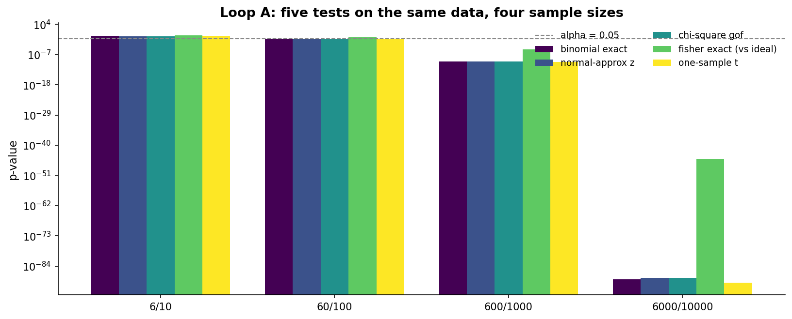
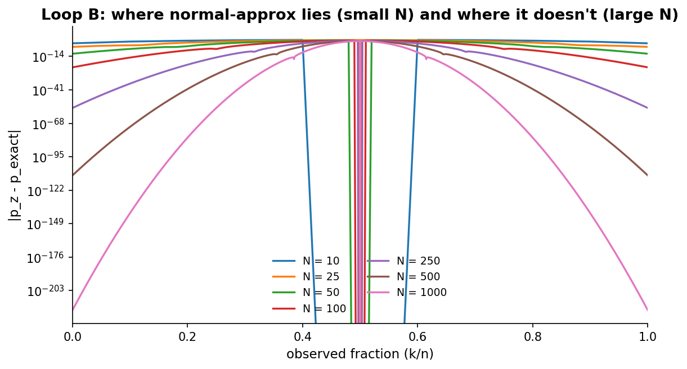
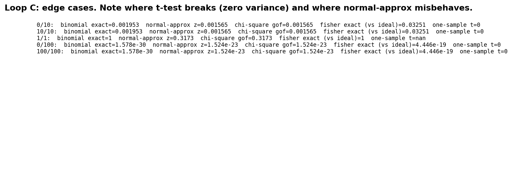
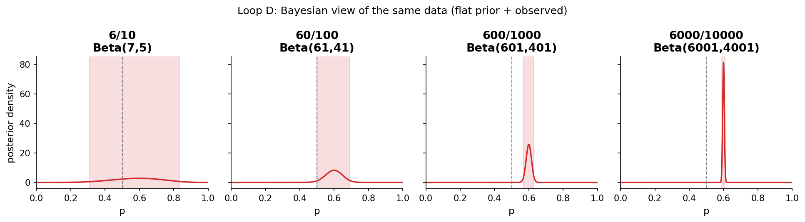

# Chapter 4: The family of tests

- Carried from Chapter 3
  - Same data, multiple tests. When do they tell the same story? When do they diverge?
- Five tests we will use through the rest of the book
  - Exact binomial test. Compute the actual probability under H0 of a result this extreme. No approximation. The gold standard for proportions.
  - Normal-approximation z-test. Treat the binomial as approximately normal. Fast and easy. Lies in the small-N or extreme-fraction corners.
  - Chi-square goodness-of-fit. Compare observed (heads, tails) to expected (n/2, n/2). Asymptotic.
  - Fisher exact test, force-fitted to a one-sample problem. We pair our observed (k, n-k) with an idealized reference of equal size (n/2, n/2) and run Fisher on the 2x2. This is the wrong tool, on purpose, to see what happens when a two-sample test is applied to a one-sample question.
  - One-sample t-test on the 0/1 sequence. Treats each toss as a continuous draw. Wrong-shape model on purpose, useful for comparison. On 0/1 data the sample variance is hat-p (1 minus hat-p) times n/(n-1), so the one-sample t is a Wald-style proportion test with the SE plugged in from the data instead of the null. The t reference distribution is the wrong shape and the data are not normal, but for moderate n away from the boundary the answer lands very close to the z-test. The one-sample t fails on the same edge cases (0/N, N/N, 1/1) as the z-test, and worse: it returns infinite t at 0/N and N/N, and NaN at 1/1.
  - Plus a Bayesian counterpart for each (the conjugate Beta posterior on p, with PyMC available for harder problems).

# Loop A: same data, every test

- Try
  - Five tests, four scenarios: 6/10, 60/100, 600/1000, 6000/10000. All test H0: p = 0.5.
- Observe
  - At 6/10 the tests all agree: nothing to see (p-values 0.50 to 0.85). Eyeball the chart -- the bars are above the alpha line in every test.
  - At 60/100 the tests start to disagree on degree. Exact binomial says 0.057 (just barely doesn't reject). Normal-approx says 0.046 (reject). Chi-square says 0.046. Fisher says 0.201. t-test says 0.045. Fisher gives a larger p-value because it is paying for variance the reference does not actually have. As we grow the reference toward infinity (treating 50/50 as known), Fisher converges to the exact binomial p-value. With reference size n, Fisher is always more conservative than exact binomial and the gap shrinks with reference size. Concretely, at 60/100, Fisher with reference size n is 0.201, with 10n is 0.059, with 100n is 0.056, converging from 0.20 toward the exact 0.057.
  - At 600/1000, all tests reject. Exact, z, chi-square, and t all land below 1e-9 (around 1.7e-10 to 2.7e-10). Fisher is six orders of magnitude weaker at 8.45e-6, still well below any conventional alpha but visibly less extreme. The Fisher framing is paying its variance tax again.
  - At 6000/10000 every test rejects with p well below any reasonable alpha. Exact, z, chi-square, and t are around 1e-89 to 1e-91. Fisher is around 7.8e-46, roughly forty orders of magnitude weaker than the others. Same hint we will return to: Fisher is solving a different problem.
  - 
  - Note: chi-square goodness-of-fit on (k, n-k) versus (n/2, n/2) and the normal-approx z-test give identical p-values at every row. They are algebraically the same test, since the chi-square statistic equals z squared and the chi-square reference distribution with one degree of freedom equals the squared standard normal. We list them separately because they generalize differently: chi-square extends to more than two categories, z extends to other shapes of null.
- Hunch
  - Tests can disagree about *whether* to reject right at the boundary. They almost never disagree about *clear* signals or *clear* nulls. The Fisher framing disagrees on *degree* even when everyone agrees on *direction*, because it is solving a slightly different problem.

# Loop B: where does normal-approximation lie?

- Try
  - Compute the absolute difference between exact-binomial and normal-approx p-values across (k, n) for n = 10, 25, 50, 100, 250, 500, 1000.
- Observe
  - At n = 10 the gap is up to 0.23. Useless near the boundary.
  - At n = 50 the gap is about 0.11.
  - At n = 250 the gap is about 0.05.
  - At n = 1000 the gap is about 0.025, still not inside one percent.
  - The gap is shrinking like 1/sqrt(n), and you need n in the thousands to be inside 0.01.
  - 
- Rule of thumb
  - The textbook rule "use normal-approx when n*p > 5 and n*(1-p) > 5" is a decent approximation of where this plot becomes flat. At p = 0.5 the rule says n at least 10. The data above shows the rule is necessary but not sufficient: even at n = 100 the gap can be about 0.08 in tail regions, and at n = 1000 it is still about 0.025. For agreement inside one percent you need n in the thousands. For automated tooling, prefer exact when feasible -- modern computers do not care.

# Loop C: edge cases

- Try
  - 0/10. 10/10. 1/1. 0/100. 100/100. Run all five tests on each. See what breaks.
- Observe
  - 1/1: t-test returns NaN, the only test that fails to produce a number. The other four still produce defined, finite p-values, though they all approach 1, correctly conveying that one toss carries no signal.
  - 0/10 and 10/10: every test reports a small p-value (extreme observations are extreme). But the magnitudes vary wildly. Exact binomial says about 0.002. Normal-approx says about 0.0016 (very close to exact at this n). t-test returns p = 0 with an infinite t-statistic. That is technically a number but it claims more certainty than the data carry, the same direction of error as normal-approx but more extreme.
  - 0/100 and 100/100: same shape, exact and chi-square both correctly tiny, normal-approx underestimates the p-value (it thinks the data is more extreme than it is).
  - 
- Hunch
  - When in doubt, prefer the exact test. Use the approximations when speed matters and N is large enough that they have caught up.

# Loop D: the Bayesian view of the same data

- Try
  - For each of 6/10, 60/100, 600/1000, 6000/10000, compute the Beta posterior under a flat Beta(1,1) prior. Plot the posterior, mark the 95% credible interval, mark p = 0.5.
- Observe
  - At 6/10: posterior Beta(7, 5), wide, centred at 0.583 (mean 7/12). The 95% CI ranges from about 0.32 to 0.81. p = 0.5 is comfortably inside.
  - At 60/100: posterior Beta(61, 41), centred at 0.598, 95% CI [0.50, 0.69]. p = 0.5 is right on the boundary -- echoing the borderline frequentist result.
  - At 600/1000: posterior Beta(601, 401), narrow, centred at 0.60, 95% CI [0.57, 0.63]. p = 0.5 is far outside.
  - At 6000/10000: vanishingly narrow around 0.60.
  - 
- Compare
  - The frequentist tests asked "is the data surprising under p = 0.5?" The Bayesian asks "is p = 0.5 plausible given the data?" At 6/10 and at very large N the two lenses agree on shape and on action.
  - At 60/100 the lenses agree on shape (both call it borderline), but the frequentist family itself splits at the alpha = 0.05 line: exact says 0.057 (do not reject), z and chi-square say 0.046 (reject), Fisher says 0.20 (do not reject). The Bayesian credible interval has its lower bound just at 0.50. Reasonable analysts would disagree about action.

# The big question that opens Chapter 5

- Tests answer "can I reject this specific H0?". They tell us about a single point. But what we often want is a range: not "can I rule out 0.5?" but "what range of p values can I rule out, and what range is plausible?"
- That's the dual move: from a test to an interval.
- Big question: instead of asking "rejected or not", what's the full set of values the data is consistent with?

# Notebook and data

- Companion notebook: [`notebook.ipynb`](notebook.ipynb)
- Generation script: [`generate.py`](generate.py)
- Numerics cited above are surfaced as [`data/numbers.json`](data/numbers.json) so prose stays in sync with code.
