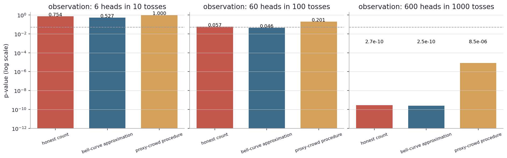
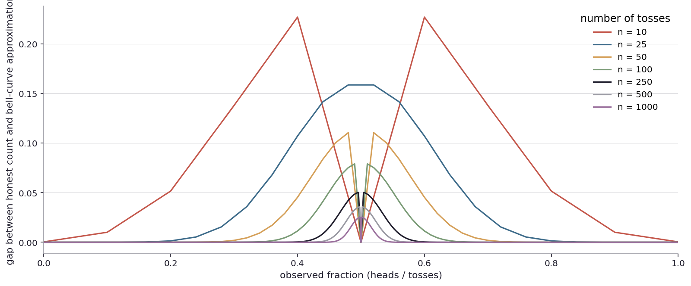
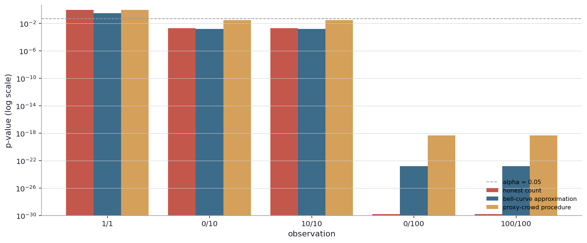
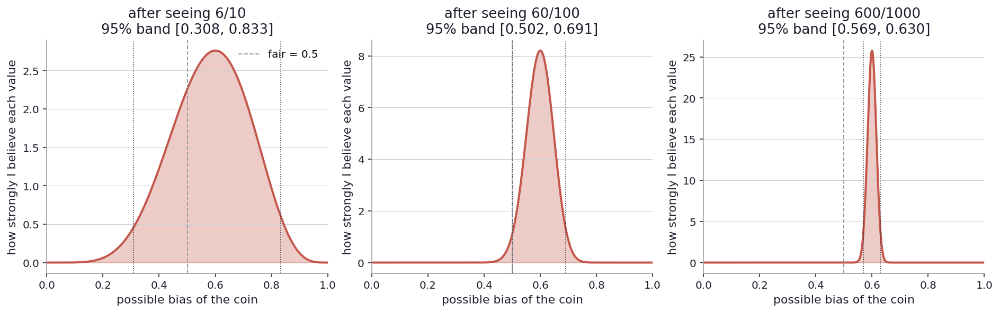

# Why don't these tests agree?

I left the last chapter with a question. I had been using one specific rule, the surprise zone with a five-percent threshold. But I had also mentioned, in passing, that there are several other rules that look at the same data and ask the same question. The exact binomial. The normal-approximation z-test. The chi-square. Fisher's exact. The one-sample t-test treating heads-or-tails as continuous. Each of them with their own quirks and edge cases.

So now I want to look at what happens when I run the same data through more than one of these rules. Do they agree? Do they disagree? When does it matter?

This is not just an abstract question. It matters because, in the real world, when something important is at stake, there is usually more than one statistician looking at the data. And those statisticians do not always pick the same rule.

In 1999, a British woman named Sally Clark was convicted of murdering her two infant sons. The prosecution's central piece of statistical evidence was an expert who testified that the chance of two infants in the same family dying of cot death (sudden infant death syndrome, SIDS) was "1 in 73 million". He arrived at that number by squaring 1/8500, the rough rate of a single SIDS death per family. The jury convicted. The expert had assumed the two deaths were independent events, which they are not (siblings share genes, environment, and risk factors). The Royal Statistical Society publicly criticized the testimony in 2001. Sally Clark's conviction was overturned in 2003. She died of alcohol poisoning in 2007, having never recovered from the wrongful imprisonment. Same data. A different statistical procedure (one that did not assume independence) would have given a number ten or a hundred times larger, and almost certainly would not have ended in conviction.

The example is harrowing, but the point is small. Two competent people can look at the same set of numbers, apply different procedures, and reach different conclusions. The procedures are not all wrong, and they are not all equivalent. They make different assumptions, simplify different things, and reach answers that diverge in particular kinds of cases. The job is to know which procedure is doing what.

Back to the coin.

Up to now I have used a specific rule. Take the observed number of heads, count what fraction of fair-coin outcomes are at least as extreme, call that the p-value. If the p-value is below five percent, call the coin biased. This is the rule that came naturally from the imagined-ten-thousand-people picture. I will call it the honest count. It just counts the relevant outcomes.

The honest count has one drawback: for large sample sizes, computing it requires summing a long tail of binomial probabilities. With a hundred tosses that is no problem. With a million tosses it is still fine for a modern computer. But before computers, it was painful. So statisticians built approximations.

The classical approximation is the bell-curve approximation. The argument goes: when the number of tosses is large, the distribution of "number of heads" looks more and more like a bell curve (normal distribution). And bell curves have nice closed-form math. Their tails can be computed by table lookup, or by a simple formula, instead of by summing probabilities one outcome at a time. So the trade is: approximate the binomial as a bell curve, accept some inaccuracy at the tails, gain the ability to compute everything fast and by hand.

Let me run both on the same data and see how close they are. Pick the observation 60 heads in 100 tosses. The honest count for this observation is 0.057. The bell-curve approximation gives 0.046.

Right at the alpha = 0.05 line, the two procedures disagree about what to do. Honest count says 0.057, just above the line, do not reject. Bell-curve says 0.046, just below the line, reject. Same data, two procedures, different verdicts.

I can run it for several observations to see the pattern.

Three panels. Each one shows three procedures applied to the same observation, on a log scale because the p-values span many orders of magnitude.

Left panel, six heads in ten tosses. Both procedures say roughly 0.5 to 0.75: nothing surprising. (I will explain the third procedure in a minute.) The data is consistent with fair, and all three agree clearly.

Middle panel, sixty heads in a hundred. The honest count is 0.057. The bell-curve approximation is 0.046. The two are close in absolute terms but on opposite sides of the alpha = 0.05 line. Right at the edge, they disagree about action.

Right panel, six hundred heads in a thousand. Both procedures give p-values around three times ten to the negative tenth. Below any conventional alpha. Both reject, easily.

So the honest count and the bell-curve approximation give very similar answers for clear signals (clearly fair or clearly biased) and similar answers most of the time elsewhere. The interesting territory is the borderline. ([Try other observations yourself](play/multi_test_calculator.py).)

How big is the gap between the two procedures, in general? The gap depends on the sample size. With a small sample, the binomial distribution does not look very bell-shaped, and the approximation is poor. With a large sample, the binomial is essentially indistinguishable from a bell curve in the middle, and the approximation is excellent.

The chart shows, for each sample size, the gap between the two procedures across every possible observation (every fraction from 0 to 1). At ten tosses (the orange curve at the top), the gap can be as large as 0.23 in some places, particularly near the extremes. The bell-curve approximation thinks 0/10 or 10/10 is more extreme than the honest count thinks. At fifty tosses, the gap maxes out around 0.11. At a thousand tosses, around 0.025. The gap shrinks like one over the square root of the sample size.

There is a textbook rule of thumb that says "use the bell-curve approximation when N times p is at least five and N times one-minus-p is at least five". For testing a fair coin (p = 0.5), this rule says any N at least 10 is fine. The chart says the rule is misleading. At N = 100, the gap is still 0.08 in some places. At N = 1000, the gap is 0.025. The textbook threshold of "N at least 10" is necessary but not sufficient. If I want the bell-curve approximation to agree with the honest count to within one percent, I need N in the thousands.

Most software tools (and certainly the simulator I have been using) just compute the honest count directly. The bell-curve approximation is now mostly a teaching device or a convenience for hand calculation. But the bell-curve framing is still everywhere because it generalizes to many situations the honest count does not.

There is a third procedure on the charts I should explain, because it shows something different. Call it the proxy-crowd procedure.

The proxy-crowd procedure goes like this. Take my observation: k heads, n minus k tails. Now imagine an idealized fair sample of the same size: half heads, half tails. That is the proxy crowd. Now run a 2x2 contingency test on the pair of samples: my observation in one row, the idealized fair crowd in the other. Ask whether the two samples could plausibly have come from the same coin.

This is technically a misuse of the procedure (it is the Fisher exact test, designed for comparing two real samples, not one sample against an idealized reference). But people do this in practice, and it is worth seeing what it does. The proxy-crowd procedure adds extra noise to the calculation, because it treats the "idealized fair crowd" as random rather than known. This makes the procedure more conservative: its p-values are larger than the honest count's, because it has to budget for variability that does not actually exist.

The right panel of the comparison chart shows this. At six hundred heads in a thousand tosses, the honest count and bell-curve both give p-values around 2.5 × 10 to the negative tenth. The proxy-crowd procedure gives 8.5 × 10 to the negative sixth. All three reject the null overwhelmingly, but the proxy-crowd is forty thousand times less extreme than the others. It is paying a tax on imaginary noise. As I make the proxy crowd larger and larger, the proxy-crowd procedure converges to the honest count, because the imaginary noise vanishes when the reference sample is treated as known.

This is one of those cases where a statistician picks a procedure that almost answers their question but in a slightly different way. The procedure is not wrong, in the sense that the math works. But the answer it gives is the answer to a slightly different question than the one I asked. I asked "is the data consistent with a fair coin?". The proxy-crowd procedure answered "are these two samples consistent with each other, given that one of them has unspecified variance?". Same shape, different question.

The general lesson: every procedure encodes assumptions. Different assumptions lead to different numbers. When the assumptions are right, the procedure gives the right answer. When the assumptions are wrong (or, like in the proxy-crowd case, just slightly off the question being asked), the procedure gives an answer to a question I did not quite mean to ask.

Now look at what these procedures do at the boundaries. What if I see all heads or all tails? What if I see one toss?

Five extreme observations. One toss with one heads (1/1). Ten tosses with zero heads (0/10) or all heads (10/10). A hundred tosses with zero or all heads.

At one toss, the honest count gives p = 1, correctly saying the data carries no information against fair (one toss can never reject fair). The bell-curve and proxy-crowd procedures give p = 1 too, which is correct.

At zero or ten heads in ten tosses, the honest count gives a small p-value (about 0.002) which is exactly two times the chance of getting all heads or all tails by chance, namely two times 1 in 1024. The bell-curve approximation also gives a very small number. Reject in both cases.

The interesting failure happens with a different procedure I have not yet shown, the one-sample t-test treating the zero-or-one outcomes as continuous numbers. The t-test fails on these inputs in a particular way. At all heads (10/10), the sample variance is zero (all the same number), and the t-statistic involves dividing by a standard error that is also zero. This gives infinity, with a p-value of zero. The procedure thinks the data is infinitely surprising. It is wrong: the data is extreme, but not infinitely so.

At one toss, no matter what the result, the t-test cannot compute a sample variance at all (you need at least two data points), and returns an undefined value. The procedure simply fails.

These are the kinds of edge cases that distinguish procedures. They look the same on typical data, but they fall over differently when the data is at the edge. Real data has edges.

The lesson, I think, is that I should know the assumptions of whatever procedure I am using, and I should know where it lies. The honest count does not lie, because it does not approximate. The bell-curve lies near the boundaries and at small sample sizes. The proxy-crowd procedure adds noise that is not there. The t-test fails entirely at all-the-same data. None of these are equally good. But they are all useful, in different situations.

There is one more lens worth bringing to the same data. The belief curve, the second way of thinking from Chapter 2.

Recall: instead of asking "what would I see if the coin were fair?", I can ask "given the data, what should I now believe about the coin?". The answer is a curve over possible biases, with mass concentrated where the data thinks the truth lies.

Three panels, three observations. Six heads in ten tosses (left), sixty heads in a hundred (middle), six hundred heads in a thousand (right). All three observations have the same fraction (60% heads). What changes is how confident the data is.

Left panel, 6/10. The belief curve is very wide. The 95-percent band of plausible biases runs from about 0.32 to 0.81. The vertical fair-coin line at 0.5 is comfortably inside the band. The data does not pin anything down.

Middle panel, 60/100. The belief curve is narrower. The 95-percent band runs from about 0.50 to 0.69, with 0.5 right at the lower edge. This is the same borderline I saw with the frequentist procedures: just barely excluding fair, but only just.

Right panel, 600/1000. The belief curve is sharp, centered at 0.6. The fair-coin value is far outside the band. The data now strongly supports a coin with bias around 0.6.

So: at 6/10, all the procedures agree that nothing is happening. At 600/1000, all the procedures agree that something is happening. At 60/100, the procedures split. The honest count says do not reject. The bell-curve approximation says reject. The proxy-crowd procedure says do not reject. The belief curve barely excludes fair. Reasonable analysts would disagree about action.

This is the picture of borderline data. It is also the picture of where real-world disputes live.

Now look up from the coin.

A pharmaceutical company runs a trial. The primary endpoint hits p = 0.04 by one analytical method (the pre-specified one), p = 0.06 by another (an alternate that the FDA reviewers prefer for this class of drug). The company wants approval. The reviewers do not. The whole approval debate, complete with advisory committee votes and reanalyses, hangs on which procedure the agency considers definitive. Both procedures are looking at the same data. They are answering slightly different questions, and the answers are on opposite sides of the conventional cutoff.

In 2017, an analysis of the famous "limbic encephalitis" antibody panel was challenged by an independent statistician using a different method. The original p-values, around 0.01, became 0.08 under the alternate analysis. The clinical guidelines that had been built on the original analysis came under reconsideration.

In financial regulation, a flagged trading pattern has a probability of innocence that depends entirely on which population the regulator considers the comparison set. The same data can produce a "1 in 10,000 chance of innocence" under one population, "1 in 50" under another. The choice of population, like the choice of statistical procedure, is not innocent. It encodes assumptions.

The pattern in all these cases is the same. There is one observation, several procedures that look at it, and the procedures give answers that span the action threshold. Good practice is to pre-commit to a procedure, just as you pre-commit to a sample size, before you see the data. If the procedure is flexible (or "post-hoc"), you can always find one that gives you the answer you want. The discipline of pre-commitment is what stops the analysis from becoming a fishing expedition.

There is one more subtlety I want to flag because it sometimes confuses people. Two of the procedures I described, the bell-curve approximation and the chi-square test (the one I did not show separately, that compares observed counts to expected counts), are actually the same procedure for this kind of data. The chi-square statistic for a two-bin observation (heads, tails) versus a fair reference is exactly the square of the bell-curve z-statistic. The reference distributions agree (chi-squared with one degree of freedom is the same as a squared standard normal). They give bitwise-identical p-values for binary data. They are the same test in different clothes. They are listed separately because they generalize differently: the chi-square extends naturally to more than two outcomes (a six-sided die, a multinomial vote), and the z-test extends naturally to other shapes of null. But for the specific case of "is this coin fair", they are one procedure.

So when I said "five tests" at the start of the chapter, I was overcounting. The real list is more like three or four genuinely different procedures, plus a few different framings of the same one. The taxonomy of statistical tests is shaped this way: many specific procedures, several of which collapse to the same thing in special cases, all sharing a family resemblance because they all answer some version of "is this real or chance?".

Knowing the family resemblance is useful, because it means I can read most papers without having to memorize a hundred different tests. They are mostly variations on the same theme: take the data, compute a statistic that captures how surprising it is under the null, look up the p-value of that statistic in the appropriate reference distribution. The differences are in the details.

Tests answer one specific question: can the data rule out this specific value of bias (usually 0.5, sometimes other values)? The data either fits inside the surprise zone for this particular null, or it does not. The output is binary, after a threshold is applied.

But often what I actually want to know is not "can I rule out this one specific value?". I want to know "what range of values is plausible, and what range can I rule out?". The first is a pointwise question: yes or no on a specific value. The second is an interval question: a band of values that the data is consistent with.

The two kinds of questions are duals of each other. For every test of "can the data rule out p = 0.5?", there is an interval of "the values of p the data does not rule out". The interval is the set of all null hypotheses I would fail to reject. This is exactly what a confidence interval is. Same machinery, asked the other way.

How wide is the interval? Where does it center? How does it depend on the sample size and the test I am using? Those are the questions that open the next chapter.

What range of biases is the data consistent with?
