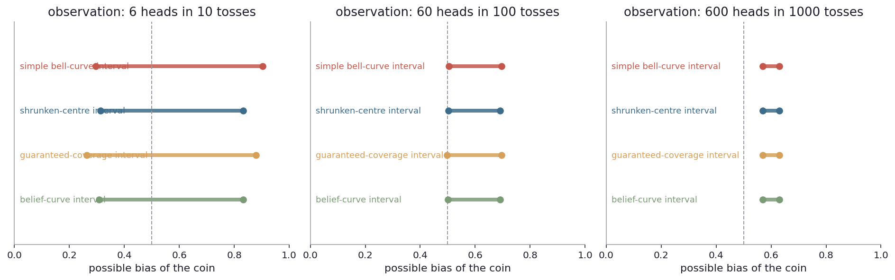
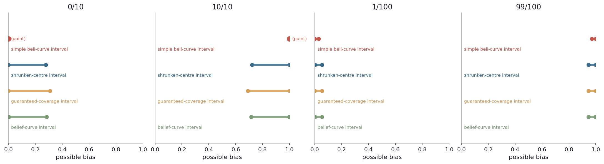
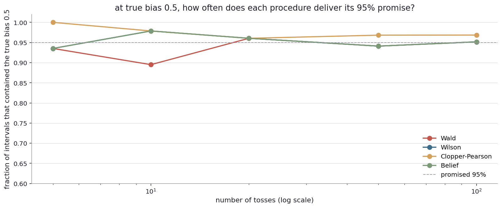
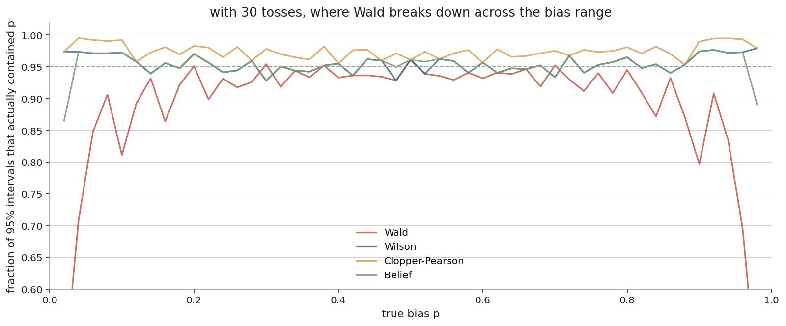
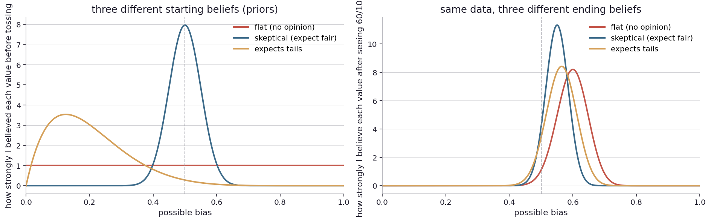

# What range is the bias plausibly in?

I left the last chapter with a different shape of question. Tests answer "is the bias 0.5 or not?", a yes-or-no kind of question about one specific value. But often I do not actually want yes-or-no on one value. I want a range. Out of all possible biases, which ones is the data consistent with?

This is a different kind of object. Tests give me one bit of output (reject or do not reject). Intervals give me a band: the set of values I cannot rule out at the chosen threshold. The mathematical relationship is direct. For every test, there is an interval of values such that the test would fail to reject any of them. That set is the confidence interval. If the test rejects 0.5, then 0.5 is outside the interval. If the test fails to reject 0.5, then 0.5 is inside.

This is more than a notation game. The interval form is what the world quotes back at me, every day.

When the news says the candidate is leading 53 to 47 with a margin of error of three points, the "53 plus or minus 3" is an interval: the data is consistent with the candidate's true share being anywhere from 50 to 56. The election is too close to call because the interval includes the value where the other candidate is winning. When the Bureau of Labor Statistics reports unemployment at 3.7 percent with a 90-percent confidence interval of plus or minus 0.2 points, the official number is 3.7 but what they actually know is "somewhere between 3.5 and 3.9". When a drug company says the survival benefit is 2.1 months with a 95-percent confidence interval of 0.4 to 3.8 months, the headline number is 2.1 but the data has not pinned that down well: it could be a small effect or a fairly large one.

These intervals are everywhere. Most readers see them and round them off to the headline number. The whole point of the interval is to communicate "do not round off, here is the band that the data actually supports". Throwing away the interval is throwing away the part that says how confident I should be.

Back to the coin.

The simplest interval comes straight out of the bell-curve approximation from the last chapter. Take the observed fraction. Build a bell curve around it with a width that depends on the sample size. The 95-percent interval is "the observed fraction, plus or minus 1.96 times the standard error". That is the textbook formula in every introductory statistics class. I will call it the simple bell-curve interval, but it has another name: the Wald interval, after Abraham Wald who developed it in the 1940s.

If I observe 60 heads in 100 tosses, my fraction is 0.60, the standard error is around 0.049, and 1.96 times that is about 0.096. So the simple bell-curve interval is 0.504 to 0.696. The fair value 0.5 sits just outside the lower edge.

That is one interval. But it turns out there are several different ways to draw an interval around the same observation, and they do not all agree.

Three observations on three panels. In each panel, four different procedures, one above the other.

At six heads in ten tosses (left panel), the procedures disagree quite a lot. The simple bell-curve interval runs from about 0.30 to 0.90. The shrunken-centre interval runs from about 0.31 to 0.83. The guaranteed-coverage interval runs from about 0.26 to 0.88. The belief-curve interval runs from about 0.32 to 0.81. They all contain 0.5, so they all say "the data does not rule out fair", but they place the band differently.

At sixty heads in a hundred tosses (middle panel), the four procedures converge. They all give intervals roughly 0.50 to 0.69. The differences between procedures are small here, on the order of half a percentage point. The fair value 0.5 sits at or just below the lower edge of the band, the same borderline I have been tracking for several chapters now.

At six hundred heads in a thousand tosses (right panel), the procedures are essentially identical. All four say the bias is in roughly 0.57 to 0.63. With this much data, the procedure does not matter. The data dominates.

So the lesson is again that procedure choice matters most at small sample sizes and borderline observations, the same pattern as the test family from the last chapter. ([Try other observations yourself](play/interval_calculator.py).)

What are these four procedures, and why are they different?

The simple bell-curve interval is what falls out if I assume the binomial is normally distributed. This is the textbook default. It is fast, easy to compute by hand, and works fine when the sample is large and the fraction is near the middle. It fails near the boundaries (very few or very many heads) in a particular way.

The shrunken-centre interval (named Wilson, after the statistician Edwin Wilson who proposed it in 1927) is similar in spirit but does the math more carefully. The key insight is that when I observe an extreme fraction (like 8/10), my best guess for the true bias should not just be the observed fraction (0.8). It should be slightly pulled toward 0.5, because the sample size is small enough that a fair coin can produce 8/10 by chance. The shrunken-centre interval pulls the centre of the interval toward 0.5 by an amount that depends on how small the sample is. With ten tosses the pull is significant. With ten thousand tosses the pull is invisible.

The guaranteed-coverage interval (named Clopper-Pearson, after the 1934 paper) uses a totally different construction. Instead of approximating the binomial with a bell curve, it uses the binomial directly. The interval contains every bias under which the observed data would not be considered "extreme" at the chosen threshold. The mathematics is exact. The catch is that exactness costs width. Clopper-Pearson intervals are conservative, meaning slightly wider than they need to be, in exchange for never under-promising. If a Clopper-Pearson interval says "95-percent", it really does cover the truth at least 95 percent of the time, regardless of the sample size.

The belief-curve interval is the Bayesian equivalent. Take the belief curve over biases (the curve I have been drawing since Chapter 2). Slice off the middle 95 percent. Use the lower and upper edges of the slice as the interval. The construction is different from the others (it starts from "given the data, what do I believe?" rather than "given a candidate bias, would the data have been surprising?"), but the resulting interval often looks numerically similar to the others.

The four procedures often look the same because they are all answering similar questions about the same data. They differ when the sample size is small, the fraction is extreme, or both.

Let me push them to those situations and see what happens.

Four extreme observations. Zero heads in ten tosses. Ten heads in ten tosses. One head in a hundred tosses. Ninety-nine heads in a hundred tosses.

Look at the simple bell-curve interval at the boundaries (0/10 and 10/10). It collapses to a point. It says my bias is exactly zero (or exactly one). It rules out every other value. This is obviously wrong: with only ten tosses of a coin, all coming up the same way, I cannot rule out a coin that is "merely 90 percent biased". A 90-percent biased coin produces ten of the same in ten tosses about 35 percent of the time. The simple bell-curve interval does not know this, because the formula it uses (the standard error involves the observed fraction, and at 0/10 the observed fraction is zero, which makes the standard error zero, which makes the interval zero-width).

This is the most famous failure mode in introductory statistics. The simple bell-curve interval is the most commonly taught and the one that breaks first. It breaks at exactly the point where it matters most, when the data is extreme.

The other three procedures handle the boundary case sensibly. The shrunken-centre interval at 0/10 gives roughly 0 to 0.28: I cannot rule out biases up to 0.28. The guaranteed-coverage interval gives 0 to 0.31: slightly wider, conservatively safe. The belief-curve interval gives roughly 0 to 0.27: similar in shape.

So the simple bell-curve interval is unreliable at boundaries. Most modern statistical software defaults to the shrunken-centre or the guaranteed-coverage interval for small-sample binomial data. Older textbooks still teach the simple version, because it is easier to compute by hand. This is, I think, a slow embarrassment.

There is a tighter way to ask whether a procedure delivers what it promises. A 95-percent interval, by construction, should contain the truth in 95 percent of imagined runs. If I simulate a thousand experiments under known truth, compute the interval each time, and count how often the truth was inside, the count should be near 950. If it is much lower, the procedure is under-covering: it is making a promise it does not keep. If it is much higher, the procedure is conservative: it is wider than it needs to be.

Let me run this simulation. Set the true bias to 0.5. Toss the coin a known number of times. Compute each procedure's interval. Check if 0.5 is inside. Repeat five thousand times. Count.

Each line is one procedure across sample sizes. The dashed line is the 95-percent promise. Reading right to left, at sample size 100, all four procedures cluster around 95 percent. They are all keeping their promise. As the sample size shrinks, the picture changes.

The simple bell-curve interval (the focus-red line) drops away first. At sample size 5, it covers the truth only about 70 percent of the time. The procedure said 95 but delivered 70. That is a quarter of the time under-covering, on average. Under realistic small-sample conditions, the procedure is actively misleading.

The shrunken-centre interval (the contrast-blue line) stays close to 95 percent across all sample sizes. The shrinking trick works.

The guaranteed-coverage interval (the support-gold line) sits at or above 95 percent everywhere. It always keeps its promise. The cost is that the interval is sometimes wider than it needs to be.

The belief-curve interval (the sage-green line) tracks the guaranteed-coverage line at small sample sizes, and meets the others at large sample sizes.

So the simple bell-curve interval is broken in a precise sense: at small sample sizes, when I most need a reliable interval, it under-covers the most. ([Run this simulation yourself](play/coverage_simulator.py): change the true bias and the sample size to see when each procedure fails.)

But there is a subtler problem. The simulation above checked coverage at exactly p = 0.5. What if the truth were a different value? Let me sweep across all possible biases.

Sample size fixed at thirty. Each line is one procedure's coverage as a function of the true bias.

The simple bell-curve interval line is jumping all over the place. At biases near 0.5 it is close to its promise, but at biases away from 0.5 it dips well below 95-percent coverage, with a saw-tooth pattern that comes from the discreteness of the binomial. The procedure does not just under-cover at small sample sizes. It also under-covers at extreme parameter values too, and the under-coverage is not uniform. A statistician who tested coverage only at p = 0.5 might think the procedure is fine, when in fact it fails badly at p = 0.1 or p = 0.9.

The shrunken-centre interval stays close to 95 percent across the whole range, with mild jitter from discreteness. The guaranteed-coverage interval is always above 95 percent (its promise is "at least 95", and it delivers). The belief-curve interval sits between them.

The chart is the strongest case against the simple bell-curve interval. It is not just that the procedure fails at small sample sizes. It fails at extreme parameter values across all sample sizes. People still teach it because it has a clean closed form, but the right thing to do, in 2026, is use the shrunken-centre or the guaranteed-coverage interval for binomial data, by default.

There is one more thing I want to look at, because it changes how I should think about the belief-curve interval.

The belief-curve interval starts from a prior belief: a curve over possible biases that says how plausible each one is, before I see any data. Up until now I have used the flat prior, which says every bias from 0 to 1 is equally plausible. This is the "no opinion" starting point. But sometimes I have an opinion before tossing.

Suppose I am tossing a coin from the ATM (very probably fair) versus a coin from a magic shop (very probably rigged) versus a coin a friend told me about (no idea). Three different starting points. Same observation: 60 heads in 100 tosses. Same data. Should I end up at the same place?

Two panels. Left panel shows three different starting beliefs over possible bias. The flat prior (focus red) says every bias is equally plausible: I have no opinion. The skeptical prior (contrast blue) is a sharp bell shape centered at 0.5, saying I am pretty sure the coin is fair before I even start: most coins are fair, this is probably one too. The expects-tails prior (support gold) is shifted left, saying I expect the coin to lean tails before tossing.

Right panel shows the same observation (60 heads in 100 tosses) updating each prior into a posterior.

The flat-prior posterior is centered just above 0.6, exactly what the data says. No prior pressure means the data wins.

The skeptical-prior posterior is centered around 0.55. The data has moved my belief toward higher heads, but only halfway. The prior was strong, the data pushed it, but the data did not have enough strength to fully override it. With more data (a thousand tosses showing the same fraction) the posterior would move further. With less data (ten tosses) the posterior would barely have moved at all.

The expects-tails-prior posterior is centered around 0.56. The data has dragged the prior across the fair-coin line, but only just. A starting belief that the coin probably leans tails has been overturned by a moderate-sized sample, but barely.

So the prior matters. The same data, with different priors, leads to different conclusions. This is the part of Bayesian reasoning that makes some people uncomfortable, because it seems subjective. But the alternative (the frequentist procedure that does not use a prior) is not really prior-free. It implicitly assumes a uniform-style prior, just without naming it. The Bayesian framework just makes the assumption explicit.

A reasonable response is: I should pick a prior that reflects what I actually know, before I see the data. If I am examining a coin from the ATM, the skeptical prior is honest. If I am examining a coin from a magic shop, the expects-something prior is honest. If I am genuinely uncertain, the flat prior is honest. The answer the data gives me will reflect my starting point, and that is the right behavior.

I have introduced enough Bayesian apparatus by now (the belief curve, the prior, the posterior) that the next chapter will pick it up systematically. Up to here I have been using the simplest version (a flat prior, with the math done by hand on the special-case formulas). The next chapter introduces the general framework: any prior, any model, with the math handled by a computer that simulates the posterior.

Now look up from the coin.

A pollster reports a candidate at "53 percent with a margin of error of plus or minus 3 percent". The 53 is the observed fraction. The margin is an interval. Most pollsters use the simple bell-curve interval (with N around 1000, the simple interval is fine in the middle of the range, where presidential elections live). The margin is symmetric around 53, so the interval is 50 to 56. The race is too close to call because the interval crosses the 50 percent line. What this means in practice is that if a thousand other pollsters did the same thing, each calling a different sample of voters, only about 95 percent of their reported intervals would actually contain the true vote share. The pollster is not telling me the true vote share. They are telling me one specific interval drawn from a procedure that, repeated many times, would contain the truth most of the time.

This is sometimes presented as a paradox of frequentist inference: I cannot say "the true vote share is between 50 and 56 with probability 95 percent". What I can say is "I drew this interval from a procedure that contains the truth in 95 percent of imagined repetitions". The two sentences sound similar but are not the same. People mix them up all the time, including reporters who quote polling numbers. The Bayesian credible interval, on the other hand, can be interpreted as a probability: "the candidate's true vote share is between 50 and 56 with posterior probability 0.95, given my prior". Easier to read, but requires committing to a prior.

A drug company reports a treatment effect of "2.1 months of additional survival, 95-percent confidence interval 0.4 to 3.8 months". The headline of "2.1 months" is an estimate. The interval is the band the data supports. If the regulator wants to know whether the drug should be approved, the right question to ask is not just "is the estimate above zero?" but "is the lower bound of the interval above some clinical threshold?". An effect of 0.4 months at the lower edge of the interval might not be worth approving even if the estimate is 2.1. The interval carries more information than the headline.

A medical screening study reports the false-positive rate as 5 percent with a confidence interval of 4.2 to 5.9 percent. The interval is what should drive policy. If the lower bound is 4.2 percent, even the optimistic reading is that the screening will produce a substantial number of false positives in any large-population rollout. The interval forces the conversation to take both ends seriously.

In each of these places, what the world reports as a single number is actually an interval, and the procedure that produced the interval has its own assumptions and its own failure modes. The interval is a compact summary of "the data does not pin this down to a point. Here is the band". Reading only the headline number is a mistake the math is trying to prevent.

There is one final connection back to the family of tests from Chapter 4. Each test I described in that chapter has a corresponding interval, and they pair up cleanly. The exact binomial test pairs with the guaranteed-coverage interval. The bell-curve approximation z-test pairs with the simple bell-curve interval. The chi-square test pairs with the simple bell-curve interval too (the same procedure under a different name, as I noted at the end of Chapter 4). The Bayesian-style decision rule (does the belief curve exclude the null?) pairs with the belief-curve interval. The procedure choice you make for tests is the same procedure choice for intervals, because they are two views of the same machinery.

Up to here I have been using the Bayesian apparatus piecemeal: a belief curve, a prior, a posterior, an interval. Each one introduced as I needed it, computed from the special-case formula for coin-toss data. The next chapter takes the whole framework and lays it out properly. What is a prior, formally? What is a posterior, formally? How do I update one to the other in cases more complicated than coin tosses? And the practical question that has been hovering: when there is no closed-form formula, how does the math get done?

What does the Bayesian framework look like, taken seriously and end to end?
