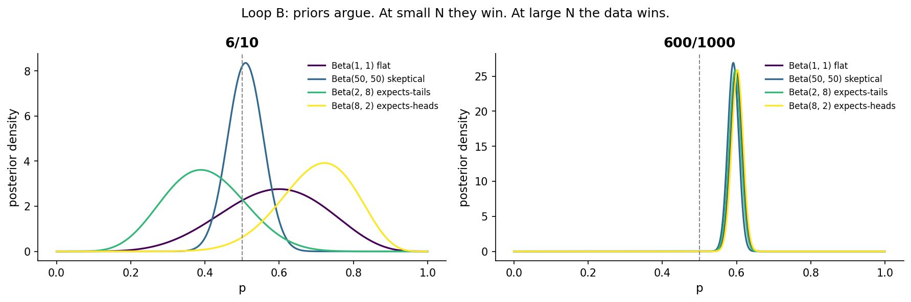
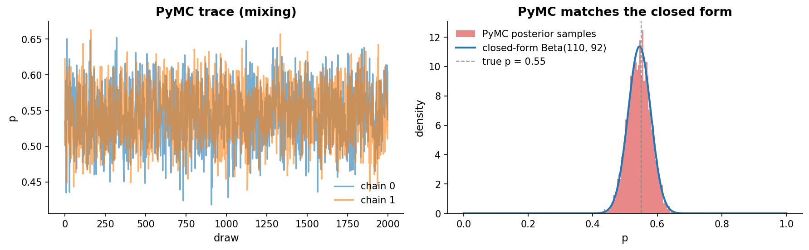
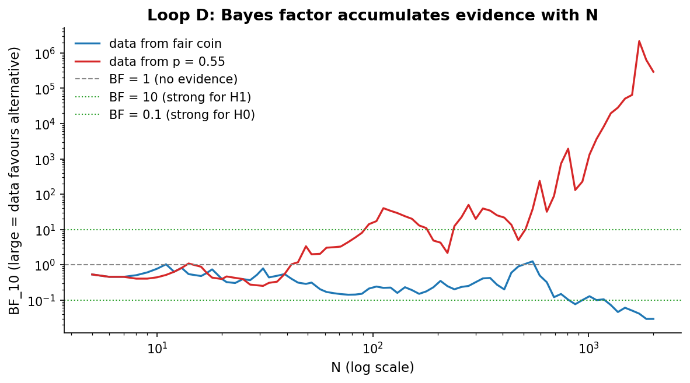
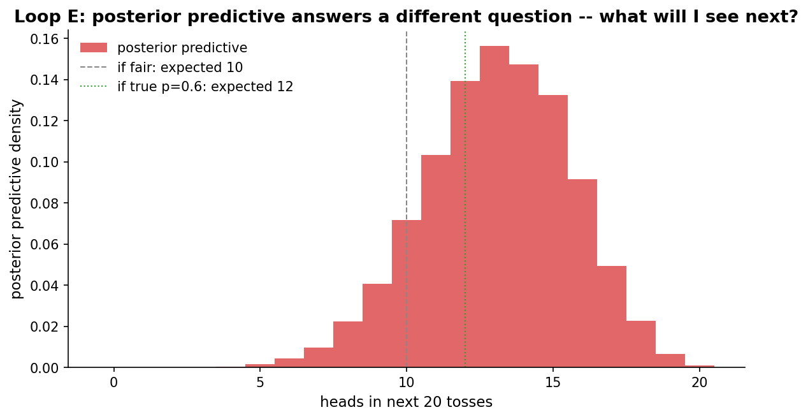

# Chapter 6: The Bayesian view, formalized

- Carried from Chapter 5
  - We've used "posterior" and "credible interval" intuitively for five chapters. Now we lay out the framework end-to-end.

# Loop A: prior, likelihood, posterior, in one breath

- The recipe
  - You start with a *prior*: your belief about the parameter before seeing data. For a coin, that's a distribution over p in [0, 1].
  - You collect data and write down the *likelihood*: P(data | p). For n tosses with k heads it is Binomial(n, p) evaluated at k.
  - Bayes' rule combines them: posterior(p | data) is proportional to likelihood(data | p) * prior(p). Normalize so it integrates to 1.
  - For Beta priors and Bernoulli likelihoods this is a closed form: Beta(a, b) prior plus k heads in n tosses gives Beta(a + k, b + n - k) posterior. Conjugate.
  - For everything more complicated than this, we use PyMC and let the sampler do the math.
- On "uninformative" priors
  - We use Beta(1, 1) throughout. It is uniform on the natural p scale, which makes it a transparent default. It is not the only "uninformative" choice. Jeffreys prior for the binomial proportion is Beta(0.5, 0.5), which is uniform on the arcsine-transformed scale and invariant under reparameterization. Both are common defaults. The right one depends on what you want to be invariant to. Beta(1, 1) is enough for transparent exposition.
- Credible interval vs confidence interval
  - We've used "credible interval" intuitively for five chapters. Now is the moment to pin down the difference. A 95% credible interval says, "given my prior and the data, I assign 95% posterior probability to this range." A 95% frequentist confidence interval says, "across infinite repetitions of the experiment, the procedure traps the true p in 95% of intervals." With a flat prior and moderate-to-large N the two intervals coincide numerically in this Beta-Binomial setup, but the statements they license are different. From here on we report both when the difference matters.

# Loop B: priors that argue

- Try
  - Same data: 6 heads in 10 tosses, then 600 in 1000. Four priors: flat Beta(1,1), skeptical Beta(50,50), tail-leaning Beta(2,8), heads-leaning Beta(8,2).
- Observe
  - At 6/10 the four posteriors are quite different. The flat prior posterior is wide and centred near 0.58 (posterior mean of Beta(7, 5)). The skeptical prior barely moves, with posterior mean 0.51, basically a tight blob at 0.5. The tail-leaning prior Beta(2, 8) yields Beta(8, 12), a posterior mean of 0.40. The heads-leaning prior Beta(8, 2) yields Beta(14, 6), a posterior mean of 0.70.
  - At 600/1000 every posterior collapses to almost the same narrow blob centred at 0.60. The data has overwhelmed the prior.
  - 
- Hunch
  - Priors are most powerful when data is scarce. With enough data, the prior choice is invisible. So:
    - If you have lots of data, the prior almost never matters and you should just use a flat or weakly informative one for transparency.
    - If you have little data, the prior is doing real work; you should justify it explicitly and ideally sensitivity-test (try several).

# Loop C: PyMC and arviz, the actual workflow

- Try
  - We do not need conjugate priors. PyMC handles arbitrary models. Here we run the same Bernoulli-Beta model in PyMC and confirm it gives the same answer as the closed form.
  - The model in code:
    - ```
    - with pm.Model():
    - p = pm.Beta("p", alpha=1, beta=1)
    - pm.Binomial("y", n=n, p=p, observed=heads)
    - idata = pm.sample(draws=2000, chains=2, tune=1000, random_seed=606)
    - ```
  - We then inspect the trace (does the sampler actually sample? does it mix between chains?) and overlay the histogram of posterior draws on the closed-form Beta density.
- Observe
  - The two chains track each other. The histogram of MCMC draws sits exactly under the closed-form curve. Sanity confirmed.
  - 
  - Diagnostics from a typical run (saved trace, see `data/posterior_chapter6.nc`): R-hat on p is 1.00, ESS_bulk is approximately 1400, ESS_tail is approximately 2700, divergences is 0. R-hat near 1.00 says the chains agree on the marginal. ESS counts effectively-independent draws from the autocorrelated MCMC samples. Divergences flag funnel-like geometry the sampler could not handle. Zero divergences here is what we want.
- Why bother with PyMC if the closed form is right there?
  - Because in 99% of real problems the closed form does not exist. PyMC + the same Bayesian recipe extends to: hierarchical models with partial pooling, ratios, transformations, censoring, latent variables, mixtures, anything. From here on we use PyMC where it earns its keep.

# Loop D: Bayes factors, the Bayesian "p-value"

- Try
  - Compute BF_{10}: the Bayes factor for the alternative H1 vs the null H0 (p = 0.5). It's the ratio of marginal likelihoods. > 1 means the data prefers H1, < 1 prefers H0.
  - Heavy caveat up front, before the demo: a Bayes factor is not interpretable without a prior on the alternative parameter. We pick H1 with p ~ Uniform(0, 1), which is the natural pair to a Beta(1, 1) baseline. That choice imports a real modelling commitment: it spreads alternative mass into p = 0.05 and p = 0.95 just as much as into p = 0.5. A Beta(2, 2), or a tighter local alternative around 0.5, would give very different BF curves. The number we report is "the Bayes factor under this specific prior on H1," not "the Bayes factor."
  - Lindley's paradox is the extreme version of this: with a vague-enough prior on H1 the BF can favour H0 even when frequentist evidence points to H1.
  - With that on the table: run two simulated experiments side by side, one with a fair coin and one with p = 0.55, and track BF_{10} as N grows.
- Observe
  - For the fair coin, BF_{10} drifts up and down near 1 forever. There's no consistent evidence against H0 because H0 is true.
  - For the biased coin, BF_{10} grows slowly at first (small N hides the bias) and then takes off. With seed 0 (the trace plotted in the figure), BF_{10} is approximately 970 at N = 1000 and approximately 290000 at N = 2000. Note the log-scale y-axis on the figure. BF growth at a fixed true effect scales roughly as exp(c * N), which is why log-scale axes are necessary.
  - 
- Compare
  - Frequentist analogue: a sequential p-value would also catch the bias eventually, but interpreting "p < 0.05 in this peek" requires alpha-spending machinery. The Bayes factor is interpretable directly: BF = 30 means the data is 30 times more likely under the alternative than under the null. No multiple-testing adjustment needed.
  - The trade is the prior on H1. The frequentist test does not need one. The Bayesian test gets a directly interpretable evidence ratio in exchange for declaring it. Pick the trade you'd rather defend.

# Loop E: posterior predictive -- a different question

- Try
  - We have observed 50 tosses (true p = 0.6, we don't know that). What's our distribution over the number of heads in the *next* 20 tosses?
  - That's the posterior predictive: sample p from the posterior, then sample heads ~ Binomial(20, p). It marginalizes over our uncertainty about p.
- Observe
  - The predictive distribution is wider than a simple Binomial(20, p_hat). It accounts for the fact that we are not sure what p is.
  - On this realization (50 tosses with seed=11) we observed 33 heads, so the posterior on p centres near 0.65 rather than the underlying 0.60. The predictive mode is 13, with 95% of predictive mass between 8 and 18 heads. If we had plugged in the posterior-mean point estimate p_hat = 0.65 and used Binomial(20, 0.65), the 95% interval would be roughly [8, 17], visibly narrower because it ignores our remaining uncertainty about p.
  - 
- Hunch
  - This is one of the things the Bayesian framework gives us almost for free: a coherent story about predictions, not just parameter estimation. Frequentist prediction intervals exist but are clumsier.

# The big question that opens Chapter 7

- Two outcomes is cramped. What if there are six? Twelve? A hundred?
- We will start with the six-sided die, build the multinomial machinery, and the path naturally leads us to A/B testing in chapter 8.
- Big question: how do these tools generalize beyond two outcomes?

# Notebook and data

- Companion notebook: [`notebook.ipynb`](notebook.ipynb)
- Generation script: [`generate.py`](generate.py)
