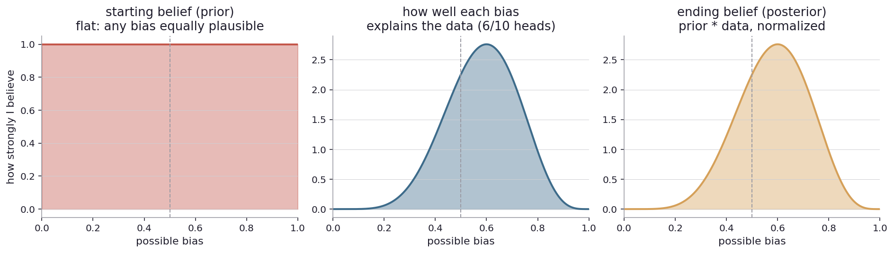
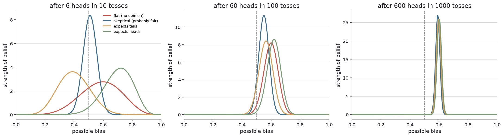
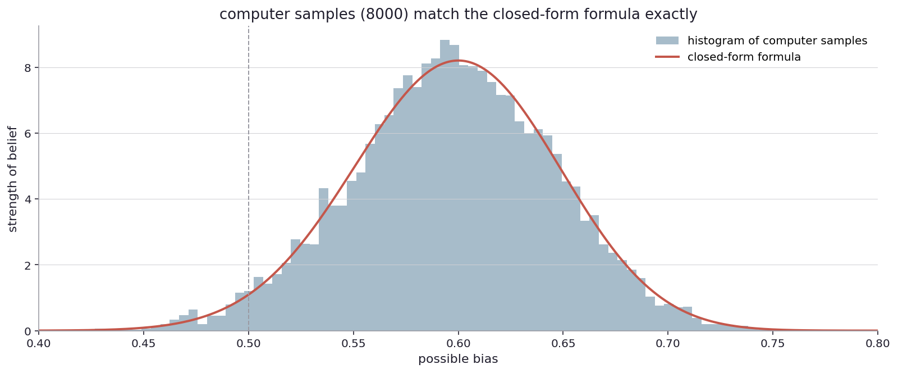
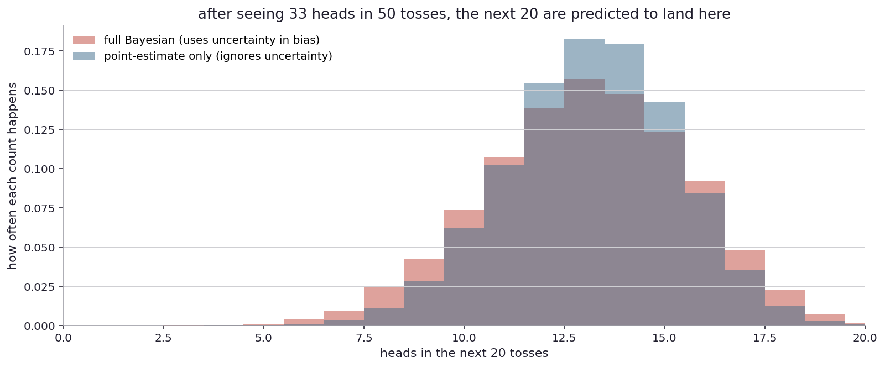
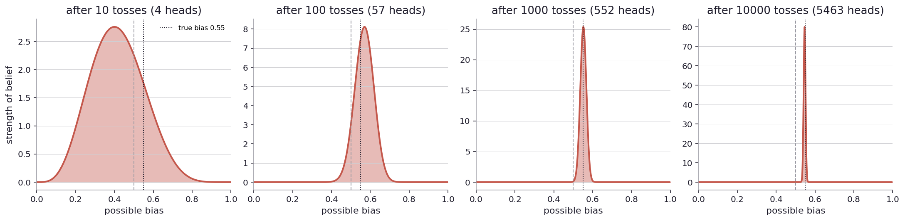

# How does my belief actually update?

I left the last chapter promising to lay out the second way of thinking properly. Up to here I have been using it piecemeal: a belief curve, a starting point, an updated curve, an interval pulled out of the curve. Each part introduced when I needed it, computed by formula for the special case of coin-toss data. Now I want the whole framework, the kind that extends to anything more complicated than a coin.

The framework has a simple shape. It has three parts, and the relationship between them is simple arithmetic. But the simplicity hides a lot of philosophical depth, which is why people argue about it for careers. I will lay out the parts as cleanly as I can, with the coin as the running example, and note the philosophical knots as they appear.

The shape of the framework shows up in places I would not expect.

When a doctor tells a patient that the screening test came back positive for a rare disease, the doctor does not actually know whether the patient is sick. What the doctor knows is something about a procedure: the screening test, run on healthy people, gives a positive result some small fraction of the time, and run on sick people, gives a positive result most of the time. The combination of the test's behavior with the prevalence of the disease in the population gives the actual probability that the patient is sick. This is the most famous setup in introductory Bayesian reasoning, and most people, including most doctors, get it wrong by an order of magnitude when asked.

When a jury hears evidence at a criminal trial, they do not start from neutral. The legal system requires them to start from a presumption of innocence: the strong prior that the defendant did not do it. Evidence presented at trial nudges this prior, and the jury convicts when the evidence has nudged it past "beyond reasonable doubt". The law is operating in the second-way framework explicitly, just without using the word.

When an election is followed by claims of fraud, the structure of the discussion is again the same. People came in with prior beliefs about how often elections are clean (very often) or rigged (rarely). They saw evidence: turnout patterns, ballot counts, surveillance footage, audits. They updated their belief in light of the evidence. The strength of the update depends on how strong the evidence is and how strong the prior was. People with very different priors can look at the same evidence and arrive at different posteriors, and accusing each other of bias is mostly an argument about whose prior is more reasonable.

In each of these places, the framework is doing the same job: combining a starting belief with new evidence to produce an ending belief. The combining recipe is the same in every case. The pieces are called the prior, the likelihood, and the posterior. They form what is called Bayes' rule, after the eighteenth-century English minister Thomas Bayes, who left a posthumous essay (1763) on the topic that nobody much noticed at the time.

Back to the coin.

Imagine I have a coin in my hand and I have not yet tossed it. I have some belief about what its bias might be. Maybe I think it is probably fair (most coins are). Maybe I have no opinion. Maybe somebody told me it is from a magic shop, and I think it is probably rigged. This belief, before any toss, is what I will call my starting belief. The technical name is the prior.

Then I toss the coin some number of times and observe a result. Say six heads in ten tosses. This observation has a probability under each possible bias the coin might have. A bias of 0.6 makes the observation likely (a 0.6 coin produces six in ten heads about a quarter of the time). A bias of 0.5 makes it less likely but not unusual. A bias of 0.1 makes it essentially impossible. The collection of "how likely is this exact observation under each possible bias?" is what I will call the data's voice. The technical name is the likelihood.

The recipe for combining them is simple multiplication. For each possible bias, multiply my starting belief about that bias by how likely the data was if the coin had that bias. Then normalize so the whole thing adds up to one (it has to, because some bias is the actual bias). The result is my ending belief: the curve of how plausible each possible bias is, after seeing the data. The technical name is the posterior.

That is it. Prior times likelihood, normalized, equals posterior. Three pieces, multiplication, one shape.

Three panels of the recipe in action. The starting belief on the left is flat: every bias from zero to one is equally plausible to me before any toss. The data's voice in the middle is the likelihood of seeing six heads in ten tosses under each possible bias. It peaks around 0.6 (where the data is most consistent with the bias) and falls off to either side. The ending belief on the right is the product, normalized: a bell-shape centered just above 0.6, narrower than either of the two sources because the data has constrained what biases are plausible.

This is the picture. The prior gets multiplied by the likelihood, normalized, and out comes the posterior. That is all of Bayes' rule. The rest is just notation and special cases.

For coin data with this kind of prior (a Beta distribution) and this kind of data (binomial), the recipe collapses to a clean formula. If my prior is Beta with parameters a and b (think of these as "imagined heads I have already seen" and "imagined tails I have already seen"), and I observe k heads in n tosses, my posterior is Beta with parameters (a + k, b + n - k). The starting parameters get added to. With a flat prior (a = 1, b = 1) and 6/10 observation, the posterior is Beta(7, 5), centered at 7/12 = 0.583, which matches the chart.

This special-case formula is the reason coin-toss problems are easy to do by hand. The general recipe (multiply, normalize) requires actual integration, which is hard. The Beta-binomial special case turns it into addition.

Now I want to pull on the threads. What happens when I change the prior?

Three panels, four priors each, applied to the same observation at three different sample sizes.

Left panel, after 6/10. The four posteriors are noticeably different. The flat prior posterior is wide, centered just above 0.58. The skeptical prior (Beta(50, 50), shaped like a tight bell around 0.5, "I am pretty sure this is a fair coin") yields a posterior that has barely moved, still tight around 0.51. The expects-tails prior (Beta(2, 8), shifted left) yields a posterior centered at 0.40. The expects-heads prior (Beta(8, 2)) yields a posterior centered at 0.70.

So with only ten tosses of data, the prior is doing most of the work. Same data, four different ending beliefs depending on where I started.

Middle panel, after 60/100. The four posteriors are much closer to each other. The skeptical prior posterior has moved noticeably. The others have all converged toward 0.6. The data is starting to dominate.

Right panel, after 600/1000. The four posteriors are essentially indistinguishable, all sharply centered at 0.6. The data has overwhelmed every prior. Whichever starting belief I came in with, after a thousand tosses showing 60 percent heads, my ending belief is centered at 0.6.

The lesson is intuitive: priors matter when data is scarce, and they do not matter when data is plentiful. ([Try other prior shapes yourself](play/prior_explorer.py).)

This is a useful answer to people who object to Bayesian methods on the grounds that priors are subjective. The objection has force at small sample sizes. At larger sample sizes, the prior is approximately invisible. So the practical question is: how much data do I have? If I am examining a single rare event, the prior matters and I should pick it carefully. If I am examining a thousand observations, I can be lazy with the prior because the data will overwhelm it.

There is also a meta-answer to the subjectivity objection. The frequentist approach (the surprise rule from Chapters 2 and 3) is not really prior-free either. By choosing to test against a specific null (like p = 0.5) and to use a specific significance threshold, the frequentist has implicitly committed to a particular kind of starting position. The Bayesian framework just makes the assumption explicit. The two methods are not as different as the philosophical wars suggest. They are different vocabularies for the same recipe.

Most real problems do not have a clean special-case formula. Imagine I have a coin where the bias is itself drawn from some distribution that depends on a manufacturing process, and I observe the coin tossed some number of times in conditions where the bias slowly drifts. The recipe (prior times likelihood, normalized) still works in principle, but I cannot do the integral by hand. This is where computers come in. There is software (PyMC is the canonical version in Python) that can take any model, sample from the posterior numerically, and give me back the same kind of curve I have been drawing. The math is the same, the computation is harder, and a computer does it in milliseconds.

The simplest version of this is to set up a Bayesian model in PyMC, apply it to data where I already know the closed-form answer, and confirm that the computer-generated samples match the formula.

The histogram is from eight thousand computer-generated samples of the posterior over the bias, after seeing 60 heads in 100 tosses with a flat prior. The smooth curve is the closed-form formula (Beta(61, 41)). They overlap exactly. The computer is not approximating. It is sampling from the posterior, and given enough samples, the histogram converges to the curve.

The reason to bother with the computer when the formula is right there is that the formula only works for a few special cases. The computer works for any model I can write down. As soon as I want to do something the formula cannot handle (multiple parameters, hierarchies, latent variables, partial observations), the computer is the only way. The framework is the same. The recipe is the same. Only the implementation changes.

There is one piece of the Bayesian framework I want to flag and then not pursue further. There is a concept called the Bayes factor, which is a ratio of how well two competing hypotheses explain the data. It is the Bayesian analogue of the p-value, and people sometimes hold it up as the right way to make Bayesian decisions.

The Bayes factor is genuinely useful in some settings, but it has a fragility I want to warn about. The Bayes factor depends on a choice of prior over the alternative hypothesis, and small changes to that choice produce big changes in the Bayes factor. This is called Lindley's paradox in the philosophy of statistics: with a vague-enough prior over the alternative, the Bayes factor can favor the null even when the data overwhelmingly supports the alternative. The fragility makes the Bayes factor a difficult tool for routine decisions. I will not use it in the rest of this book. The posterior probability of action-relevant hypotheses (like "the bias is at least 0.55") is what I will use instead, because it is more stable to prior choices.

There is another thing the framework gives me almost for free that the frequentist approach does not, and it is worth a paragraph because it is genuinely useful.

Suppose I have observed fifty tosses of a coin and I want to predict how many heads I will see in the next twenty. The naive thing to do is take my best guess for the bias (say, thirty-three out of fifty, or 0.66) and use it to predict the next twenty. This gives me a binomial distribution centered at 13.2 heads with some spread.

This is the right shape, but it does not capture my uncertainty about the bias. I do not actually know the bias is 0.66. My belief curve has width. The Bayesian way to predict is to draw a possible bias from my belief curve, then draw a count of heads from that possible bias, and repeat many times. The result is a wider distribution that includes both kinds of uncertainty.

The orange-red histogram is the full Bayesian prediction: it samples the bias from the belief curve and the count from the bias. The blue histogram is the plug-in version: it uses a single estimated bias and ignores my uncertainty about it. The full Bayesian version is wider. Specifically, the 95-percent range is roughly 8 to 18 heads, while the plug-in is 8 to 17. The difference is one head out of twenty, but it represents the uncertainty I would have ignored if I had used my best guess instead of the whole belief curve.

For prediction tasks where the cost of being overconfident is real, the Bayesian framework gives me the correct width almost automatically. Frequentist prediction intervals exist (and there is a literature on how to construct them), but they are clumsier and require additional machinery on top of the basic test framework. In the Bayesian framework it is a one-line idea: sample from the posterior, sample the prediction.

There is one more pattern I want to make explicit because it shows up in every Bayesian problem and once you see it you cannot unsee it. The posterior is the prior, plus the data, plus a little bit of arithmetic. As more data comes in, the posterior gets narrower, and the prior gets correspondingly less important. So if I think of "the posterior at any moment" as a sliding belief that updates with each new toss, I get a movie.

Four panels, the same coin (true bias 0.55, simulated), watching the belief curve evolve as data accumulates. After ten tosses (left panel), the belief curve is wide and barely informative. After a hundred, narrower, with the peak near 0.55. After a thousand, much narrower, with the true value clearly inside. After ten thousand, the curve is essentially a spike at 0.55.

This is the picture of "learning from data" the Bayesian framework gives me. With each new observation, I update the curve. The curve narrows. Eventually, with enough data, the curve concentrates on the truth. The rate of narrowing depends on the kind of data and the sample size. The framework just tracks the recipe.

Now look up from the coin.

A doctor sees a patient with a positive screening test for a rare condition that affects, say, one in a thousand people. The screening test is "ninety percent accurate", meaning it correctly says positive nine out of ten times for sick people, and ten percent of healthy people get a false positive. The patient is rightly worried.

Apply the Bayesian recipe. Prior: my belief about the patient before the test was that they had a one in a thousand chance of being sick. Likelihood: a sick person tests positive with probability 0.9, a healthy person tests positive with probability 0.1. Posterior: of all people testing positive, what fraction are actually sick?

The arithmetic, working through it on paper, says the posterior is about 0.9 percent. About one in a hundred. The patient testing positive raises their chance of being sick from one in a thousand to about one in a hundred. The "ninety percent accurate" headline made it sound like the test result is mostly trustworthy. The math says that even with a positive test, the patient is still more likely to be healthy than sick, because the prior was so low to begin with.

This is base-rate reasoning, and it is the most famous failure mode in introductory Bayesian thinking. Doctors get it wrong (Eddy 1982 found 95 of 100 doctors gave the wrong answer to a similar problem). Lawyers get it wrong. Patients get it wrong. The framework exists exactly because human intuition about combining probabilities is unreliable, and the recipe forces a careful arithmetic that gives the right answer.

A jury hearing evidence is doing the same recipe. Their prior, set by the legal system, is "the defendant probably did not do it" (presumption of innocence). The likelihood is "given the defendant did it, how likely is this evidence? Given the defendant did not do it, how likely is this evidence?". The posterior, after considering the evidence, is the probability the defendant did it. The legal system does not articulate the recipe in those words, but the structure of "innocent until proven guilty" is exactly a strong prior plus an evidentiary update.

In claims that an election was rigged, people are often arguing about priors, not about the data. Unusual vote patterns can be evidence of fraud, or they can be evidence of demographic shifts, or they can be evidence of nothing at all. The data alone does not pin down which it is. The conclusion depends heavily on how prior-likely the observer thinks fraud is. Two reasonable people with different priors about the integrity of elections can look at the same forensic data and come to opposite conclusions. The Bayesian framework makes this explicit: the prior is part of the answer, not a hidden adjustment.

In each of these places, the framework is doing useful work that the simple frequentist surprise rule cannot do. The frequentist test asks "is the data surprising under the null?". It does not have a place to put my prior knowledge. The Bayesian framework makes the prior a first-class part of the answer. Same data, different priors, different posteriors. That is a feature when the priors are honestly stated, but a vulnerability when they are hidden or fudged.

There is a forward question that opens the next chapter. So far my coin has been a binary thing: heads or tails. The framework I just laid out generalizes naturally to more outcomes. Six-sided dice. Twelve-sided. Multinomials of arbitrary size. The recipe (prior times likelihood, normalized) does not care how many outcomes there are. The math gets more elaborate (the Dirichlet distribution replaces the Beta), but the structure is the same.

What does all this look like with more than two outcomes?
