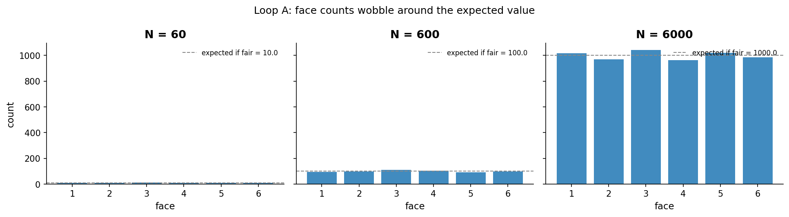
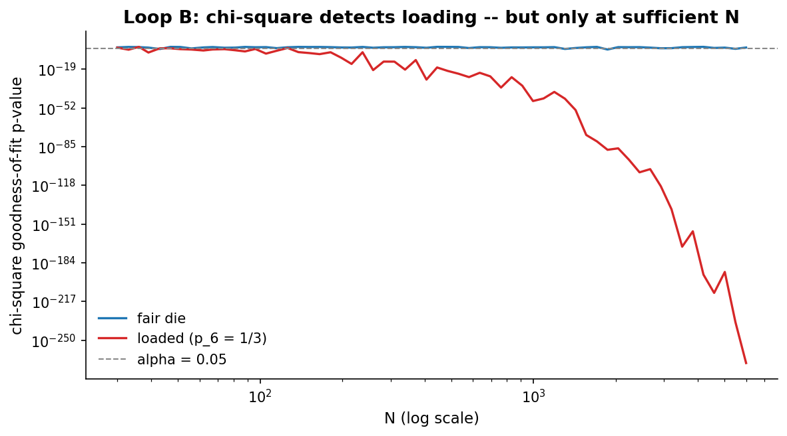
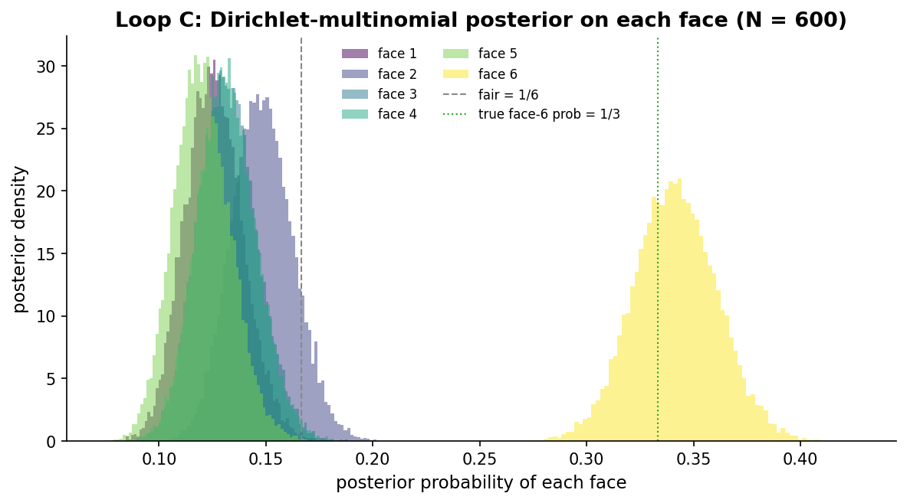
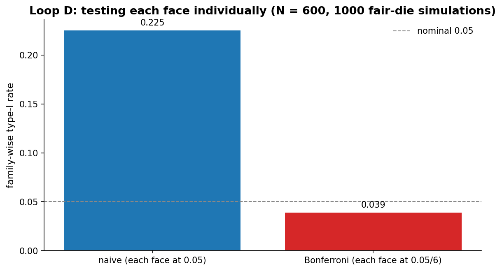

# Chapter 7: The six-sided die

- Carried from Chapter 6
  - Two outcomes was cramped. Six gives us more interesting failure modes -- including a brand new headache called "multiple comparisons".

# Loop A: face counts wobble

- Try
  - Roll a fair die 60, 600, and 6000 times. Count each face. The expected count is N/6. The actual counts wobble.
- Observe
  - At N = 60 some faces appear 7 times, others 14. The wobble is huge as a fraction of the expected (10).
  - At N = 600 every face is in the 80-120 range. Still visible wobble; not enough to spook anyone.
  - At N = 6000 every face is within 1-2% of 1000.
  - 
- Hunch
  - The same regression-to-mean we saw with the coin, only across six categories. Variance per face is approximately N * (1/6) * (5/6).
  - One subtlety: the face counts are not independent. They sum to N, so if one face lands above its expected value, some other face must land below. Formally, cov(c_i, c_j) = -N * p_i * p_j for i != j. We will see this negative covariance show up in Loop D.

# Loop B: chi-square goodness-of-fit

- Try
  - We need a test that asks "is the whole vector of face frequencies consistent with uniform 1/6?". That's chi-square goodness-of-fit. Apply it to a fair die and to a loaded die with p = (2/15, 2/15, 2/15, 2/15, 2/15, 1/3) (face 6 has p = 1/3, the other five split 2/3 evenly at 2/15 each) at increasing N.
- Assumption check
  - The chi-square approximation to the multinomial is a large-sample result. The standard rule of thumb is expected counts of roughly 5 or more per cell. With six faces and uniform expected, that means N >= 30 sits right at the boundary, and from about N = 60 onward (expected = 10 per face) we are comfortably clear of it. For very small N or rare cells, an exact multinomial test or a simulation-based p-value is the safer call.
- Observe
  - For the fair die, p-values bounce around above 0.05. They do dip below 0.05 occasionally -- that's our 5% type-I rate doing its job.
  - For the loaded die, p-values start above 0.05 (small N can't see it) but drop steadily as N grows. In the saved single-shot run (seed = 72, the chi2_pvalues_grid data), the loaded p-value first stays below 0.05 from N = 138 onward. Across the higher-N rows the loaded p-value collapses by many orders of magnitude, so by a few hundred rolls a single experiment essentially always rejects.
  - 

# Loop C: Dirichlet-multinomial, the Bayesian counterpart

- Try
  - The Beta-binomial of Chapters 1-5 generalizes naturally: K outcomes instead of 2, Dirichlet prior with K parameters instead of Beta with 2, the conjugacy still holds.
  - The conjugate analogue of Beta-binomial in the multinomial world is Dirichlet-multinomial. With a Dirichlet(1, 1, 1, 1, 1, 1) prior and observed counts, the posterior is Dirichlet(1 + c1, 1 + c2, ..., 1 + c6).
  - Plot the posterior marginal for each face on the same axes for the loaded-die data with N = 600.
- Observe
  - Faces 1-5 each have posterior marginals concentrated near 0.13 (slightly below 1/6 because face 6 ate the mass). The face-6 posterior is concentrated near 0.33.
  - The fair line at 1/6 sits inside the posteriors for faces 1-5 and well outside the face-6 posterior.
  - 
- Compare
  - The Bayesian view answers "what's plausible for each face?" directly. The frequentist chi-square answers "is the whole vector consistent with fair?". Different questions, both useful. The Bayesian view also avoids the pitfall in the next loop.

# Loop D: multiple comparisons -- a frequentist trap

- Try
  - Suppose we test each face individually, using a binomial test against H0: p = 1/6. We test six hypotheses, each at alpha = 0.05. Run this 1,000 times on simulated *fair* dice and count how often at least one face gets falsely flagged.
- Observe
  - Naive: in our run (seed = SEEDS["monte_carlo"] = 72, n_trials = 1000) at least one face is falsely flagged 22.5% of the time. We expected 5%. We got over 4x that.
  - Bonferroni-corrected (each test at 0.05/6 = 0.0083): 3.9% of the time in the same simulation, comfortably under the nominal 5% bound.
  - 
- Bayesian counterpart
  - The Dirichlet posterior is a single joint object over (p_1, ..., p_6). Asking "is face 6 unusually high?" reads a marginal of that joint, and reading more marginals does not inflate any test threshold the way independent frequentist tests do, because there is no test threshold to inflate: the joint posterior is one consistent object.
  - But that is not the same as "Bayesian has no multiplicity issue." Dirichlet(1, 1, 1, 1, 1, 1) is symmetric (exchangeable across faces), not hierarchical. If a reader scans many marginal credible intervals across many faces and reports the most extreme one, they are doing selection on the posterior, and the multiplicity discipline reappears in the decision rule. The proper Bayesian remedy is hierarchical pooling: a learned concentration parameter, or partial pooling toward a common mean, that shrinks extreme marginals back. We pick that up in the hierarchical chapter.
- Probe an edge case
  - Bonferroni is conservative. At 100 tests, alpha/100 = 0.0005 per test, which kills power. There are smarter frequentist strategies: Holm's step-down procedure (still controls family-wise error rate, uniformly more powerful than Bonferroni) and the Benjamini-Hochberg FDR procedure (controls expected fraction of false discoveries instead of any-false-discovery). Chapter 11's Loop C.5 demonstrates Holm and BH on segmented A/B data alongside Cochran-Mantel-Haenszel, the classical aggregate-with-stratum-adjustment that pays no multiplicity tax at the cost of giving up per-segment claims. The library exposes these as ``expkit.inference.multitest.bonferroni / holm / benjamini_hochberg`` and ``expkit.inference.cmh.cochran_mantel_haenszel``.

# The big question that opens Chapter 8

- We tested whether one die is fair. The next move: two dice (or two coins, or two website variants). Is variant B different from variant A? That's an A/B test.
- Big question: how do we go from "is this one thing fair?" to "is this thing different from that thing?"

# Notebook and data

- Companion notebook: [`notebook.ipynb`](notebook.ipynb)
- Generation script: [`generate.py`](generate.py)
