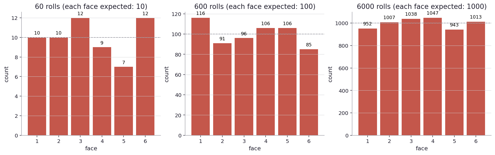
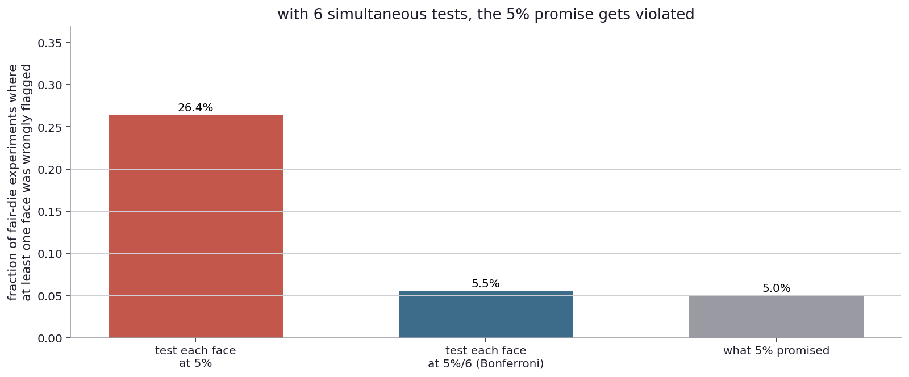
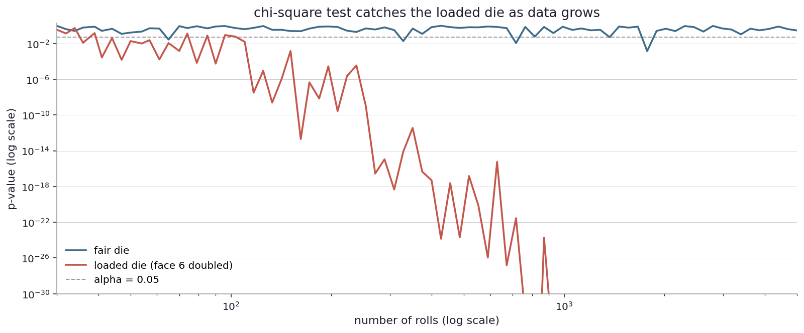
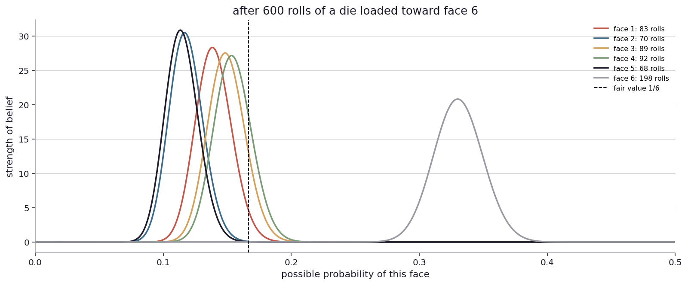

# What if there are more than two outcomes?

Up to here the coin has had two faces. Most of the things I want to use this machinery for in real life have more than two. A six-sided die. A vote with more than two candidates. A multiple-choice quality control inspection (defective, marginal, acceptable, excellent). A jury verdict with more than two options (acquit, convict, hung). A medical test that returns one of several categories. The framework needs to generalize.

The good news is that the recipe (prior times likelihood, normalized) works the same way no matter how many outcomes there are. The framework is indifferent to the number of categories. The math gets a little more elaborate (the Dirichlet distribution replaces the Beta for many-category priors), but the structure is the same.

The bad news is that more outcomes bring a brand new headache that two-outcome problems do not have. With many outcomes, I am tempted to ask many questions at once. "Is face 1 unusual? Is face 2 unusual? Is face 3 unusual?". Asking many questions at once changes the false-alarm math in a way that catches people out, and the rest of this book is going to deal with the fallout in chapter after chapter. The headache has a name: multiple comparisons.

Real-world stage first.

A casino is suspicious of a particular die. They take the die off the table, set it aside, and roll it many times in a back room. They want to know whether any face comes up more often than the other faces would predict. There are six faces, so there are six tests they could run.

A genome-wide association study scans tens of thousands of genetic markers, asking whether each one is associated with a disease. Each test on its own would falsely flag about five percent of the time. With ten thousand tests, the expected number of false positives just by chance is around five hundred. The whole study is dominated by false alarms unless somebody adjusts the math.

A pharmacovigilance system monitors many drug-event pairs (drug X with side effect A, drug X with side effect B, drug Y with side effect A, and so on). The signals look real because there are so many pairs being tested. Most of the signals turn out to be noise.

A bug-tracking system reports anomalies on every metric being monitored. With hundreds of metrics, alarms going off is the default state, even when nothing is actually wrong.

In each of these places, the question is the same. When I make many decisions at once, each with a small chance of being wrong, what is the chance that at least one of them is wrong? The answer is much larger than people expect, and the recipe for handling it is straightforward but easy to forget. I want to walk through the recipe with the cleanest possible example, the six-sided die.

Back to the coin, except now it has six faces.

The first thing I want to do is just see what fair-die data looks like at different sample sizes, the same picture I drew at the start of Chapter 1 for coins.

Three panels, three sample sizes. Sixty rolls of a fair die on the left. Six hundred in the middle. Six thousand on the right. The horizontal axis is the face. The vertical bars are the count for each face. The dashed line is what fair predicts (one sixth of N).

At sixty rolls, the counts wobble dramatically. Some faces show up seven times, others fourteen. The "expected" count is ten, but every face misses by some amount, and the variation is large as a fraction of expected. If I picked the face with the highest count and called the die loaded toward that face, I would be wrong: the wobble is just chance.

At six hundred rolls, the counts settle into the eighty-to-one-twenty range. Visible wobble, not enough to spook anyone. Each face is within twenty percent of expected.

At six thousand rolls, the counts are within one or two percent of one thousand each. The wobble is now negligible. The die is clearly fair.

This is the same story as the coin: more data, less wobble. It is the multidimensional version of the law of large numbers. The wobble per face shrinks like one over the square root of sample size, and the picture confirms it.

But notice something. There is now an interaction between faces that there was not with coins. If face 1 is high, the count for face 1 stole some mass from somewhere, and somewhere has to be lower than expected. The faces are not independent of each other. They sum to the total number of rolls. This is a small subtlety that becomes important when I want to ask "is face 1 unusually high?" because I cannot answer that question without knowing what is happening to the other five faces.

Now to the headache. Suppose I want to use the surprise rule from Chapter 2 to test each face independently. Take the count for face 1, ask whether it is consistent with one-sixth probability under the binomial. Repeat for face 2, face 3, all six faces. If any of them flag the surprise zone at the five percent level, I will say the die is loaded.

How often does this rule wrongly flag a fair die?

For one face, the answer is about five percent. That is the design of the surprise zone. But I am running six tests, not one. The chance that at least one of six tests flags by chance is much larger than the chance any single one does. It is roughly six times five percent, or thirty percent, by a rough approximation. The exact answer is closer to twenty-five percent because the tests are not perfectly independent (those negative correlations between faces shave a bit off), but the upshot is the same. Six tests at five percent each give me, in aggregate, much more than a five percent chance of a false alarm.

Let me actually run it. ([Try it yourself](play/multiple_comparisons.py).)

Two procedures, plus the promise. The naive procedure (test each face at five percent, flag the die if any face is significant) flags a fair die about twenty-three percent of the time, not five. The promise has been violated by a factor of about four. The naive procedure is calling fair dice loaded, almost a quarter of the time.

The fix is straightforward: tighten each individual test so the combined false alarm rate stays at five percent. The most direct way is to test each face at five percent divided by six, or about 0.83 percent. With this tightening (called the Bonferroni correction, after a 1936 paper by Carlo Bonferroni), the combined false-alarm rate drops back below the original five percent target. The middle bar in the chart shows this: about four percent, comfortably under the promise.

The tradeoff is that Bonferroni is conservative. By making each test more demanding, it also makes each test less likely to catch real effects. With six tests it is a manageable cost. With a hundred tests it can kill statistical power: dividing five percent by a hundred gives 0.05 percent per test, which requires huge sample sizes to clear. For very high test counts there are smarter alternatives (the Holm step-down procedure, and the false discovery rate machinery of Benjamini and Hochberg), which I will set aside for later chapters.

For the die specifically, there is a different approach that does not need any correction at all. Run a single test that asks "is the entire vector of face counts consistent with uniform one-sixth?". One test, one p-value, no multiple comparisons. The chi-square goodness-of-fit test is the standard implementation. It computes a single number that summarizes how surprised I should be by the entire vector of face counts together, and that number has a known reference distribution.

One caveat before reading the picture. Chi-square is a large-sample approximation, and the usual rule of thumb is that every category should have an expected count of about five or more. For a fair six-sided die that means roughly thirty rolls at the boundary, and by sixty rolls (expected ten per face) I am comfortably clear. For very small N, or for cells that are genuinely rare, the approximation frays and the honest move is an exact multinomial test or a simulation-based p-value.

Two lines, both as functions of sample size. The blue line is the chi-square p-value when rolling a fair die. The orange line is the chi-square p-value when rolling a die loaded toward face 6 (probability 1/3 for face 6, 2/15 for each of the others). On a log-log scale because both p-values span many orders of magnitude.

The fair-die line bounces around above the alpha = 0.05 line, dipping below occasionally. That is the five-percent false-alarm rate doing its job.

The loaded-die line starts above 0.05 (small samples cannot see the bias) and then drops, fast. By a few hundred rolls the loaded-die p-value is below 0.05 reliably. By a thousand rolls it is below 10 to the negative tenth. The bias becomes visible to the test.

So with the chi-square test, I have one tool that handles the whole vector at once and avoids the multiple-comparisons trap by construction. ([Try other loadings](play/loaded_die_detector.py).)

There is a Bayesian view of this, and it is a clean illustration of how the framework's "prior times likelihood, normalized" recipe extends to many outcomes.

Recall that for two outcomes (heads, tails), I had a Beta prior over the bias and a binomial likelihood, and the Beta-binomial conjugacy made the posterior another Beta. For many outcomes, the analogous structures are Dirichlet (the multi-outcome Beta) and multinomial (the multi-outcome binomial). The Dirichlet-multinomial conjugacy works the same way. With a flat Dirichlet prior over six probabilities (each face equally plausible before any roll), and observed counts c1 through c6, the posterior is Dirichlet with parameters (1 + c1, ..., 1 + c6). Each parameter is "imagined rolls of that face I had already seen", just like the Beta case.

What is interesting is the marginal: what does the posterior say about face 6 specifically, ignoring the others? The marginal of a Dirichlet is a Beta, with the same structure as the two-outcome case. So I can read off "how plausible is each value of P(face 6)" by drawing a Beta curve over the marginal, just like the coin's belief curve.

Six curves, one per face, all on the same axes. After 600 rolls of a die loaded toward face 6, the posterior marginals are: faces 1 through 5 each peak somewhere around 0.13 (slightly below 1/6, because face 6 is eating their mass). Face 6 peaks near 0.33, where the loading lives. The fair-die value of 1/6, marked with a vertical line, sits inside the credible bands for faces 1 through 5 and far outside the band for face 6. The data tells me that face 6 is loaded. The other faces are uniformly slightly low, but I cannot tell any of them apart from "fair minus a bit" individually.

Here is the part that matters for the multiple-comparisons headache. The Dirichlet posterior is one consistent object over all six probabilities at once. When I read off the marginal for face 6, I am not running a separate test. I am reading one number off a single joint object. Reading more marginals does not inflate any test threshold, because there is no test threshold to inflate. The joint posterior is a single answer, queryable from many angles.

This is one of those places where the Bayesian framework feels cleaner than the frequentist procedure. The frequentist worker has to either run six tests with corrections or run one test on the whole vector. The Bayesian worker has one thing, the joint posterior, and queries it however they want.

There is a subtle catch I should flag. The Dirichlet prior I used has all parameters equal to 1, which is the flat-on-each-face equivalent of the Beta(1,1) prior. This says "I have no opinion about each face individually, before rolling". But I might have a stronger opinion: that the faces are likely similar to each other (each near 1/6), even if I cannot say what specific value they would land at. This stronger opinion is a hierarchical prior, where the per-face probabilities are themselves drawn from a population-level distribution that I can also learn from data. The hierarchical prior shrinks extreme observations toward the population mean, which is a Bayesian-flavored solution to the multiple-comparisons problem in cases where it matters.

I will pick this up in chapters on segmentation, when the multiple comparisons are not "many faces of one die" but "many subgroups of one population", a setting that comes up everywhere.

For now, the take-home from this chapter:

When I run many tests at once, I have to budget for the joint false alarm rate, not the per-test one. The naive "each test at 5%" rule does not deliver 5% combined.

The simplest fix is Bonferroni: divide alpha by the number of tests. Conservative, easy to compute, fine for a small number of tests.

For more sophisticated cases (very many tests, mixed real and noise effects), there are better procedures that I will reach for later.

There is often an alternative path that avoids the headache: a single test on the whole vector, like chi-square for multi-category data. This is usually preferable when it applies.

The Bayesian framework handles many outcomes naturally with the Dirichlet-multinomial structure, and the joint posterior dodges the multiple-comparisons trap by being one consistent object. But "no multiple-comparisons trap" is not the same as "no multiplicity discipline at all". If I scan many marginals and report the most extreme one, I am still doing selection, and the selection breaks the Bayesian guarantees too. The right Bayesian solution is hierarchical pooling, which I will get to.

Now look up from the coin and the die.

A casino runs a single chi-square test over the face counts of a suspect die rather than tests on each face individually. They have one threshold, one p-value, one decision. Many casinos do exactly this in practice. Their compliance teams report the results to gaming regulators.

A geneticist running a genome-wide study with twenty thousand markers does not test each at five percent. They use a stricter threshold (often called "genome-wide significance", around 5 times 10 to the negative eighth), which is roughly 0.05 divided by a million. The factor of a million comes from approximately the number of independent genetic positions in a typical genome. With this correction, false-positive rate is controlled.

A pharmacovigilance system monitoring drug-event pairs uses similar adjustments, plus tools from the false discovery rate literature to allow more permissive thresholds when the goal is "find as many real signals as possible while keeping the proportion of false ones small" rather than "find very few signals but be sure each is real".

In each of these places, the multiple-comparisons discipline is not optional. Without it, a procedure that handles each test honestly delivers a flood of false alarms in aggregate. The fix is built into how the threshold is set, before any data is looked at. Setting the threshold loosely and then firefighting is much harder than setting it tightly to start.

There is a forward question that opens the next chapter. So far I have tested whether one die is fair. The next move is two dice. Or two coins. Or two website variants. Two drugs. The question shifts from "is this one thing what I expected?" to "is this thing different from that thing?". The framework adapts. The math gets a little richer because there are now two unknowns instead of one, but the recipe is recognizable.

How do I go from "is this one thing fair?" to "is this thing different from that thing?"
