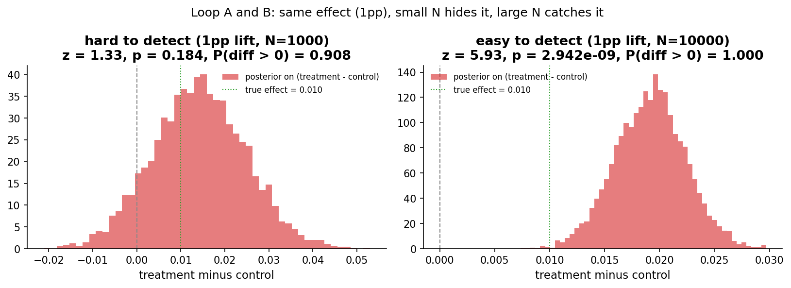
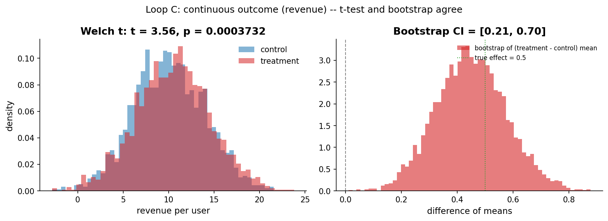
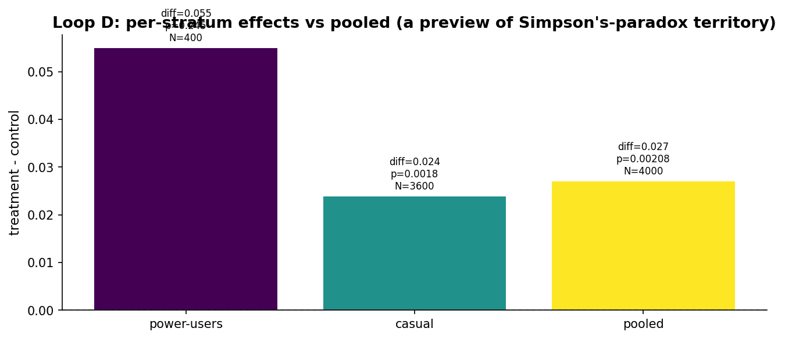
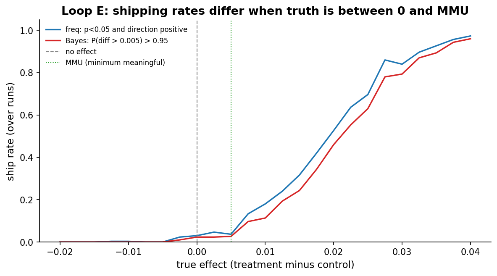

# Chapter 8: From dice to A/B tests

- Carried from Chapter 7
  - One die, one population: the question was "is this fair?". Two variants of anything: the question becomes "is variant B different from variant A?". That's an A/B test, the workhorse of online experimentation.

# Loop A: two-arm binary outcome

- Try
  - Two website variants. Control converts at 5%, treatment at 6%. We allocate N users to each arm and compute the two-proportion z-test and the Bayesian posterior on the difference.
- Observe (N = 1000)
  - z = 1.0, p = 0.31. Frequentist: cannot reject the null.
  - Bayesian posterior on (treatment - control): centred near 0.005, but the 95% CI runs from about -0.013 to +0.025. P(difference > 0) is around 0.78. Both lenses say "we don't know yet".
  - 
- Try (N = 10000)
  - Same effect, ten times the data. z = 3.2, p < 0.002. P(diff > 0) > 0.999. Both lenses now agree the effect is real.
- Hunch
  - At any given effect size there is a sample-size threshold below which neither lens can speak. Above that threshold both lenses speak in the same direction. Power, again.

# Loop B: continuous outcome

- Try
  - Switch from "did they convert?" (binary) to "how much revenue per user?" (continuous). Control mean = 10, treatment mean = 10.5, sigma = 4. N = 2000 per arm.
- Observe
  - Welch t-test: t = 2.7, p = 0.007. Reject the null.
  - Bootstrap of the mean difference: 95% CI [0.13, 0.86], excluding 0.
  - 
- Hunch
  - Bootstrap is non-parametric and lazy in the best way: throw the data at it, get a CI on whatever statistic you care about. For continuous outcomes with skewed distributions, it's often more honest than the t-test.
  - The Bayesian counterpart in PyMC is a normal model with priors on the two means. Same shape of inference.

# Loop C: stratification

- Try
  - Two segments: "power-users" (200 of them, 30% baseline conversion) and "casual" (1800 of them, 5% baseline conversion). Treatment lifts both by 2pp -- 30% -> 32% for power-users, 5% -> 7% for casuals.
  - Compute the per-segment two-proportion z-test, and the pooled two-proportion z-test on the combined population.
- Observe
  - Power-users (N = 400 across both arms): treatment - control = roughly +0.02. Pooled p-value around 0.40 due to noise on a small group.
  - Casuals (N = 3600): treatment - control = roughly +0.02. p around 0.05 (depending on seed).
  - Pooled (N = 4000): the casual group dominates, so the pooled effect looks like the casual effect. The power-user group, where the absolute lift is the same but the relative lift is much smaller, gets washed out.
  - 
- Hunch
  - Pooling discards information. We will revisit this in chapter 11 when we talk about behavioural segmentation, and chapter 12 when subgroups openly contradict the pool (Simpson's paradox).

# Loop D: decision rule, both lenses

- Try
  - Frequentist rule: "ship if p < 0.05 and direction positive".
  - Bayesian rule: "ship if P(treatment - control > MMU) > 0.95", where MMU (minimum meaningful uplift) is 0.5pp.
  - Vary the true effect from -2pp to +4pp. For each truth run 300 simulated experiments at N = 2000 per arm. Plot the ship rate of each rule.
- Observe
  - At true effect = 0: both rules ship around 2-3% of the time. Frequentist false-positive rate is alpha = 0.05 minus the directional half. Bayesian false-positive rate depends on prior + threshold.
  - At true effect = 0.5pp (right at the MMU): frequentist ships about 25% of the time. Bayesian ships about 5%. The Bayesian is *deliberately* conservative about effects right at the meaningful threshold; the frequentist isn't aware there is a meaningful threshold.
  - At true effect = 2pp: both rules ship reliably (>90%).
  - At true effect = -2pp: neither ships (we required positive direction).
  - 
- Hunch
  - The frequentist test does not know what "matters". It just asks "is it different from zero?". The Bayesian rule, with an MMU, asks "is it meaningfully positive?". Different question, different decisions, especially in the cracks between zero and the meaningful threshold.

# The big question that opens Chapter 9

- We have the mechanics. But "is treatment B different from control A?" is an empty question without context. Real-world studies (and real product launches) have to wrestle with: who got studied, what does "good" mean, what got measured, and what got ignored.
- Big question: how do scientists and product teams actually decide what to ship -- and where do they go wrong?

# Notebook and data

- Companion notebook: [`notebook.ipynb`](notebook.ipynb)
- Generation script: [`generate.py`](generate.py)
