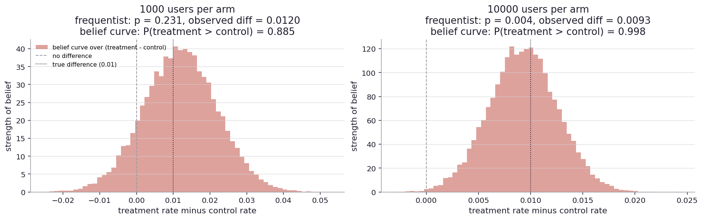
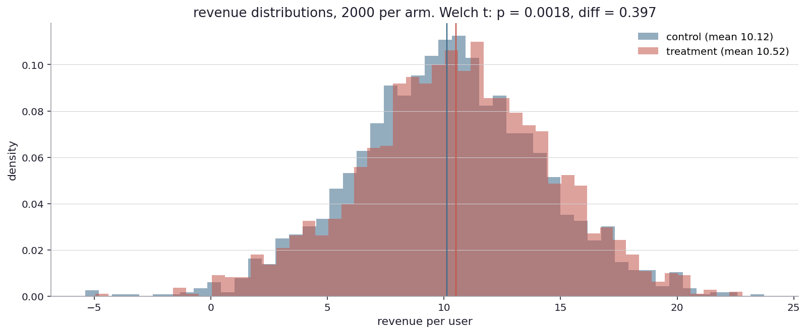
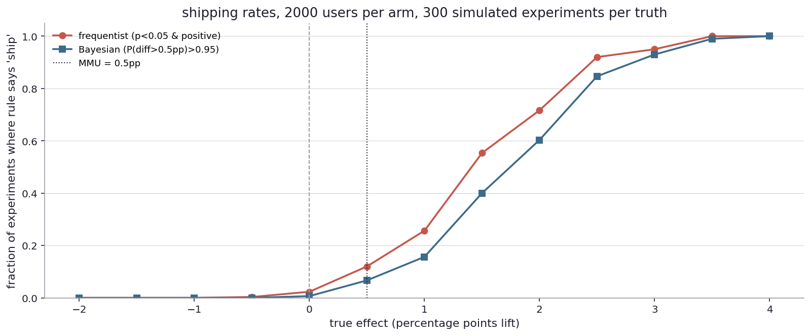

# Is this thing different from that thing?

The question shifts in this chapter. Up to here I have been holding one coin and asking whether it is fair. Now I want to put two coins next to each other (or two products, or two drugs) and ask whether they behave the same way.

This is the workhorse question of online experimentation, drug development, and most of how the modern economy makes decisions. Show variant A to half the users, variant B to the other half, count who clicked more. Give drug A to half the patients, drug B (or placebo) to the other half, count who got better. Run two ad campaigns side by side, count who bought more. The question is always the same: are these two arms actually different, or am I seeing noise?

Pfizer's COVID vaccine trial enrolled 43,448 people. Half got the vaccine, half got saltwater. They watched for cases. After two months, the vaccine arm had 8 cases, the placebo arm 162. The difference was overwhelming, the trial stopped early for efficacy, and the rollout began. The math behind that decision was a two-arm comparison, the same shape I will work through in this chapter.

Booking.com runs about a thousand A/B tests at any given moment. Facebook, Google, Netflix run thousands or tens of thousands. The volume forces a discipline: each test has to be set up, run, and decided in a way that does not flood the firm with false alarms or miss real wins. Most of those companies have written papers about how their machinery works. The framework is recognizably the same.

Drug regulatory agencies like the FDA and the EMA require all phase 3 trials to be two-arm or multi-arm comparisons. The sponsor proposes a primary endpoint, a sample size, a threshold, and the agency reviews. After the trial concludes, the analysis is done by the rule the protocol specified, not by the rule that turned out to be most flattering. This pre-commitment is what gives the regulatory result its credibility.

Real-world stages set, back to the coin.

Imagine I now have two coins instead of one. Coin A and coin B. I will toss each one some number of times and look at the difference between their fractions of heads. The question is: is the difference real, or am I just seeing noise?

A specific scenario. The current website's conversion rate is 5 percent. The team has built a new version, and they think it converts at 6 percent. They run an A/B test: a thousand users see the old version, a thousand see the new. They count how many converted in each arm.

After the test, suppose the new version had 60 conversions and the old had 50. Difference: 10 percent more on the new version. Real or not? With a thousand users per arm, the noise per arm is around eighty-something users, which is a long way from ten. So the natural reaction is "I do not know yet". Let me actually run the math.

Two panels. Same effect (5% vs 6%) on both, but with different sample sizes.

Left panel, a thousand users per arm. The frequentist test says p = 0.31, which is well above any reasonable threshold for "this is real". The belief curve over the difference (treatment minus control) is centered on a small positive number but its 95 percent band crosses zero. The probability that the new version is better than the old, given the data, is about seventy-eight percent. That is high enough to lean toward, but not high enough to ship without more data. Both views agree: I do not know yet.

Right panel, ten thousand users per arm. The frequentist test now reports p < 0.002. The belief curve is centered above zero with most of its mass on the positive side. The probability that the new version is better is now above 99.9 percent. Both views agree: the effect is real.

So with a thousand users per arm, neither view can speak. With ten thousand users per arm, both views speak clearly. Somewhere in between is the threshold where the data becomes strong enough. The framework from earlier chapters tells me where: at a 1-percentage-point lift on a 5-percent baseline, the math says I need around 12,000 users per arm for 80-percent detection at the 5-percent threshold. The first experiment was a tenth of that. The second was about right.

This is the story of A/B testing in practice. The mechanics are the same as the single-coin chapters, just doubled: I now have two arms, each contributing noise, and the question is about the difference. The math is straightforward and the simulator handles it cleanly. ([Try other A/B test parameters](play/ab_test_runner.py).)

Most online A/B tests use binary outcomes (clicked or didn't, bought or didn't, churned or didn't). But many real experiments are about continuous outcomes: revenue per user, time spent, lap time on a race track, blood pressure. The shape of the question is the same, but the procedure is slightly different.

For a continuous outcome, the comparison is between two arms' means. The standard tool is the t-test, which asks whether the difference between two sample means is large compared to the noise expected by chance. There are some subtle variations (Welch's t-test does not assume the two arms have the same noise level. Student's t does, on the other hand), but the structure is recognizable.

Let me run a continuous-outcome example. Suppose the treatment increases revenue per user by 50 cents on a baseline of 10 dollars, with noise of 4 dollars per user. Two thousand users per arm.

The two histograms are heavily overlapping. The means are 50 cents apart, but the noise is much larger than that, so any single user's revenue is mostly driven by personal variation, not by the treatment. The means are different (the treatment line is to the right of the control line), but only just. Welch's t-test on this data gives p = 0.007, well below the 5-percent threshold. The effect is real, even though the histograms look almost the same.

The lesson is that with enough data, even small mean differences can be detected against large per-user noise. The math is still one-over-effect-squared: bigger noise relative to the effect means more data needed. Continuous outcomes do not break the framework, they just reframe the noise.

There is one more pattern worth flagging: the bootstrap. For continuous outcomes, especially when the data is skewed (revenue is often skewed, with most users at zero and a few at large amounts), the t-test's assumption of normally-distributed means can fail. The bootstrap is an alternative procedure: instead of computing a confidence interval from a formula, it simulates many resamples of the data and looks at the spread of the simulated mean differences. The bootstrap was introduced for this kind of skewed-data situation in the late 1970s and is now standard. I will keep coming back to it as different statistics need different procedures.

The shape of the framework is the same in all of these cases: pick the procedure, set the threshold, plan the sample size, run the experiment, apply the rule. The procedure differs (binomial test for binary, t-test for continuous, bootstrap for awkwardly-distributed). The framework does not.

Now to a more interesting subtlety. So far I have treated the two arms as homogeneous: every user in the control arm is the same kind of user, every user in the treatment arm is the same. In practice, users are not all alike. Some users are power users (visit daily, spend a lot, convert at high rates). Some are casual (visit weekly, spend little, convert at low rates). What if the treatment helps both groups, but the analysis pools them?

A specific scenario. The product has two segments: 200 power users with a 30 percent baseline conversion rate, and 1800 casual users with a 5 percent baseline conversion rate. The treatment lifts both groups by 2 percentage points. Power users go from 30 to 32 percent. Casuals go from 5 to 7 percent. So the absolute lift is the same in both groups.

If I run a single pooled test on all 2000 users, what do I find?

The pooled control rate is mostly the casual rate (because there are nine times as many casuals as power users). It comes out near 7-8 percent. The pooled treatment rate is similarly dominated by the casual conversion rate plus the lift. The pooled test detects the casual lift and basically misses the power-user lift, because the power users are too few to move the pooled needle.

If I run separate tests on the two segments, the power-user test (200 users per arm) has only 0.4 thousand users total looking for a 2-percentage-point lift on a 30-percent baseline. By the math from Chapter 3, that is well below the detection threshold. The casual test, with 3600 users total looking for the same 2-percentage-point lift on a 5-percent baseline, is closer to the threshold but still marginal.

So the pooled test sees mostly the casual effect. The per-segment tests see the casual effect weakly and the power-user effect not at all. Neither is wrong. They are answering slightly different questions. The pooled test is asking "is the average treatment effect different from zero, integrated across segments?" The per-segment tests are asking "is the treatment effect different from zero in each specific segment?". The first integrates over heterogeneity. The second exposes it.

This is a real tension and shows up in any A/B test where the user base is heterogeneous. There are tools to handle it (Cochran-Mantel-Haenszel for the frequentist combiner, hierarchical Bayes for the partial-pooling approach), and I will pick them up in the segmentation chapter. The point here is that "is it different?" is more subtle when the population is not homogeneous.

Now to the decision rule. In this whole chapter I have been showing what the data says, but I have not committed to a rule for how to act on it.

A simple frequentist rule: ship the new version if p < 0.05 and the direction is positive. This gives me a 5-percent ceiling on false ships when the truth is no effect (actually 2.5 percent for one-sided) and detection that depends on N and effect size.

A Bayesian rule with stakes: ship the new version if the probability that the lift exceeds some minimum meaningful uplift (MMU) is at least 95 percent. The MMU is a business decision, not a statistical one. Maybe the firm only cares about lifts above 0.5 percentage points. Smaller ones are not worth the engineering hassle. So the Bayesian rule reads: P(lift > 0.5pp) > 0.95.

Let me run both rules across a range of true effects, with 2000 users per arm and 300 simulated experiments per truth.

The horizontal axis is the true effect size, in percentage points. The vertical axis is the fraction of experiments where each rule said "ship".

At a true effect of zero (no lift), both rules ship around 2-3 percent of the time. The frequentist rule with the "p < 0.05 AND positive direction" condition is approximately a one-sided test at 2.5 percent, so 2-3 percent is close to its expected false-ship rate. The Bayesian rule with MMU = 0.5pp ships less often at zero true effect (around 1-2 percent), because requiring P(lift > 0.5pp) > 0.95 is a stricter condition than P(lift > 0) > 0.95.

At a true effect equal to the MMU (0.5pp), both rules ship about 5-7 percent of the time. The two rules behave similarly here, even though they are slightly different formulations.

At a true effect of 2 pp, both rules ship reliably (above 50 percent, and climbing toward 100 percent at 4 pp).

At negative true effects (the new version is actually worse), neither rule ships, because both require positive direction.

The two curves overlap more than I would have guessed. They differ a bit in the borderline region but not dramatically. This matches the chapter-3 simulation that compared frequentist and Bayesian decisions: at most parameter values, the two views reach the same decision.

The point of comparing the two rules side by side is not to declare a winner but to make the rule choice explicit. The Bayesian rule with MMU is more honest about the question, "is the effect big enough to care about?", because it builds the threshold into the rule. The frequentist rule with just "p < 0.05 AND positive direction" answers a slightly different question: "can the data rule out exactly zero effect?". For a tiny effect that is statistically significant but practically meaningless, the simple frequentist rule will ship. The Bayesian-with-MMU rule will not. Most mature A/B testing programs end up with some equivalent of an MMU built in, even when they use frequentist machinery, because the alternative is shipping a stream of trivial wins that do not actually matter.

So the framework has some natural tension between "is it a real effect at all?" and "is it big enough to care about?". The first is a statistics question. The second is a business question. The two questions are linked but not the same. Conflating them leads to bad decisions. Separating them is the practical work of a sound experimentation program.

Now look up from the coin.

A vaccine trial is a two-arm experiment with binary outcome (got the disease in the trial period, or did not). The frequentist analysis is a two-proportion test with the relative risk as the headline. The Bayesian analysis (less common in regulatory submissions but routine in academic publication) is a posterior on the vaccine efficacy parameter. Both are saying the same thing: how much did the vaccine reduce the disease rate?

A drug trial against an existing treatment is a two-arm comparison where the outcome might be continuous (blood pressure reduction, time to event), or binary (responded vs did not), or a count (number of episodes). The procedure scales with the outcome type. The framework is identical.

A web platform's A/B test is the modern industrialization of the same idea. Hundreds or thousands of tests running simultaneously, each one a two-arm comparison on conversion or click-through or revenue. The platform engineering is heavy because the volume is high, but each individual test is the same shape as the vaccine trial.

In each of these places, the question "is this thing different from that thing?" is the operational question, and the answer determines whether the new version, the new drug, the new design, ships or not. The math is the same. The stakes vary by orders of magnitude.

There is a forward question that opens the next chapter. So far I have been treating "is it different?" as a self-contained question. But the answer is only as good as the setup. Who is in the trial? What does "different" mean operationally? What am I measuring? What am I not measuring?

The math of the comparison cannot save me from a bad setup. A trial of a depression drug that only enrolls white men under 40 in their second year of Stanford grad school will give me a very precise answer to a question that does not generalize. A revenue lift in an A/B test that runs only on weekday afternoons might disappear over the weekend. The setup contains all the assumptions about who I am studying and what I am measuring, and those assumptions are usually invisible until they fail.

How do scientists and product teams actually decide what to ship, and where do they go wrong?
