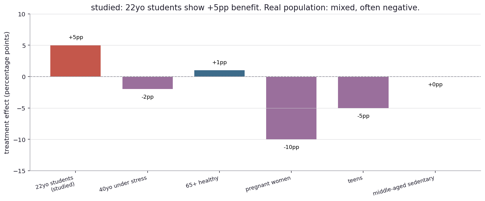
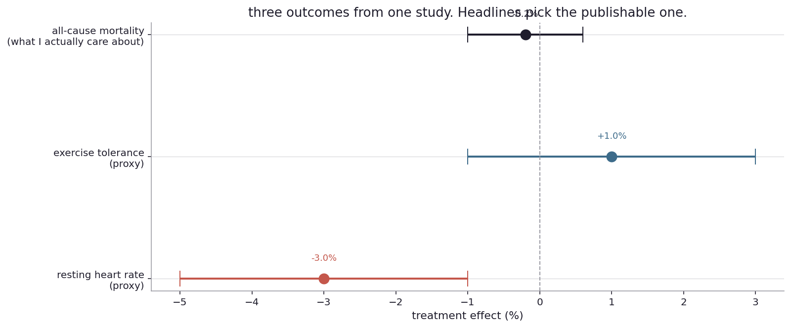
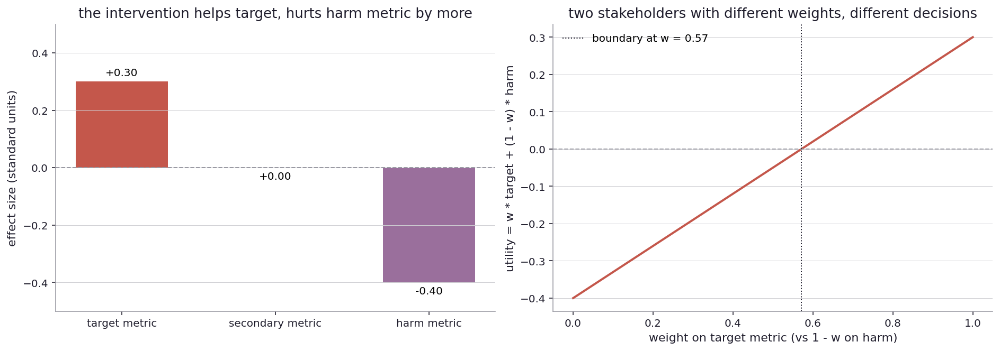

# Who got studied, and what got measured?

I left the last chapter with a quiet uneasiness. The math of two-arm comparison works. The procedures are honest. But the answer to "is this thing different from that thing?" is only as good as the setup. Who was in the trial? What does "different" mean? What was measured? What was not?

This is the chapter where the math gets out of the way and the design choices step in. I will keep the simulator, but the questions are mostly about what is hiding in the small print of any real study.

Real-world stage first.

The famous "moderate red wine consumption is good for your heart" headlines (running roughly from the 1980s through the 2010s) came largely from observational studies of European populations. The studies typically compared moderate drinkers to non-drinkers and found lower rates of cardiovascular disease in the drinkers. The headlines wrote themselves: "wine is good for your heart". The catch is that the non-drinker group was not random. It included recovering alcoholics, people who had stopped drinking due to health problems, and people who had never drunk for cultural or religious reasons. The non-drinker group was, on average, sicker than the drinker group, before any wine ever entered the picture. The 2018 reanalysis by Stockwell and others found that controlling for the prior health of the comparison group eliminated most of the apparent benefit of moderate drinking. The headline had been built on a comparison group that was not really comparable.

A 2003 Vioxx (rofecoxib) trial showed favorable cardiovascular outcomes compared to placebo. The drug was approved. Three years later, withdrawal followed because subsequent observational data on a wider population showed substantial cardiovascular harm. The original trial had been internally valid (its analysis was correct) but externally limited (the people in the trial did not match the people who would take the drug in the real world).

A 2011 paper claimed evidence of psychic precognition (Bem, JPSP) using standard statistical methods. The internal analysis was correct given the chosen procedures. The procedures themselves built in degrees of analyst freedom (which trials to include, when to stop, which exact statistic to report) that, applied to a question with strong prior implausibility, produced a positive result that then failed to replicate.

In each of these places, the math was running honestly inside its bubble. The bubble's boundary was the problem. Who was in the study? What was being compared to what? What outcome was being measured, and why?

Back to the coin.

The cleanest version of the problem is to imagine a treatment that I want to evaluate. I run a tight, well-controlled experiment in some specific population. The experiment shows a clear positive effect. So far, so good. The question is: what does the result tell me about a different population?

Let me make this concrete with a fake but plausible scenario. Suppose I want to evaluate whether a daily glass of wine reduces the rate of some bad cardiovascular outcome. I run my study in 22-year-old college students because they are the easiest to recruit, follow up with, and pay. I randomize 1000 to wine, 1000 to no wine, follow them for a year, and measure the outcome. I find that the wine group has a 5-percentage-point lower rate.

Both lenses agree on the studied data. The frequentist test gives a p-value around 0.001. The belief curve over the difference is centered at +5 percentage points with the 95-percent band well clear of zero. Real, by any standard.

The headline writes itself: "wine reduces heart-disease risk by 5 percentage points".

Now apply the same intervention to a real population, the kind of mix I would actually find in a country: 10 percent college students, 20 percent middle-aged people under stress, 20 percent healthy retirees, 5 percent pregnant women, 10 percent teenagers, 35 percent middle-aged sedentary adults. The intervention does different things in different segments.

The studied bar is the +5 percentage points I would write in the press release. The other bars are what the same intervention does in segments that were not studied. Pregnant women: -10 percentage points (substantial harm, because alcohol in pregnancy is a known teratogen). Teens: -5 percentage points (developmental and accident-related harm). Forty-year-olds under stress: a slight harm. Sedentary middle-aged adults: nothing detectable. Healthy retirees: a tiny benefit.

If I weight these by the segment shares to get the population-wide average effect, the answer is approximately negative. The intervention, applied to the actual population I claim to be helping, on average makes things worse. The "wine reduces heart disease by 5 percentage points" headline is a true statement about 22-year-old college students, and a misleading statement about everybody else. The mistake is not in the math. It is in the leap from the studied population to the general population.

Statisticians call this the external validity problem, or sometimes transportability. There is a formal literature on when an internally valid effect can be carried to a new population (the conditions involve the joint distribution of treatment, outcome, and covariates being the same in both populations, which is rarely true), but for everyday reading the lesson is simpler. Studies are typically designed for internal validity (the analysis is correct for the people in the study). The press release is about external validity (the effect generalizes). The two are different, and the gap is where most "X is good for you" stories live.

The specific lesson for the wine example: even if the studied effect is real in the studied population, I cannot reliably project it to a different population without knowing how the effect varies across subgroups, and I cannot know how it varies without studying those subgroups. The default assumption ("the treatment behaves the same way in everybody") is rarely true and is the part the headline does not say.

There is a slightly different version of this trap, and it gets less press but matters as much.

A treatment can have a real positive effect on the studied outcome, while also having other effects the study did not measure. If the unmeasured effects are negative, the headline is misleading even when the headline number is correct.

A specific example. The wine study measured cardiovascular events. Suppose I had also measured liver function, alcohol-related accidents, sleep quality, cognitive function, and risk of breast cancer in women. The wine arm might show worse outcomes on every other measurement. The "wine reduces cardiovascular risk by 5 percentage points" headline is technically true and clinically misleading, because the overall health picture is dominated by the harms.

This is the outcome-choice trap. The study has to pick what to measure, and that choice is doing a lot of the work of "what does this drug do?". A drug company that picks a favorable outcome can get a true positive result that does not represent the overall picture.

Three outcomes from one hypothetical study. The first is resting heart rate, which the wine reduces by about 3 percent (clinically meaningful for cardiovascular risk). The second is exercise tolerance, which is roughly unchanged. The third is all-cause mortality, the outcome people actually care about, which is essentially flat with a wide error bar.

The first outcome is the publishable one. The third is the one that matters. Choosing which one to feature is a decision the reader does not see. The data are all real. The framing makes one a story and the others footnotes.

This is also why aggregate "all-cause" outcomes are usually preferred by people who study health rigorously. Specific outcomes can be cherry-picked. All-cause mortality is hard to game. If the drug helps cardiovascular outcomes but kills people through some other mechanism, all-cause mortality catches it. Most chronic-disease outcomes are individual-cause. All-cause is the ground truth.

Now to a third trap, which is structurally different from the first two.

A treatment can have multiple measured effects, some positive, some negative. What matters for the decision is the trade-off. The data do not make the trade-off. That is a values choice.

A specific example. Suppose I have a wine intervention with three measured effects: a positive target effect (+0.30 on cardiovascular events), a neutral secondary effect (no change in some other outcome), and a negative harm effect (-0.40 on liver outcomes). The data are clear: the intervention helps the target, hurts the harm metric by more.

Left panel: the three effects, side by side. The target is positive, the harm is more negative. On any single-metric reading, this intervention is bad. On the target-only reading, it is good.

Right panel: the utility weighting. If I weight the target metric at w (and the harm at 1 - w), the combined utility is w * 0.30 + (1 - w) * (-0.40). The line crosses zero at w ≈ 0.57. Below that weight, the combined utility is negative (the harm dominates). Above, positive (the target dominates).

So two stakeholders with different weights, looking at the same data, will make different decisions. A cardiologist who only weighs cardiovascular benefit will favor the intervention. A liver specialist will not. Neither is reading the data wrong. They have different utility functions. ([Try other weight combinations](play/utility_explorer.py).)

This is what a real decision actually looks like once the data are in: a posterior on each outcome, a weighting across outcomes, and a threshold. The first piece is statistical. The second and third are values questions, and they belong to the decision-maker, not the analyst. Most public-health debates that look like fights about "the data" are actually fights about the weighting, which the data cannot settle.

Now look up from the coin (and the wine).

A drug trial designed for one population (often middle-aged white men, the most common demographic in classical drug trials) gets approved on the basis of effects in that population. The drug then enters the market and is taken by women, children, elderly people, and people of all ethnicities. Sometimes the drug works the same in all groups. Sometimes it does not. The 1990s push for sex-specific dosing of zolpidem (Ambien) came after years of women receiving doses calibrated for men, and waking up groggy in the morning more often than men did. The drug was internally valid in its trials. It was externally limited in a way that was not corrected for two decades.

A psychology study finds an effect in undergraduates at one Midwestern university. The headline implies the effect generalizes to humanity. Sometimes it does. Often it does not. The shorthand "WEIRD" (Western, Educated, Industrialized, Rich, Democratic) entered the literature in 2010 to capture how unrepresentative most psychology samples are.

A web company runs an A/B test on the visitors who happen to be on the website during the test period. Power users behave differently than first-time visitors, mobile users different from desktop, weekday traffic different from weekend. A test that runs for one week and ships based on its result is implicitly assuming the population on that one week is representative of the longer-term population. Sometimes it is, sometimes a holiday or a marketing campaign makes it weird.

In each of these places, the same external-validity question is hovering. The math is fine inside the study. The leap to "and therefore in the world" is not a math question. It is a sampling question, an outcome-choice question, a side-effect question, and a weighting question, all stacked together. None of them are visible in the headline.

The reason this matters is that most readers (and most decision-makers) do not read the small print. They read the headline. The headline is engineered to be readable, which means engineered to omit the caveats. If the math has done its job, the caveats are still in the paper, in some appendix or footnote, often in numbers most people cannot read. The defense against being misled is not better math. It is a willingness to read the small print, or at least to ask whether the small print exists.

There is a forward question that opens the next chapter. So far I have been describing classical research traps: who got studied, what got measured, what got missed. But in industry, where I am running an A/B test instead of a clinical trial, the same traps show up in different costumes. The metric is "did they click?" instead of "did they survive?". The time horizon is one week instead of ten years. The cost of being wrong is small (revert the change) rather than catastrophic (recall the drug). Yet the structural problems are the same.

What shape do these problems take in industry experimentation, where the metric is "did they click?" and the time horizon is one week?
