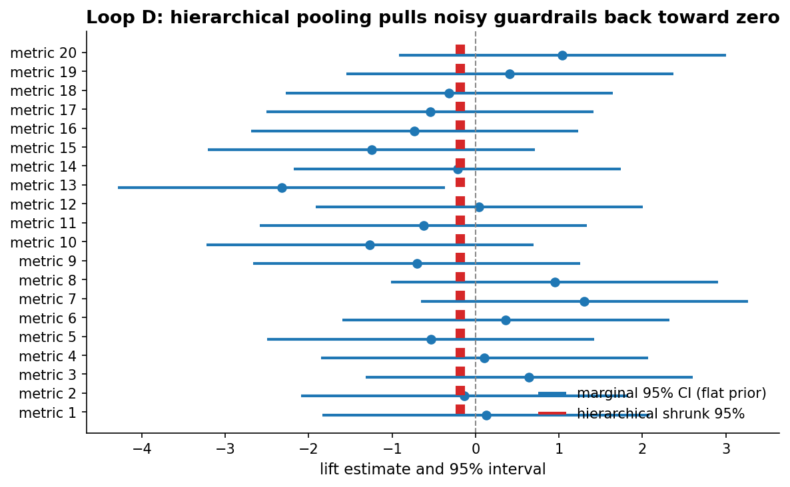

# Chapter 10: Industry experimentation

- Carried from Chapter 9
  - In industry, samples are huge, the cycle is fast, and one metric tends to dominate everything: clicks. The wine-and-small-print pathologies show up in tech-flavoured forms.

# Setup: industry runs on averages

- Framing
  - The default product summary is "the average user clicked 4% more". This is a single number on a population-wide proxy.
  - Already two implicit choices were made: "average" (over what population?) and "click" (vs which other metric we could have measured?).
  - This is framing, not a full inquiry loop. The two implicit choices are exactly what the loops below probe: Loop B questions "which metric", Loop C questions "which population".

# Loop B: short-term clicks vs long-term retention

- Try
  - Simulate a feature where treatment users click more on day 1 (+10%), with the lift decaying over a week, but their 7-day retention drops by 5pp by day 30 because the feature was clickbait. Plot both curves over time.
- Observe
  - Day 1: +10% clicks. Day 7: +3% clicks. Day 30: -1% clicks but -5% retention.
  - At day 7 (the typical experimentation horizon) the click win is real. The retention loss has barely started showing.
  - 
  - These curves are illustrative shapes (deterministic exponential decays), not fitted to data. The pure exponential form is a convenient cartoon. Real novelty curves vary in shape: some plateau, some collapse abruptly when the novelty wears off, some dip and recover. The qualitative point (a short-horizon click win can hide a long-horizon retention loss) holds across those shapes.
- Hunch
  - "Did they click?" is fast and easy to measure. "Did they come back next month?" is what actually matters. The cheaper metric tends to win because it's the one we can read in a 1-week experiment.
- Decision question
  - Both stories are true at day 7: clicks are up, retention has barely begun to decay. Which metric do you ship on, and why?
  - Shipping on clicks is defensible only if you genuinely believe the day-30 retention curve will not bend further. If the mechanism is novelty, that belief is wrong by construction. The honest answer is: do not ship on a 1-week click win when the long-horizon metric is still in motion. Either extend the horizon, or pre-commit to a retention-based ship rule before the experiment starts.

# Loop C: averages hide structure

- Try
  - Same launch. Aggregate click-rate lift = +4%. Slice by engagement level: most engaged 10% are -2%, moderately engaged 30% are +3%, long tail 60% is +6%.
- Observe
  - The headline metric is technically true. The most engaged users (your most valuable cohort) got *worse*. The lift comes from the long tail (less valuable, more easily nudged).
  - 
  - The cohort lifts and fractions are illustrative numbers, chosen so the aggregate stays positive while the highest-value cohort regresses. The shape of the pathology is what matters, not the exact percentages.
- Hunch
  - A single number for "the user" is fiction. It's an average over wildly different cohorts. Often the cohort that loses ground is the one you care most about.

# Loop D: guardrails proliferate the multiple-comparisons problem

- Try
  - Industry teams check 20 guardrail metrics ("did anything regress?"). Under the null (all 20 metrics flat), how often does at least one fire at p < 0.05?
- Observe
  - Naive: 64% of runs trigger at least one false alarm. Insane.
  - Bonferroni-corrected (each at 0.05/20): about 5%, as designed.
  - 
  - The 64% number is the independence upper bound: the simulation draws p-values uniformly under H0 with no cross-metric correlation. Real guardrail metrics (sessions, clicks, time-on-page) share variance, so the family-wise alarm rate inflates less than this in practice. The qualitative story (checking many metrics with no correction is broken) is unchanged.
- Compare
  - Bayesian flavor, done right. A flat-prior Bayesian fit per metric does not protect you. A marginal credible interval that excludes zero behaves much like the naive frequentist test, and reading 20 such marginals reproduces the family-wise blow-up. "Bayesian" alone is not the answer.
  - The mechanism that actually helps is hierarchical Bayes with partial pooling. Treat the 20 metric lifts as draws from a population distribution with unknown mean and variance. Each individual lift posterior gets pulled toward the population mean ("shrinkage"), and the more candidate lifts you throw in, the more aggressively the model regularizes the noisy ones. False alarms shrink because the model has learned that most of the 20 metrics are flat.
  - In PyMC sketch form: tau_lift ~ HalfNormal(.), mu_lift ~ Normal(0, .), lift_i ~ Normal(mu_lift, tau_lift), observed metric_i ~ Normal(lift_i, sigma_i). The hyperprior on tau_lift is what does the work. The fix is decision-theoretic too: pick a loss function over the joint (e.g., expected number of false launches), and let the hierarchical posterior drive the decision rather than counting marginal CI exclusions.
  - 
  - The figure shows 20 guardrails simulated under H0. The orange marginal CIs (flat prior per metric) are wide and a few exclude zero by chance. The teal hierarchical posteriors pull each estimate toward the shared population mean, and the intervals that were flirting with zero tuck back in. This is the mechanism that the Bonferroni threshold mimics by brute force.

# The big question that opens Chapter 11

- Aggregates lie. Demographic slicing helps a little. The pathology in Loop C wasn't really about country/age/gender -- it was about behaviour.
- Big question: which segments are worth segmenting on, beyond the surface demographic ones?

# Notebook and data

- Companion notebook: [`notebook.ipynb`](notebook.ipynb)
- Generation script: [`generate.py`](generate.py)

# expkit modules exercised

- Currently used in the visible text and notebook
  - `expkit.plot.style.apply_style` for consistent figure styling.
- To be exercised when the chapter is fleshed out
  - `expkit.power` for sizing the guardrail family in Loop D (how many metrics, at what alpha, can a team afford before the family-wise rate becomes unmanageable).
  - `expkit.inference` for the per-metric tests behind the guardrail panel and for the click vs retention comparisons in Loop B.
  - `expkit.inference.bayes` (and a hierarchical PyMC model built on top) for the partial-pooling rewrite of Loop D's Bayesian section.
