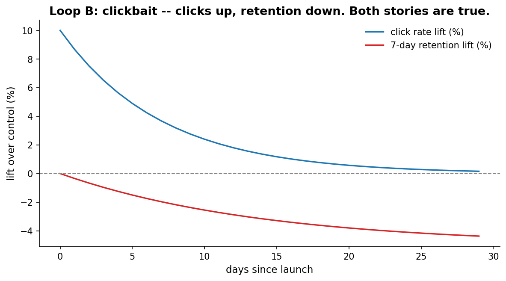
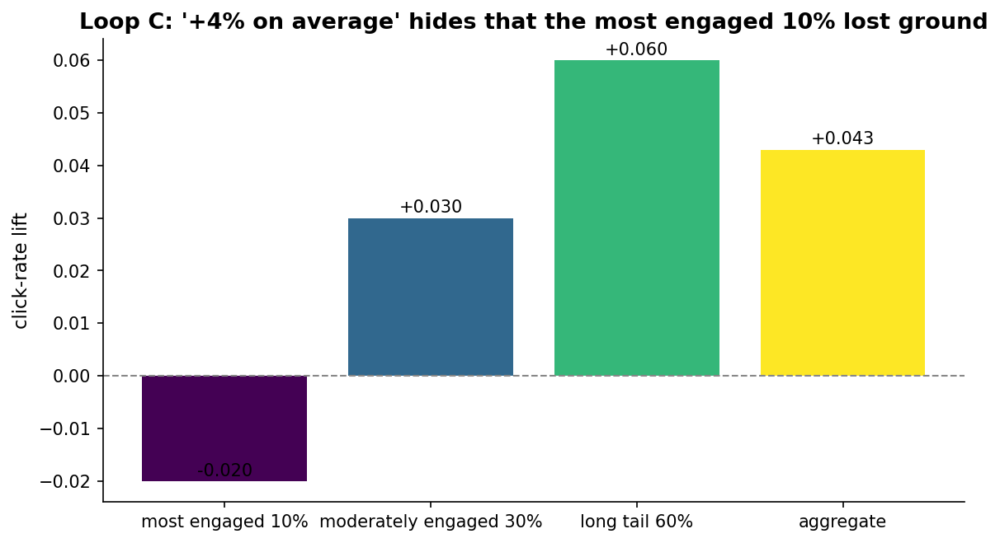
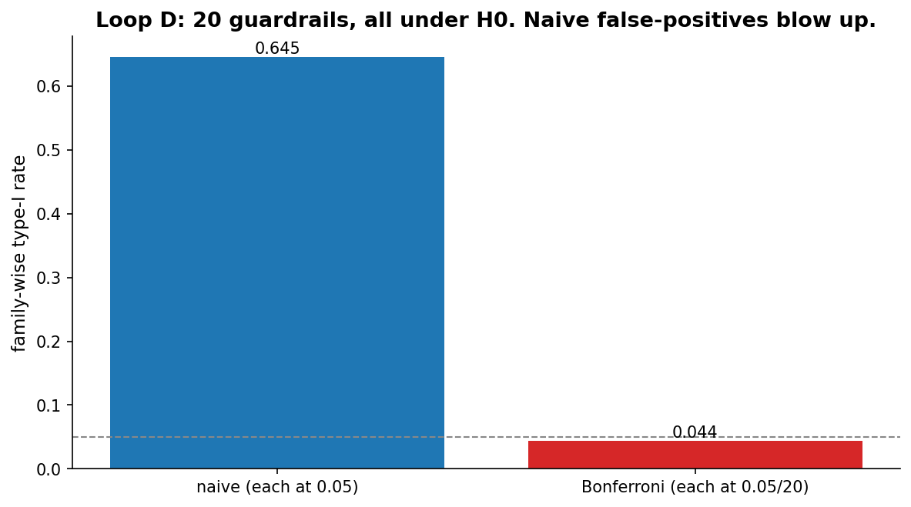

# Chapter 10: Industry experimentation

- Carried from Chapter 9
  - In industry, samples are huge, the cycle is fast, and one metric tends to dominate everything: clicks. The wine-and-small-print pathologies show up in tech-flavoured forms.

# Loop A: industry runs on averages

- Try / observe
  - The default product summary is "the average user clicked 4% more". This is a single number on a population-wide proxy.
  - Already two implicit choices were made: "average" (over what population?) and "click" (vs which other metric we could have measured?).

# Loop B: short-term clicks vs long-term retention

- Try
  - Simulate a feature where treatment users click more on day 1 (+10%), with the lift decaying over a week, but their 7-day retention drops by 5pp by day 30 because the feature was clickbait. Plot both curves over time.
- Observe
  - Day 1: +10% clicks. Day 7: +3% clicks. Day 30: -1% clicks but -5% retention.
  - At day 7 (the typical experimentation horizon) the click win is real. The retention loss has barely started showing.
  - 
- Hunch
  - "Did they click?" is fast and easy to measure. "Did they come back next month?" is what actually matters. The cheaper metric tends to win because it's the one we can read in a 1-week experiment.

# Loop C: averages hide structure

- Try
  - Same launch. Aggregate click-rate lift = +4%. Slice by engagement level: most engaged 10% are -2%, moderately engaged 30% are +3%, long tail 60% is +6%.
- Observe
  - The headline metric is technically true. The most engaged users (your most valuable cohort) got *worse*. The lift comes from the long tail (less valuable, more easily nudged).
  - 
- Hunch
  - A single number for "the user" is fiction. It's an average over wildly different cohorts. Often the cohort that loses ground is the one you care most about.

# Loop D: guardrails proliferate the multiple-comparisons problem

- Try
  - Industry teams check 20 guardrail metrics ("did anything regress?"). Under the null (all 20 metrics flat), how often does at least one fire at p < 0.05?
- Observe
  - Naive: 64% of runs trigger at least one false alarm. Insane.
  - Bonferroni-corrected (each at 0.05/20): about 5%, as designed.
  - 
- Compare
  - Bayesian flavor: a posterior over the joint of all 20 metric lifts. Reading marginals doesn't blow up the family-wise rate -- the prior + likelihood machinery accounts for the joint already. Cost: more compute and more model effort.

# The big question that opens Chapter 11

- Aggregates lie. Demographic slicing helps a little. The pathology in Loop C wasn't really about country/age/gender -- it was about behaviour.
- Big question: which segments are worth segmenting on, beyond the surface demographic ones?

# Notebook and data

- Companion notebook: [`notebook.ipynb`](notebook.ipynb)
- Generation script: [`generate.py`](generate.py)
