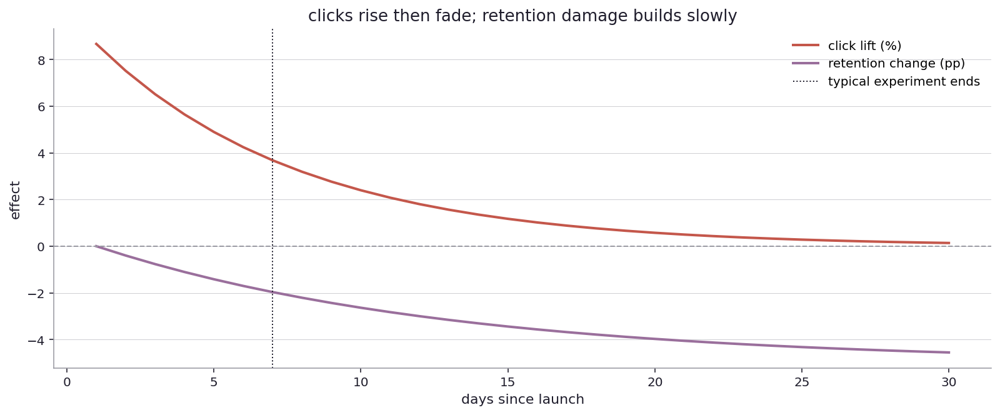
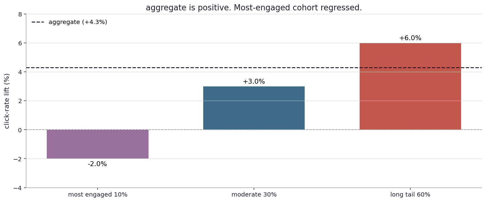
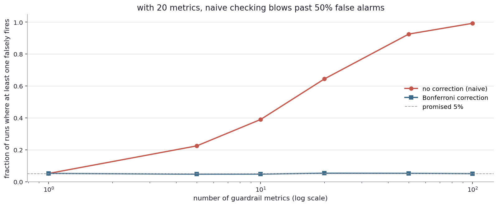

# Did they click, and does it actually matter?

I left the last chapter with the four traps of clinical research, where the math runs honestly but the framing of the study determines the answer. Industry experimentation, the world of A/B tests at tech companies, hits the same traps in different clothes. The differences make the failures faster, larger in scale, and (sometimes) cheaper to fix.

Real-world stage first.

Yahoo's news team in the late 2000s ran an extensive set of A/B tests on headline wording. They found that headlines optimized for click-through rate were systematically more sensational and shorter than the editorial team's defaults. After several years of click-optimized headlines, Yahoo's reputation for serious news collapsed and traffic eventually fell as users moved to other outlets. Each individual A/B test had been correctly run. Each had given a clear positive answer on the click metric. The aggregate trajectory was a slow erosion of the long-term metric (loyal traffic) by way of optimizing the short-term metric (clicks).

YouTube's recommendation algorithm was famously optimized for watch time in the mid-2010s, leading to a documented drift toward more sensational content. The metric was hitting its target. The product was drifting in a direction the company eventually decided to correct.

Facebook's News Feed in the 2010s prioritized engagement (likes, shares, comments). The metric went up. The downstream effects (anger amplification, conspiracy spread, polarization) only became visible to the company in internal research that took years to surface. The Wall Street Journal's 2021 "Facebook Files" series documented the lag between metric optimization and the realization that the metric was the wrong thing to optimize.

Booking.com publishes detailed engineering accounts of running A/B tests at scale: about a thousand simultaneous tests, careful guardrails, hierarchical priors on metric drift. They have written about specific cases where short-horizon click wins reversed completely once long-horizon revenue caught up.

In each of these places, the trap was not that the math failed. The math worked. The company shipped what the math said to ship. The aggregate of those decisions, played out over years, was sometimes the wrong direction.

Back to the simulator.

The simplest version of the trap is short-term wins that hide long-term losses. Suppose I run a feature that boosts clicks initially, but the boost is from clickbait: novel-feeling headlines that lure users in once and then disappoint them. After a month, the same users are less likely to come back. The click metric is still up early on, but the retention metric has started to dip.

Two curves, both versus days since launch. The orange-red line is click lift, peaking around +10 percent on day 1 and decaying toward zero by day 30 as the novelty wears off. The purple line is retention change, which is roughly zero at day 1 (the user has not had time to not-come-back yet) but slowly accumulates a -5 percentage point loss by day 30.

The vertical dashed line is day 7, the typical horizon for an A/B test in industry. At that point, the click lift is still positive (around +3 percent) and the retention loss has barely registered (a few tenths of a percentage point). If I am running a one-week test and shipping based on the click metric, I ship. The retention damage is invisible at the moment of decision.

The honest test would either run for thirty days (an expensive proposition because it ties up traffic) or pre-commit to a retention-based rule before the test starts. Most teams do neither, because the time cost is real and the click metric is what the experimentation platform is built around. The default is to optimize the easy-to-measure metric, and the easy-to-measure metric is rarely the one that matters for the long-term product. ([Try different horizons yourself](play/clickbait_simulator.py).)

The shape of this trap is not unique to clickbait. Anywhere there is a short-term proxy and a long-term outcome that diverge, the proxy is what the experimentation horizon catches and the outcome is what the business depends on. The trap recurs across many product domains: short-term engagement vs long-term subscription churn, short-term ad click vs long-term brand trust, short-term load time vs long-term frustration that builds across sessions.

The next trap is about averages.

A launch shows an aggregate +4 percent click lift across all users. The headline number is real. The team ships. Six months later, the most-engaged users (the most valuable cohort) have churned at higher rates than expected, and the click lift has come from low-value users who were nudged into one-off interactions but never invested in the product.

Three cohorts. The most-engaged 10 percent of users had a -2 percent click change (they got worse). The moderately-engaged 30 percent had +3 percent (slight improvement). The long tail 60 percent had +6 percent (a big lift). The aggregate, weighted by cohort size, is +4.0 percent (the dashed horizontal line). The headline is true. The story behind it is that the product became more clickbait-y for users who do not invest much in it (and who responded to clickbait), and made the experience worse for the users who actually drive the business.

This is a structural issue with averages. The average is over a heterogeneous population. The lift in the average can come from any subset of the population. Worse, the lift can be in the subset that I do not care most about, while the cohort I do care about is silently regressing.

The fix is the same fix that came up in the wine chapter: do not just report the aggregate. Slice by cohorts that matter to the business (engagement level, tenure, revenue percentile, geography), and look at each slice. If the launch is bad for any of the cohorts that matter, do not ship just because the aggregate is good. The decision should depend on which cohorts I am willing to harm. ([Reweight the cohorts yourself](play/aggregate_cohort_simulator.py).)

Industry teams that have been bitten enough times build this into their experimentation platform. Booking.com, Microsoft, Netflix all have published machinery for cohort-aware analysis, including segment-level guardrails and minimum-effect requirements per cohort. The mature programs treat the aggregate as a summary statistic, not a decision input.

The third trap is multiple comparisons in the form of guardrail metrics.

A typical industry A/B test does not just measure the primary metric (the thing the team is trying to improve). It also monitors a set of guardrail metrics: error rates, latency, revenue, engagement on adjacent surfaces, churn risk. The idea is to catch unintended damage. With twenty guardrails, no real effect, and each guardrail tested independently at five percent significance, what fraction of innocent launches will trip at least one alarm?

The chart shows naive (no correction) and Bonferroni-corrected false-alarm rates as a function of the number of guardrail metrics. With one metric, the naive rate is 5 percent (as designed). With ten, it is around 40 percent. With twenty, around 64 percent. With a hundred, essentially every fair-launch test trips at least one false alarm.

The Bonferroni-corrected line stays at five percent regardless of the number of metrics, by tightening the per-metric threshold. The price is each individual test gets harder to clear, which means real regressions are sometimes missed. But at twenty metrics, the alternative is that two-thirds of fair launches get false-alarm panics. Most industry teams pick the corrected version. ([Run this simulation yourself](play/guardrail_simulator.py).)

There is a Bayesian flavor of this fix that often works better in practice. Treat the guardrail metrics as draws from a population: most metrics are flat or near-flat, a few might be moving. A hierarchical Bayesian model learns the population's variance and shrinks each individual metric's posterior toward the population mean. Metrics that look like outliers get pulled back toward zero unless the data is very strong. Metrics that look consistent with the population stay put. The shrinkage automatically does the work of multiple-comparisons correction without committing to a specific Bonferroni-style rule. I will pick this up in the segmentation and hierarchical chapters.

Now to the meta-pattern. Industry experimentation has scaled the classical research traps and built tools to push back against them. The successful tools share a few features:

Pre-commitment: deciding before the experiment starts what counts as success, what guardrails matter, and what the decision rule is. After-the-fact analysis is too easy to twist.

Hierarchies and pooling: when many cohorts or many metrics are tested at once, hierarchical models that share information across them are more honest than per-cohort or per-metric tests at threshold.

Long-horizon guardrails: even one-week tests should have automatic long-horizon flags that delay or revisit decisions when the long-horizon metric eventually catches up.

Skepticism of single-metric reads: any decision rule that depends only on the aggregate of one metric is an invitation to cohort-level harms. Sliced reads are more honest.

These tools cost engineering effort, and many teams skip them because the cost is real and the failures are slow. The Yahoo, YouTube, Facebook stories are slow-motion versions of the failure mode. The tools exist, the failure mode is well understood, and the discipline of using them is the difference between a careful experimentation program and an optimization treadmill that drifts in a direction nobody chose.

Now look up from the simulator.

A media company optimizing for time-on-site can find itself with content that drives time-on-site at the cost of brand trust. The metric is fine. The metric is the wrong metric.

A logistics company optimizing for delivery speed without measuring driver injury rates can find itself with metric improvements that come from drivers cutting corners on safety. The metric is fine. The metric is the wrong metric.

A bank optimizing for loan origination volume without measuring delinquency rates two years out can find itself with a great quarterly number followed by a wave of defaults. The metric is fine. The metric is the wrong metric.

In each of these places, the problem is not the math. The metric being measured is real and the analysis is honest. The problem is that the metric is a proxy, and the relationship between proxy and the actual goal is not stable across time, across cohorts, across product changes. The defense is not better math. It is metric design: picking metrics that match what the business actually needs, and being skeptical of any easy-to-measure metric that promises to substitute for the hard-to-measure one.

This is the territory of metric selection, which I will pick up in a later chapter explicitly.

For now, the take-home is: industry experimentation works exactly the same way as clinical research and can fail in exactly the same ways. The traps are about who got measured (cohorts that matter), what got measured (proxies vs the actual goal), what got missed (long-horizon outcomes, side effects on adjacent surfaces), and how the decision is made (single metric vs weighted, threshold vs interval). Each trap has a tool. None of the tools are mandatory. The discipline of using them is what separates programs that learn from programs that drift.

There is a forward question that opens the next chapter. The cohort observation in the aggregate-hides-structure trap was based on demographics and engagement levels. But not every slicing is equally useful. If I slice by gender, by country, by age, I sometimes find heterogeneity but the slices can also be too coarse to matter or too fine to populate. The interesting slicings are usually behavioral, and they are not always obvious before the fact.

Which segments are worth segmenting on, and how do I find them?
