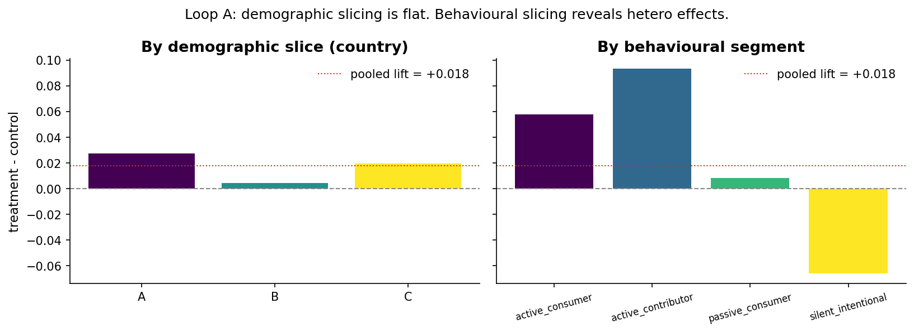
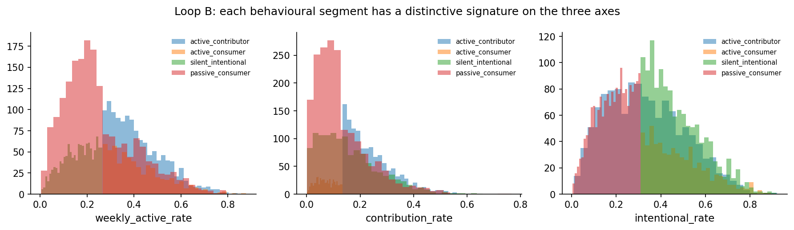
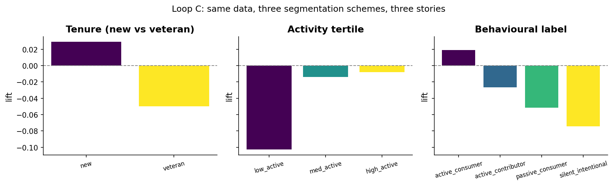
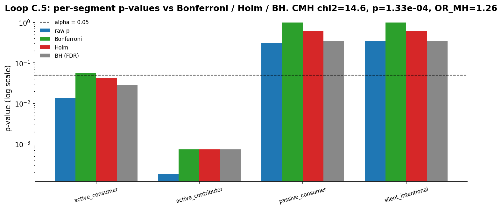
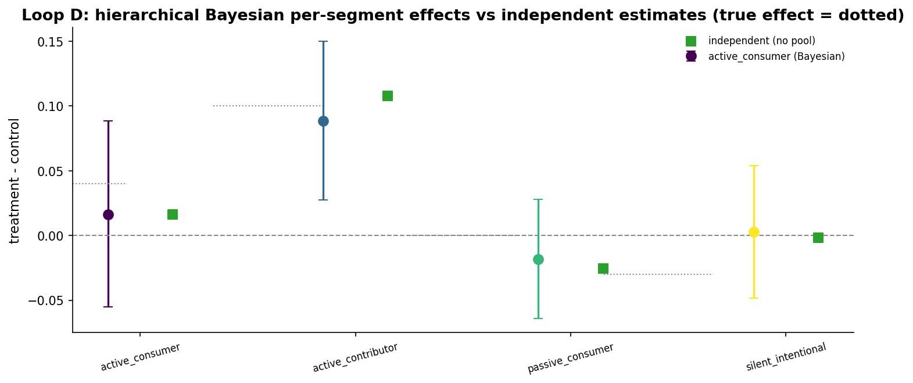

# Chapter 11: Segmentation done right

- Carried from Chapter 10
  - The aggregate hid the most important story. Demographic slicing helps a little. Behavioral slicing helps a lot.

# Loop A: demographic slicing vs behavioural slicing

- Try
  - 5,000 users, four behavioural segments (active contributor, active consumer, silent intentional, passive consumer). Random country and age. The simulator injects per-segment treatment lifts of +10pp for active_contributor, +4pp for active_consumer, -3pp for silent_intentional, and 0 for passive_consumer. These are the simulator ground truth, baked in by construction, not numbers we discovered in the data.
  - Slice by country (uninformative). Slice by behavioural segment (very informative).
- Observe
  - By country: lifts are roughly equal across A, B, C. Country tells us nothing.
  - By behavioural segment: contributors gain a lot, silent intentionals actually lose. The pooled lift averages everything out into something modest, around +0.033 for this seed. The pooled value depends on the segment proportions, which depend on the median-split cascade described in Loop B, so do not read it as a population parameter.
  - The empirical per-segment lifts in this realization come out near +0.066, +0.129, -0.040, and +0.030 (one realization, seed 110), which differ from the injected +0.10, +0.04, -0.03, 0.0. That gap is sampling noise, and Loop D is what lets us recover the injected values within posterior uncertainty.
  - 
- Hunch
  - Demographic features are descriptive but rarely *the cause* of differential treatment effects. Behaviour is closer to the cause.
- Practical note: how to pick which behaviours to slice on
  - Two inputs. First, domain knowledge: which user actions plausibly interact with the thing the treatment changes. A UI change to the posting flow should be sliced by contribution rate, not by timezone. Second, inspection: before unblinding, plot behavioural axes against baseline outcome to see which ones show variation worth splitting on. Pre-register the slices from step one. Treat the slices that come only out of step two as exploratory, and budget multiplicity for them as in Loop C.5.

# Loop B: behavioural segments have distinctive signatures

- Try
  - Plot each segment's distribution along the three behaviour axes (weekly active, contribution rate, intentional navigation rate).
- Observe
  - Active contributors: high on all three axes.
  - Active consumers: high active, lower contribution, higher intent.
  - Silent intentionals: low active rate but high intent when they do show up.
  - Passive consumers: low everywhere.
  - 
  - How the labels are built: the thresholds in label_behavioral are simple medians on each of the three axes, applied as a cascade. Default is passive_consumer. Override to active_contributor when high_active and high_contrib. Else override to active_consumer when high_active and not high_contrib and high_intent. Else override to silent_intentional when not high_active and high_intent.
  - Consequence: segment sizes are unbalanced. With seed 110, n = 5000, the realized counts are passive_consumer 1898, silent_intentional 1249, active_contributor 1228, active_consumer 625. The "active_consumer" bucket is the smallest because it requires the joint condition high_active and not high_contrib and high_intent, which is a small slice of the joint distribution. This matters when we compare per-segment power and when we read the "tiny segments borrow strength" claim in Loop D.
  - Why medians: medians are chosen so the labels are well-defined for any input, not because of a domain rule. A real product would tune the cuts to its own behaviour distribution.
- Hunch
  - These segments are not arbitrary buckets. They have visibly different signatures. Their relationship to product changes is therefore more interpretable than a country slice.

# Loop C: three different segmentations, three stories

- Note on generative process
  - Loop C is different from Loop A and Loop D. Here the treatment effect varies *continuously* with weekly_active_rate, via treatment_p = base + (weekly_active_rate - 0.4) * 0.3. There is no per-segment lift baked in. Loops A and D inject heterogeneity *discretely* by behavioural segment. We are looking at how three segmentation schemes summarize the same underlying continuous heterogeneity, so do not compare per-segment magnitudes across loops; the data-generating process is not the same.
- Try
  - Same population, same treatment. Three different segmentation schemes:
    - tenure (new vs veteran)
    - activity tertile (low / med / high active)
    - behavioural label (the four-bucket scheme)
- Observe
  - Tenure: minor difference. The treatment helps both new and veteran roughly equally.
  - Activity tertile: clear gradient. High-active gain a lot; low-active are flat or slightly negative.
  - Behavioural label: mirrors activity but adds nuance (silent intentionals look different from passive consumers despite similar activity).
  - 
- Hunch
  - The segmentation is itself a modelling decision. Choosing it is choosing the lens through which to read the experiment. There is no "objective" segmentation.

# Loop C.5: multiplicity in practice, plus the classical combiner

- Try
  - Take the segmented A/B data from Loop A. For each of the four behavioural segments, run a Chapter 8-style two-proportion z test of treatment vs control. That gives four raw p-values, one per segment.
  - Adjust the four p-values three ways. Bonferroni multiplies each raw p by the number of tests. Holm sorts them ascending and uses descending multipliers (m, m-1, m-2, m-3), which is uniformly more powerful than Bonferroni at the same FWER. Benjamini-Hochberg sorts the raw p ascending and steps up against the line p_(i) <= (i/m) * alpha; it controls the false discovery rate, not the family-wise error rate, and is much more permissive when the family is large.
  - Cochran-Mantel-Haenszel goes the other direction. Instead of testing each segment separately and then correcting, CMH treats the four segments as four 2x2 strata of the same global treatment-vs-control comparison and asks: across the strata, conditioning on each stratum's row and column totals, does treatment shift outcome consistently? It returns one chi-square statistic, one p-value, and one Mantel-Haenszel pooled odds ratio.
- Observe
  - 
  - In this realization (seed 110, n = 5000), the raw per-segment p-values are 1.84e-4 (active_contributor, true lift +10pp), 1.40e-2 (active_consumer, true lift +4pp), 3.45e-1 (silent_intentional, true lift -3pp), 3.13e-1 (passive_consumer, true lift 0). The two segments with the strongest true effects produce the smallest raw p; silent_intentional shows no rejection because in this draw the sample noise (+2.46pp observed) overwhelms the small true -3pp effect. This is exactly the multiplicity-vs-power tradeoff the corrections are about: with only 600-or-so users per arm per segment, a 3pp lift is hard to find without a large multiplicity tax eating the budget.
  - At alpha = 0.05: Bonferroni rejects only active_contributor (4 * 0.0140 = 0.056, just above 0.05 for active_consumer). Holm rejects two: active_contributor and active_consumer, because Holm's multiplier on the second-smallest p is m - 1 = 3 instead of m = 4, so 3 * 0.0140 = 0.042 < 0.05. BH (FDR) rejects the same two with adjusted p of 7.35e-4 and 2.80e-2. Holm and BH happen to agree here on which segments to reject; they often diverge when more segments contain real signal.
  - CMH on the same four 2x2 tables gives chi2 = 14.6, p = 1.33e-4, pooled OR_MH = 1.26. One number for "across the four segments combined and adjusted for stratum, treatment moves the outcome up." The CMH p is comparable to the smallest raw segment p, but it makes no per-segment claim and pays no multiplicity tax.
  - These methods answer different questions. Per-segment + correction asks "which segments individually moved?". CMH asks "did treatment work, on average, after adjusting for segment?". Hierarchical Bayes (Loop D) asks both at once via partial pooling.
- Hunch
  - If you only need a global yes/no, CMH (or any segment-adjusted aggregate) is fine and pays no multiplicity tax. If you want per-segment claims, pick Holm when you must control FWER and the segment list is small/pre-registered, BH when the segment list is large and you can tolerate FDR rather than FWER. Hierarchical pooling is a third path that we build out in Loop D.

# Two-lens commentary

- Frequentist: two standard routes.
  - Per-segment two-proportion z test (Chapter 8) or chi-square (Chapter 7), with Bonferroni, Holm, or Benjamini-Hochberg adjustment across the segments. Independent inference per segment. Bonferroni and Holm control the family-wise error rate; BH controls the false discovery rate, which is a much weaker guarantee but produces more discoveries. Holm dominates Bonferroni; BH dominates Holm in expected discoveries when many segments are real. Pays a multiple-testing power tax that grows with the number of segments. Appropriate when segments are pre-registered and few.
  - One logistic regression on the whole table with arm, segment, and arm:segment interaction terms. Read the per-segment effect off the interaction coefficients. One model, no Bonferroni in the same form. Interpretation lives on the logit scale and depends on contrast coding. Preferable when segments are many or when the analysis is post-hoc.
  - Cochran-Mantel-Haenszel is the classical aggregate-with-adjustment, demonstrated in Loop C.5: it returns one global chi-square plus a Mantel-Haenszel pooled odds ratio that adjusts for stratum (segment). It pays no per-segment multiplicity tax but tells you nothing about which segment moved. Use it when you want a single segment-adjusted yes/no.
- Bayesian: a hierarchical model where each segment has its own treatment effect drawn from a population-level distribution. Partial pooling. Segments with little data borrow strength from the global mean.
- The two views often agree directionally. The Bayesian view is more honest about uncertainty in tiny segments, and partial pooling replaces the explicit multiple-testing correction with a regularization toward the population.

# Loop D: hierarchical Bayesian model with PyMC

- Frame
  - Loop D is a *recovery* exercise. The simulator bakes in the lifts +10, +4, -3, 0 by segment. We test whether the hierarchical model can recover those known values within its posterior uncertainty, and how it differs from the no-pooling per-segment estimates that simply read off the empirical lifts. This is a controlled check, not a discovery.
- Try
  - This is the kind of model Chapter 6 was preparing us for: no closed-form, partial pooling, the sampler does the work.
  - We fit a hierarchical model: each segment has a logit baseline and a treatment effect drawn from a population-level Normal(mu, tau). We use a non-centered parameterization for the per-segment effects.
  - Why non-centered: in the centered form effect[s] ~ Normal(mu, tau), the latent space rescales with tau, so when tau is small the joint posterior pinches into a narrow neck (the "funnel") whose curvature changes with tau. NUTS has to take very small steps inside the neck and large steps outside it, which produces divergences and biased posterior tails. The non-centered form effect[s] = mu + tau * z[s] with z[s] ~ Normal(0, 1) keeps the latent z at unit scale regardless of tau, so the geometry is well-conditioned even when tau is near 0. Standard hierarchical-modelling guidance (see Betancourt and Girolami on hierarchical model geometry).
  - The model in shorthand:
    - ```
    - baseline[s] ~ Normal(0, 2)
    - mu ~ Normal(0, 1)
    - tau ~ HalfNormal(1)
    - effect[s] = mu + tau * z[s] where z[s] ~ Normal(0, 1)
    - p_control[s] = invlogit(baseline[s])
    - p_treatment[s] = invlogit(baseline[s] + effect[s])
    - ```
  - We feed in the same per-segment success counts the independent test would use.
- Observe
  - The hierarchical posterior on each per-segment effect recovers the simulator-injected values within posterior uncertainty (+10pp for active_contributor, +4pp for active_consumer, -3pp for silent_intentional, ~0 for passive_consumer).
  - Compared to the independent point estimates, the hierarchical estimates pull toward the population mean. The pull is small here because each segment has hundreds to thousands of users; with smaller segments the regularization would matter much more.
  - Quantify the shrinkage. Read off the posterior of tau (the population scale of segment effects on the logit scale): its posterior mean and 95 percent CI, plus mu's posterior mean. Then for each segment compute shrinkage = (independent_estimate - posterior_mean) / (independent_estimate - mu_posterior_mean), on the logit scale. Values near 0 mean "no pooling, segment dominates its own posterior". Values near 1 mean "full pooling, segment's posterior collapses to the population mean". With segments in the hundreds to low thousands here, shrinkage is small (single-digit percent for the large segments, larger for active_consumer which has the smallest n). The notebook prints these numbers; with n_per_segment around 100 the shrinkage would be much larger and visibly visible on the plot.
  - 
- Hunch
  - Hierarchical pooling is the Bayesian alternative to a Bonferroni / Holm correction or to an arm:segment interaction regression. Instead of paying a multiple-testing power tax or fitting a flat interaction model, you let the hierarchy regularize toward the population. Small segments borrow strength; large segments dominate their own posterior. No knob to tune by hand, and tau itself is a parameter you read off rather than a tuning choice.

# The big question that opens Chapter 12

- In the demographic-vs-behavioural figure, the *pooled* lift is positive while *some* segments are negative. Could the aggregate ever be negative when every segment is positive? Yes. That's Simpson's paradox.
- Big question: under what conditions do parts and the whole disagree?

# Notebook and data

- Companion notebook: [`notebook.ipynb`](notebook.ipynb)
- Generation script: [`generate.py`](generate.py)
