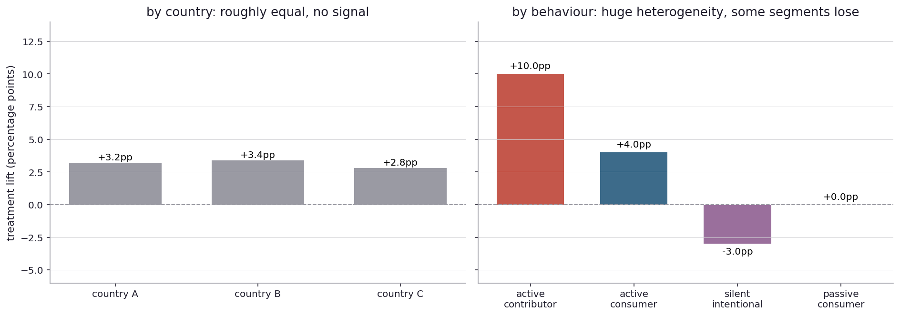
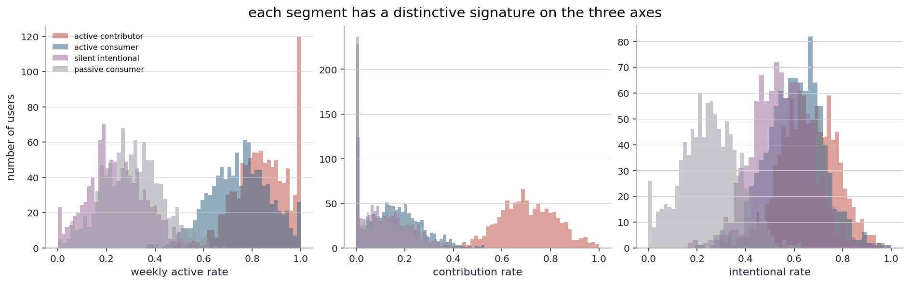
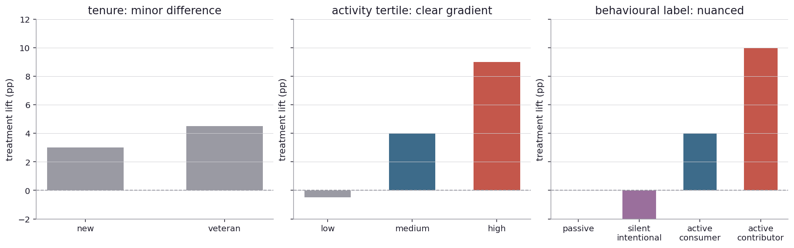

# Which segments are worth segmenting on?

I left the last chapter with the observation that the aggregate hides cohort-level structure, and that the cohort that suffered in the example was the most-engaged 10 percent. So slicing by cohort is necessary. The question now is: which slicing? Not every way of cutting up the population is equally informative. Some slicings reveal real heterogeneity. Others reveal nothing. The choice of segmentation is itself a modeling decision, and getting it wrong wastes the time and traffic the analysis was supposed to save.

Real-world stage first.

A pharmaceutical company tests a new statin and finds the average cholesterol drop is significant. They publish. The drug enters the market. A few years later, post-market surveillance finds that the drug is much more effective in people with a particular genetic variant and barely effective without it. The trial had not been large enough to detect the heterogeneity, but the heterogeneity was real and clinically important. The aggregate effect was a population average over two very different sub-effects.

A school district piloting a new reading curriculum finds the program lifts average reading scores by a small but real amount. Slicing by free-and-reduced-lunch eligibility shows the lift is concentrated in middle-income kids and absent in low-income kids. Slicing by teacher experience shows the lift is concentrated in classrooms with experienced teachers. The "average" lift is real but it does not tell the policy question of whether to scale the program: scaling depends on which kids it actually helps and under what conditions.

A subscription product runs an A/B test on a new onboarding flow and finds the aggregate retention lift is +0.5 percentage points. Slicing by activity level shows that for the most-active 5 percent of users (who already retain at 90 percent), the new flow drops retention by 2 points. The most-valuable cohort is being harmed. The lift is coming from the long tail. Same data, very different decision depending on what is sliced.

A criminal-justice algorithm predicting re-arrest risk has equal accuracy across racial groups in the aggregate. The 2016 ProPublica reanalysis found that the false-positive rate was nearly twice as high for Black defendants as white defendants. The aggregate metric was hiding a per-cohort discrepancy that was the actual question.

In each of these places, the aggregate was real but did not capture the structure that mattered. The structure was visible only when the data was sliced the right way, and slicing wrong (or not slicing) hid the story.

Back to the simulator.

Imagine I am running an A/B test on a software product. The treatment changes the user interface in some way. I have data on each user: their assignment, their outcome, and a bunch of attributes (age, country, time-zone, kind of device, plus behavioral data like how often they have been logging in, whether they have ever contributed content, whether they navigate purposefully or browse).

If I just look at the aggregate, I see a small positive lift, around +3 percentage points. Real, by the math. The team wants to ship.

Before shipping, I slice. The natural first slice is demographic: by country.

Left panel: country slicing. Three countries, three lifts, all roughly +3pp. Country A: +3.2. Country B: +3.4. Country C: +2.8. The slicing is uninformative. The lift is the same everywhere, give or take noise. If I had only sliced by country, I would have learned nothing beyond what the aggregate already told me.

Right panel: behavioral slicing. Four segments based on how users actually use the product. Active contributors (people who post content regularly) gained +10 percentage points. Active consumers (heavy users who do not post) gained +4 points. Silent intentionals (low-volume users who navigate purposefully when they do show up) lost 3 points. Passive consumers (low-volume browsers) were unchanged.

The two slicings tell completely different stories. By country, the launch is uniform. By behavior, the launch is wildly heterogeneous: it helps the contributors, helps the consumers, hurts the intentionals, and does nothing for the passive majority. The aggregate, +3pp, is a population-weighted average across these four very different responses.

The behavioral slicing matters more because the segments are closer to the cause of the heterogeneity. People who actively contribute content are interacting with the product in a particular way, and a UI change affects them in a particular way. People who silently navigate to specific destinations are interacting differently and respond differently. The cause-and-effect chain runs through behavior, not through which country the user is in.

This is the general lesson: demographic features are descriptive but rarely causal for treatment heterogeneity. Behavioral features are closer to the mechanism, and slicing on them is more likely to surface the structure that matters.

How do I know which behavioral features to slice on? The honest answer is, partly through domain knowledge and partly through inspection. Active contributors are probably going to respond differently to a UI change than silent browsers. That is a hypothesis the team should articulate before the experiment, then check after. The check is the slice.

The behavioral segments themselves can be defined by combining a few axes. For this example, three axes: weekly active rate (how often the user logs in), contribution rate (how often they post content), intentional navigation rate (when they show up, do they go straight to a target or browse). Each axis is a number between 0 and 1. The segments are corners of this three-dimensional space.

Three histograms, one per axis. Each axis shows the distribution of the four segments. Active contributors are high on every axis. Active consumers are high on activity but low on contribution. Silent intentionals are low on activity but their visits are intentional. Passive consumers are low everywhere.

The signatures are visibly different. The segments are not just labels. They are clusters in a real behavioral space. The labels capture something about how each kind of user actually uses the product.

Now there is a question about the segmentation itself. Why these four segments and not three or six? Why these axes and not different ones? Different segmentations of the same data can tell different stories.

Three different segmentation schemes applied to the same population and the same launch.

Left panel: tenure (new vs veteran users). Minor difference. New users gain about +3pp, veterans about +4.5pp. The slicing reveals a small effect but does not tell me much about the launch.

Middle panel: activity tertile (low, medium, high). Strong gradient. High-active users gain +9pp, low-active are flat or slightly negative. The lift is concentrated in active users.

Right panel: behavioral label (the four-bucket scheme). Most informative. Captures both the activity gradient and the silent-intentionals dip that the activity tertile misses.

So the three schemes give three different summaries. The first is uninformative. The second is informative but misses nuance. The third captures the most structure, at the cost of being more elaborate to define and interpret.

The choice of segmentation is a modeling choice. It encodes assumptions about what kinds of heterogeneity are interesting and which are not. There is no objective best segmentation. The right one depends on the question being asked.

There is a complication that comes up whenever I run separate tests on multiple segments. Suppose I run a separate two-proportion test on each of the four behavioral segments, each at the 5-percent threshold. With four segments, the chance that at least one falsely fires by chance is about 19 percent, much higher than 5. The multiple-comparisons trap from Chapter 7, in segment-shaped clothes.

The two standard fixes are the same as before. Bonferroni: divide alpha by the number of segments, so each test is at alpha/4 = 1.25 percent. Conservative but works. Holm: a slightly smarter step-down that retains the family-wise error rate guarantee but is uniformly more powerful. Benjamini-Hochberg: a different kind of guarantee (false discovery rate, not family-wise) that is much more permissive and works well when the number of segments is large.

There is also a non-multiplicity-correcting alternative. Instead of running per-segment tests and correcting, run a single test that adjusts for segment composition. The Cochran-Mantel-Haenszel test does this: treat each segment as a stratum, run one test that asks "across all strata, does treatment shift the outcome?". One test, no multiplicity tax, but the test cannot tell you which segments drove the effect.

The choice between the two approaches depends on what I want to answer. Per-segment-with-correction tells me which segments respond. CMH tells me whether the average response is real, after accounting for segment composition. Different questions, different tools.

There is a Bayesian alternative that is cleaner than either of the frequentist approaches: a hierarchical model. Treat the per-segment effects as draws from a population distribution with some unknown mean and variance. Each segment's effect is shrunk toward the population mean by an amount that depends on how much data the segment has and how much variability the population shows. Small noisy segments get pulled toward zero. Large clear segments stay where they are. The hierarchical posterior gives me a calibrated answer per segment without needing a multiple-comparisons correction.

Hierarchical models are more involved to fit than per-segment z-tests, which is why they are not the default in industry tools. But they are the right thing to do when many segments are tested at once, especially when some are small. They will come back when I get to formal hierarchical modeling.

Now look up from the simulator.

A pharma company running a phase-3 trial pre-specifies a primary subgroup analysis: men vs women, certain age brackets, certain genotypes. The pre-specification is what makes the analysis credible. After-the-fact subgroup hunting is the canonical way to find spurious heterogeneity that does not replicate.

A web platform's mature experimentation system stores per-segment results for every test and surfaces them in a dashboard alongside the aggregate. A reasonable platform either flags decisions where some segment is significantly worse than the aggregate, or requires explicit acknowledgment of the segment-level damage before shipping. The discipline is built into the tooling.

A government agency evaluating a job training program looks at outcomes by demographic group, region, prior employment status, and education level. The aggregate tells one story. The slicings tell several. The decision to scale or not depends on which slicings show benefit and which show harm.

A criminal-justice algorithm has its outputs audited per protected class, not just in aggregate. The 2016 ProPublica work and the subsequent academic literature on algorithmic fairness made this a routine part of the audit. The aggregate accuracy is not enough. The per-cohort error structure is the real question.

In each of these places, segmentation discipline is the difference between informed decision-making and flying blind. The aggregate is a useful summary, but only a summary, and the structure underneath it is usually where the consequential information lives.

There is a forward question that opens the next chapter. Sometimes the per-segment story and the aggregate story actually contradict each other in direction. Each segment shows a positive effect. The aggregate shows a negative effect. Or the reverse: every segment shows the treatment is worse, but the aggregate shows it is better. This sounds impossible. It is not. The phenomenon has a name and a famous history.

How can the parts and the whole disagree?
