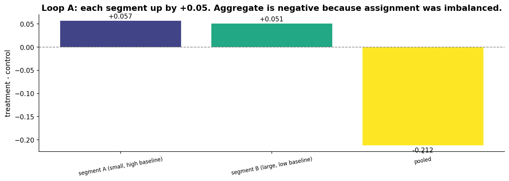
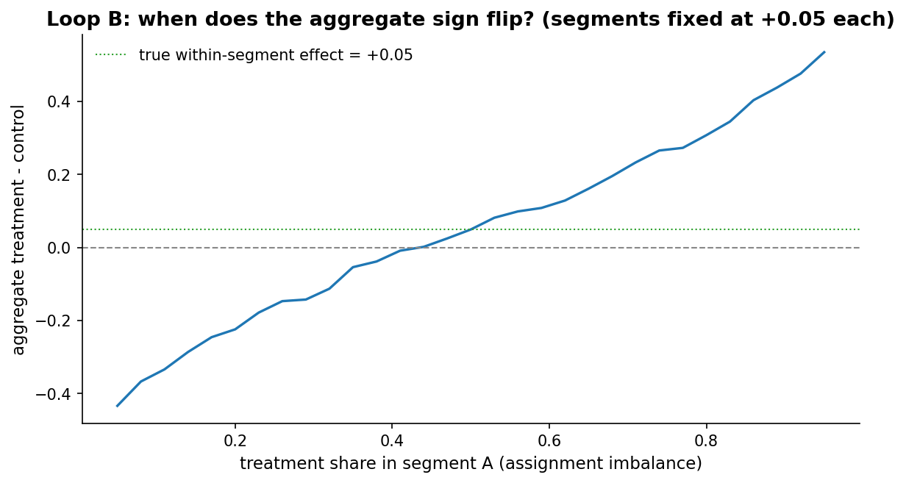
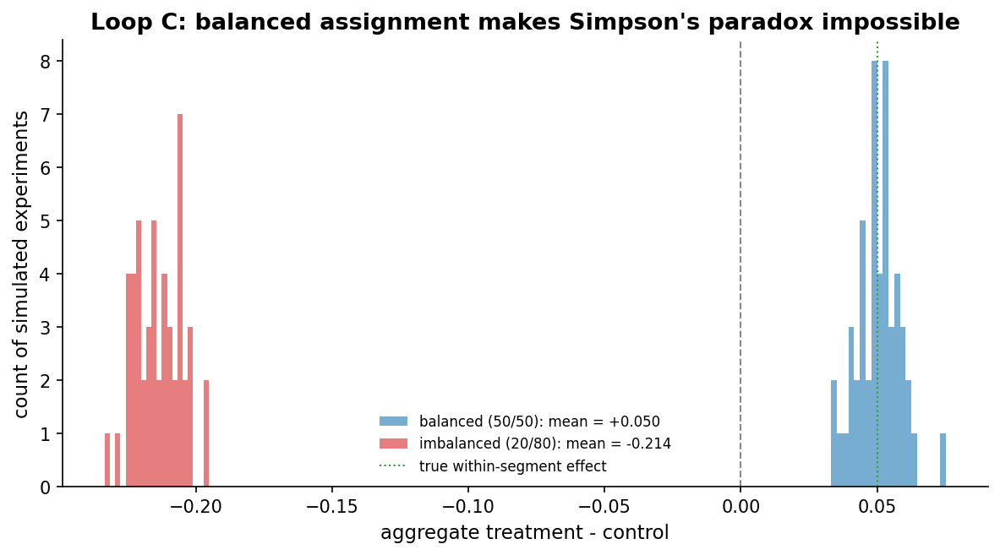
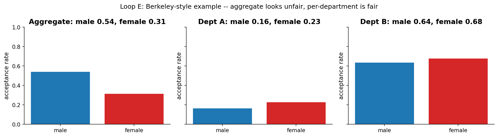

# Chapter 12: Simpson's paradox -- when the parts disagree with the whole

- Carried from Chapter 11
  - Subgroups can move in one direction while the aggregate moves the other. We make it concrete.

# Loop A: build the paradox

- Try
  - Two segments. Segment A is small (20% of the population) with high baseline (80%). Segment B is large (80% of the population) with low baseline (20%). Treatment lifts each segment by exactly 5pp.
  - Now bias the assignment: treatment over-represented in low-baseline segment B. (Specifically: 20% treatment in A, 80% treatment in B.)
- Observe
  - Per segment: A control 0.80, A treatment 0.85. B control 0.20, B treatment 0.25. Each segment up by +5pp.
  - Aggregate: control mean is dominated by segment-A users (because most controls came from A). Treatment mean is dominated by segment-B users (because most treatments came from B). So control overall ≈ 0.69, treatment overall ≈ 0.39. Aggregate diff is *negative* despite every segment being *positive*.
  - 
- Hunch
  - Simpson's paradox is a numerical fact about weighted averages. It is not a paradox in any deep sense; it is a consequence of the assignment mechanism not being independent of segment.

# Loop B: when does the sign flip?

- Try
  - Sweep the treatment-share-in-A from 0.05 to 0.95 (with treatment-share-in-B = 1 - that value). For each, compute the aggregate effect.
- Observe
  - When treatment share in A is balanced (around 0.5), aggregate ≈ +0.05 (the true within-segment effect).
  - As we push treatment share in A toward 0 or 1, the aggregate effect drifts away from +0.05 and can flip sign.
  - 
- Hunch
  - The closer the assignment is to balanced *within each segment*, the closer the aggregate is to the true within-segment effect. The further from balanced, the more the aggregate can lie.

# Loop C: when is it impossible?

- Try
  - Same population, two scenarios. Balanced (50/50 in each segment) vs imbalanced (20/80).
- Observe
  - Balanced: aggregate effect always near +0.05 across simulated runs. The truth.
  - Imbalanced: aggregate effect distribution is shifted. Many runs show the wrong sign.
  - 
- Rule of thumb
  - Random assignment (proper A/B testing with no segment-correlated bias) prevents Simpson's paradox by construction. The paradox shows up most often in observational data, in opt-in experiments, or in poorly-implemented assignment that correlates with segment membership.

# Loop D: two lenses on the paradox

- Frequentist
  - Run a stratified analysis: per-segment two-proportion z-test. Each segment will show the +5pp lift. The aggregate test will show the wrong direction. The right answer is the stratified one. Choosing between them is a substantive judgement, not a statistical one.
- Bayesian (hierarchical)
  - A hierarchical Bayesian model partitions variance into segment-level and population-level. The posterior on each segment is +5pp; the population-level effect is also +5pp; the apparent aggregate "lie" disappears because the model knows about segment membership.
  - In PyMC: per-segment treatment effect ~ Normal(mu, tau), with mu ~ Normal(0, 1) and tau ~ HalfNormal(1). Observe the per-segment outcomes. Posterior mu is the average treatment effect across segments, weighted appropriately.

# Loop E: a Berkeley-style example

- Try
  - Two departments. Department A is hard (low acceptance ~20%) and most female applicants apply there. Department B is easy (high acceptance ~65%) and most male applicants apply there. Within each department, women have a slightly *higher* acceptance rate than men.
- Observe
  - Aggregate: men have a higher acceptance rate (because most men apply to the easy department).
  - Per department: women have higher rates in both.
  - 
- Hunch
  - The aggregate looks like discrimination against women. The per-department view looks like (slight) preference for women. The "right" answer depends on which causal question you're asking.

# Loop F: the hierarchical model recovers the within-segment effect

- Try
  - Take Loop A's data (two segments, +5pp lift each, but treatment overrepresented in segment B). Fit the same hierarchical Bayesian model from Chapter 11 (per-segment effect drawn from a population-level Normal). The model gets the segment label as part of its inputs.
- Observe
  - The per-segment posterior on (treatment - control) for each segment is centred near +5pp, exactly the truth.
  - The naive aggregate (no segment context) gives -16pp. Misleading.
  - The Bayesian population-level mu (translated to a probability-scale "average effect" around the average baseline) is also near +5pp.
  - 
- Hunch
  - The hierarchical model dissolves Simpson's paradox by construction. As long as the segment label is fed in, the model partitions variance correctly. The paradox lives in the *aggregation* you choose to report -- and by writing down a per-segment model, you've already made that choice consciously.

# The big question that opens Chapter 13

- We've spent five chapters arguing about which segment, which metric, which lens. We have not asked the deeper question: which metric *should* we be measuring in the first place?
- Big question: how do company-level outcomes connect to the experiment-level metrics we read in week one?

# Notebook and data

- Companion notebook: [`notebook.ipynb`](notebook.ipynb)
- Generation script: [`generate.py`](generate.py)
