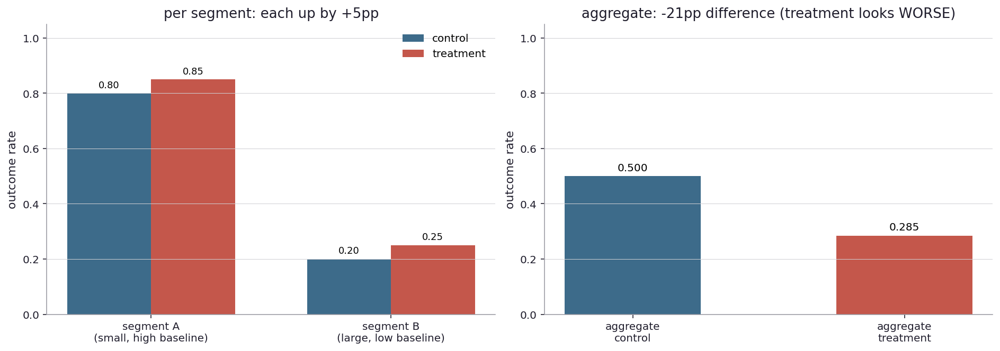
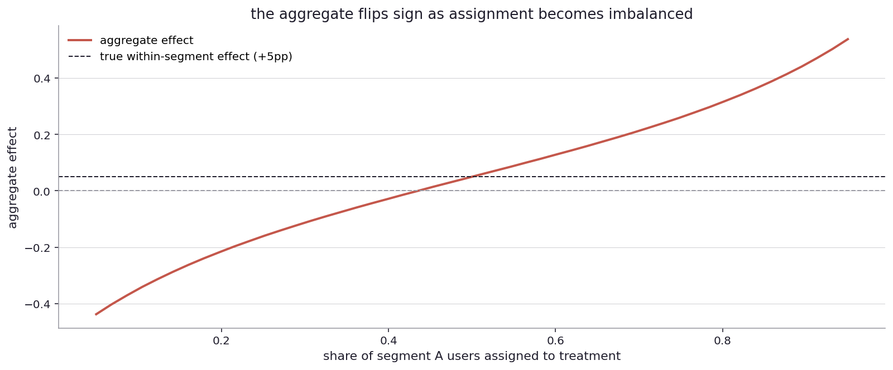
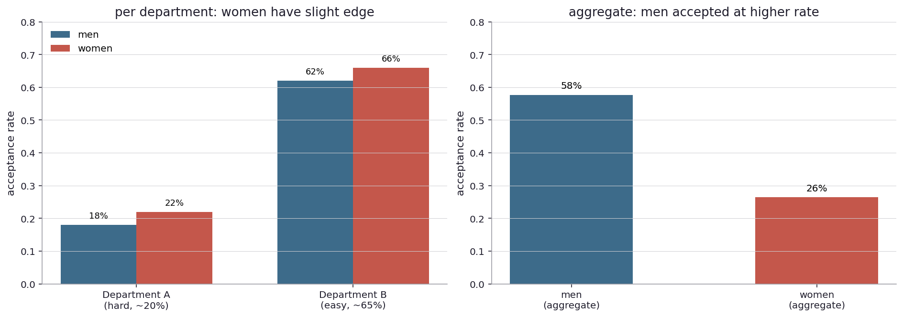
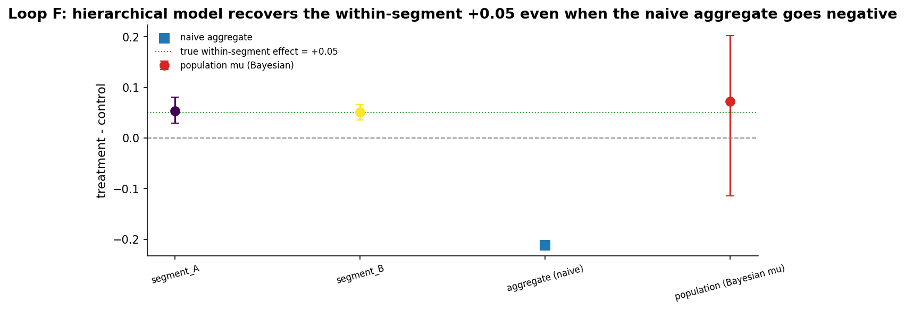

# How can the parts and the whole disagree?

I left the last chapter with a curious possibility. When the data is sliced by segment, every segment can show a positive effect. The aggregate, computed across all segments, can show a negative effect. Or every segment can show a negative effect, and the aggregate can show positive. The parts and the whole disagree about the direction.

This sounds impossible. It is not. The phenomenon has a name (Simpson's paradox, after a 1951 paper by Edward Simpson), a long history, and at least one famous court case. It happens when there is a hidden imbalance in how the segments are represented in the comparison, and the imbalance plays havoc with the aggregate weighting.

Real-world stage first.

In 1973, Berkeley admitted graduate students. The aggregate numbers showed that men were admitted at a substantially higher rate than women: about 44 percent of men applied were admitted, versus 35 percent of women. Berkeley sued by the women rejected. Bickel, Hammel, and O'Connell published a paper in Science in 1975 that re-examined the data per department. Within each of the six largest departments, women were admitted at the same or higher rate as men. The aggregate disparity came from the fact that women applied disproportionately to the most competitive departments (which had low admission rates for everyone), while men applied disproportionately to the easier ones. The lawsuit lost. The Berkeley case is the canonical example of Simpson's paradox in real-world data.

In the early 2000s, a study compared the effectiveness of two kidney stone treatments on a large patient population. Treatment A was better in patients with small stones. Treatment A was better in patients with large stones. Aggregating across both groups, treatment B looked better. The catch: treatment A was preferred for large stones (the harder cases), so the patient mix in the A arm was sicker on average. The aggregate comparison was not really comparing two treatments. it was comparing two treatments on different patients. The per-stratum analysis was the right one, and treatment A really was better.

In sports, batting averages have shown the paradox. A player with a higher average than another in each year can have a lower career average, if the proportion of at-bats in each year differs between the two players. David Justice and Derek Jeter famously had this shape between 1995 and 1996.

In each of these places, the per-segment story and the aggregate story disagree. The arithmetic is innocent. The interpretation is the substantive question.

Back to the simulator.

Let me build the paradox from scratch with the cleanest possible numbers. Two segments, A and B. Segment A is small (20 percent of the population) and has a high baseline outcome (80 percent). Segment B is large (80 percent of the population) and has a low baseline outcome (20 percent). The treatment lifts each segment by exactly 5 percentage points. Within each segment, the treatment is unambiguously good.

The trick is in how I assign people to treatment versus control. Most of the segment-A users get assigned to control. Most of the segment-B users get assigned to treatment. Specifically: 20 percent of segment A is in treatment (so 80 percent is in control), while 80 percent of segment B is in treatment (so 20 percent is in control).

Now look at the per-segment view and the aggregate view side by side.

Left panel: the per-segment view. Segment A control: 80 percent. Segment A treatment: 85 percent. Segment B control: 20 percent. Segment B treatment: 25 percent. Each segment shows a +5pp lift from treatment, exactly as designed.

Right panel: the aggregate. The aggregate control rate is 50 percent (it is dominated by segment-A users, because most controls came from segment A, and segment A has a high baseline). The aggregate treatment rate is 28.5 percent (it is dominated by segment-B users, because most treatments came from segment B, and segment B has a low baseline). Aggregate difference: -21.5 percentage points. Treatment looks much worse than control, even though treatment helps every segment.

The arithmetic is correct. The aggregate average is a population-weighted average, and the weighting in the control arm is different from the weighting in the treatment arm. The control arm is mostly segment A (high baseline). The treatment arm is mostly segment B (low baseline). Comparing the two arms is comparing two different population mixes, not the treatment effect.

The whole paradox sits on this asymmetric assignment. If the assignment were symmetric (50 percent of A in treatment and 50 percent of A in control, same for B), the aggregate would correctly recover the +5pp effect. The paradox cannot arise from balanced random assignment. It requires the assignment mechanism to be correlated with segment membership.

Let me sweep across assignment imbalances and watch the aggregate effect drift.

Horizontal axis: the share of segment A users assigned to treatment (from 5 percent to 95 percent). Vertical axis: the resulting aggregate effect.

When the share is balanced around 50 percent, the aggregate effect is near +5pp, the truth. When the share is heavily skewed (close to 5 percent or 95 percent), the aggregate drifts away from +5pp, sometimes by a lot, sometimes flipping sign entirely.

The picture says: balanced assignment gives the truth. Imbalanced assignment can give anything, including the wrong sign.

This is why proper randomized trials work. Random assignment is balanced in expectation: the segment composition of the treatment arm is, on average, the same as the segment composition of the control arm. The paradox cannot arise. Even in finite samples, random assignment makes the paradox vanishingly unlikely with reasonable sample sizes.

The paradox shows up in observational studies, in non-random assignment, in self-selection. It shows up when the data is collected without controlling for segment composition. It shows up in administrative data about hospital outcomes (where the sicker patients go to better hospitals), in graduate admissions (where the harder programs get the more selective applicants), in any setting where the comparison groups differ in composition.

There is something subtle hiding behind the arithmetic. The aggregate is not "wrong" in any technical sense. It is the right answer to a particular question: "If I randomly pick someone from the treatment group and someone from the control group, who is more likely to have a positive outcome?". The answer to that question is genuinely the aggregate. But that question is rarely the one anyone wanted to ask. The question they wanted to ask was "Does the treatment help?", which is a question about the within-segment effect.

So the aggregate and the within-segment view answer different questions. The aggregate answers a population-comparison question. The within-segment view answers a treatment-effect question. The paradox is not about which arithmetic is correct. it is about which question the arithmetic answers.

The Berkeley case is the canonical illustration. The aggregate question is "if I am a woman applying to Berkeley, am I less likely to be admitted than a man?". The answer to that question, in 1973, was yes, because women applied disproportionately to harder departments. The within-segment question is "given a department, am I less likely to be admitted as a woman?". The answer, per department, was no. Both answers are true. They answer different questions.

The "right" answer for a court case depends on what the court is asking. If the question is "is there a discriminatory effect of being female on Berkeley admission?", then the aggregate is misleading, because the disparity is explained by department choice. If the question is "is there a discriminatory effect of admissions policies, summed across departments and weighted by who applies where?", then the aggregate is informative. Different questions, different right answers.

Left panel: per-department admissions. Department A is competitive (women slightly favored, both around 20 percent admission). Department B is less competitive (women slightly favored, both around 65 percent). Within each department, women have a small edge.

Right panel: aggregate admissions. Men accepted at 57.6 percent, women at 26.4 percent. Aggregate disadvantage for women, despite per-department advantage. The 31-point aggregate gap comes entirely from the fact that men applied mostly to department B (the easy one) and women applied mostly to department A (the hard one).

The case shows that the question of what to do with the data is not a math question. The math is unambiguous. The interpretation requires a decision about what the relevant comparison is, and that depends on the causal structure of the data.

Statisticians have a name for this. The aggregate and the per-segment analysis disagree because there is a confounder: department choice influences both the treatment (how the application is judged) and the outcome (whether the application is admitted). When the confounder is correlated with the segment of interest (gender), the aggregate is contaminated by the confounder.

The fix in this case is to condition on the confounder: do the per-department analysis. The fix is also the danger in the wrong setting. If I have a treatment that affects an outcome partly through some intermediate variable, and I condition on the intermediate variable, I block the very effect I am trying to measure. The decision to slice or not is a substantive judgment about the causal structure of the data.

This is the bridge from statistics to causal inference. The arithmetic does not pick the right answer. The causal structure does. Same numbers, opposite right answers, depending on what the data-generating process is.

The frequentist response is "stratified analysis". I run a two-proportion comparison inside each segment, one at a time, and report the per-segment effects separately. Each segment-level test here would flag +5pp as real. The aggregate test would flag the wrong direction. The stratified view is the right one, and choosing it over the aggregate is a substantive judgment, not a statistical one.

The Bayesian alternative is a hierarchical model that learns the per-segment effects and the population-level average effect simultaneously. The model is given the segment label as input. It does not get fooled by an aggregate that hides the per-segment structure. It reports both the per-segment posterior and the population-weighted posterior, and the user can read off whichever one matches their question.

Running the hierarchical model on the same paradox data (two segments, +5pp lift each, 20 percent of segment A treated, 80 percent of segment B treated) brings back the truth. The per-segment posteriors both centre near +5pp. The population-level effect, translated onto the probability scale around the average baseline, also lands near +5pp. The naive aggregate, plotted in the same panel for contrast, still sits near minus 21pp. Same data, two ways of summarizing, opposite answers. One small caveat: with only two segments the partial-pooling variance is barely pinned down by the data, so the sampler needs careful tuning. More segments make this easier. I would not read too much into the population-level spread with only two clusters.

Now look up from the simulator.

In drug development, the per-genotype analysis can show a treatment is highly effective in one variant and ineffective in another, while the aggregate shows a moderate effect overall. The development decision (approve, restrict to a genotype, abandon) depends on which view is the right one. Often the per-genotype view is the right one for the regulator, because the drug should not be prescribed to people who will not benefit.

In educational program evaluation, the per-school analysis can show consistent positive effects of a curriculum while the aggregate shows mixed or negative effects, because the curriculum was rolled out preferentially to schools with declining test scores. The aggregate is contaminated by selection. The per-school analysis is closer to the truth.

In employment discrimination cases, the aggregate hiring rate by demographic group is sometimes Simpson-paradox compared to the per-position rate. Courts have generally treated the per-position view as the more relevant one, because the alternative (the aggregate) is too easily explained by application patterns rather than discrimination at the hiring step.

In each of these places, the parts-and-whole disagreement comes down to a substantive judgment about which question is being asked. The arithmetic is innocent. The interpretation is everything.

There is a forward question that opens the next chapter. So far I have been talking about a single outcome metric and asking how it slices. But often the question of which outcome to optimize is itself a strategic question. Different metrics measure different things, and the relationships between them are not always tight. A short-term metric can move while a long-term metric does not. A click metric can move while a revenue metric does not.

What is the right metric to be measuring, and how do these metrics relate to each other?
