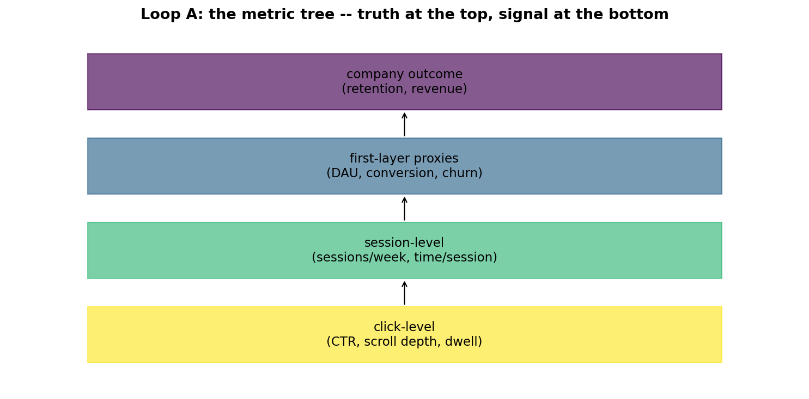
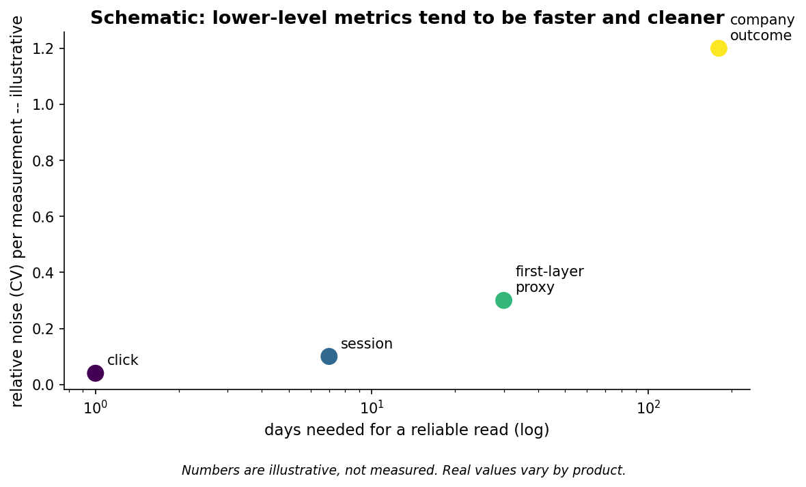
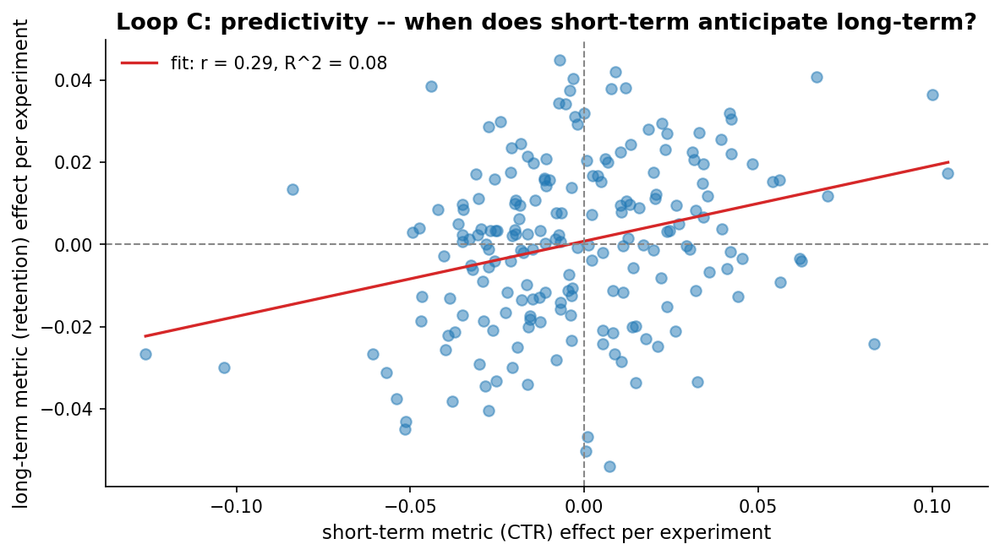
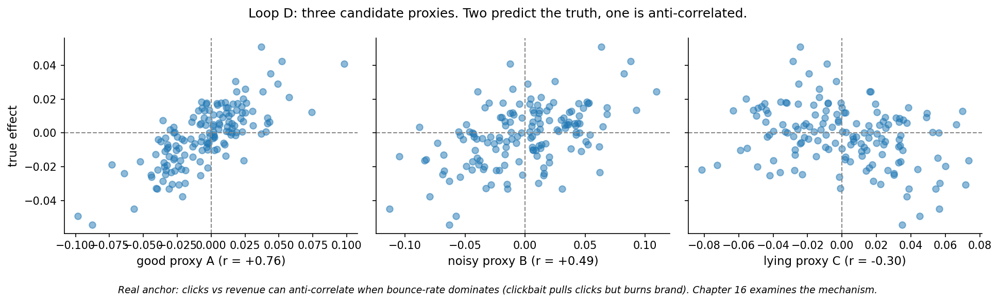

# Chapter 13: The metric tree

- Carried from Chapter 12
  - Which metric should we even be measuring? The answer is structural, not statistical.

# Loop A: the tree

- Try
  - Sketch a four-layer tree. Top: company outcome (retention, revenue). Below: first-layer proxies (DAU, conversion, churn). Below: session-level metrics (sessions/week, time/session). Bottom: click-level events (CTR, scroll depth, dwell).
- 

# Loop B: noise vs measurement speed

- Observe
  - Click-level: cheap to read in a day, but a 4% lift in clicks doesn't always mean a 4% lift in retention.
  - First-layer proxies: a 1-week experiment can give you a noisy read on conversion.
  - Top-level: revenue and retention need months of data and have huge noise relative to the effect we're hoping to see.
  - 
  - The figure is schematic, not measured. The CV values and day counts are illustrative; real numbers vary by product and team.
- Hunch
  - The bottom of the tree gives quick clean reads of *something*, but that something might not be the truth. The top gives the truth, slowly.

# Loop C: predictivity

- Try
  - Simulate 200 experiments. Each has a true latent effect. We measure a short-term metric (noisy proxy) and a long-term metric (less noisy, closer to the truth).
- Observe
  - Pearson r between short and long is around 0.29 with a 95 percent bootstrap CI of roughly [0.15, 0.41] across the 200 simulated experiments. Spearman rho lands close to Pearson r here because the simulated link is linear, but on real metric pairs (saturating, threshold-shaped) Spearman is the safer summary.
  - R^2 around 0.08. The short-term metric is correlated with the long-term one, but the noise dominates at the per-experiment level.
  - Most of the time the short-term metric points the right way. Some experiments diverge sharply.
  - 
- Hunch
  - Pearson assumes linearity; for monotone non-linear pairs, report Spearman as well.
  - "Predictive validity" is a property of metric pairs, not individual metrics, and it is itself a distribution rather than a point estimate. The bootstrap CI on r reminds us that the headline correlation is uncertain, and that two metric pairs with the same r can differ in stability across slices.
  - Bayesian counterpart: place a prior on the correlation and read the posterior over rho directly. With these 200 paired experiments the posterior is centred near 0.29 with a 95 percent HDI of roughly [0.16, 0.42], close to the bootstrap CI but with a posterior interpretation (probability statements about rho rather than long-run frequency statements about an estimator). Chapter 16's predictivity scoring carries this forward.
  - Some short-term metrics ARE predictive of long-term outcomes; others are not. Choosing your headline metric is choosing this correlation.

# Loop D: proxies that lie

- Try
  - Three candidate proxies for the same true effect: a clean one, a noisy-but-correct one, and a lying one (anti-correlated with truth).
- Observe
  - Clean proxy r ~ 0.7. Noisy r ~ 0.4. Lying r ~ -0.3.
  - Anti-correlation is not theoretical. Clicks can rise while revenue falls when bounce rate dominates: a low-quality clickbait variant pulls clicks but burns brand and reduces revenue. Time-on-page can rise when users are stuck rather than engaged. Chapter 16 picks up the predictivity-of-proxies thread; the bounce-rate / clickbait mechanism itself is a Goodhart's-law issue and is referenced rather than worked out in this book.
  - 
- Hunch
  - You can verify which is which only by tracking the long-term metric anyway. The proxy economy is built on faith that the proxies you chose actually predict.

# The big question that opens Chapter 14

- Even when we have a good metric, the experiment can lie. The most famous flavour: the metric goes up at first, then settles.
- Big question: when does a real-looking lift turn out to be a temporary novelty bump?

# Notebook and data

- Companion notebook: [`notebook.ipynb`](notebook.ipynb)
- Generation script: [`generate.py`](generate.py)
