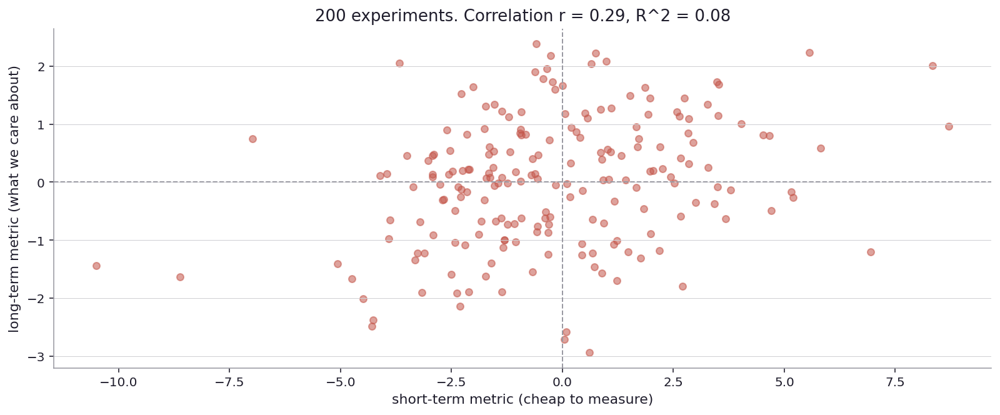
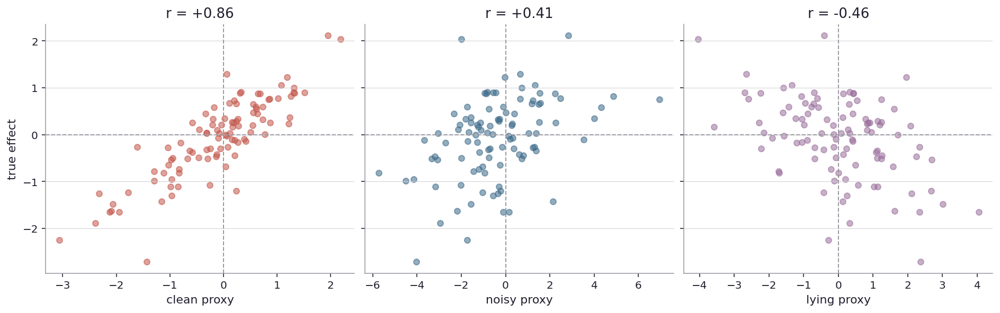

# What metric should I be measuring?

I left the last chapter with the question of which metric to optimize. The answer is structural, not statistical, and it determines whether the entire experimentation program is asking the right question.

Real-world stage first.

A streaming service measures hours-watched as its top metric. The product team optimizes recommendations to maximize hours-watched. After two years, hours-watched is up 30 percent and subscriber retention is flat. Users are watching more in any given month but not staying around longer. The metric was technically correct and strategically wrong: hours-watched was a proxy for engagement, but engagement turned out not to predict retention.

Goodhart's law (named after British economist Charles Goodhart, 1975): "When a measure becomes a target, it ceases to be a good measure." This is the operational form of the problem. Every metric, once optimized, drifts. A click metric optimized hard enough leads to clickbait. A response-time metric optimized hard enough leads to corner-cutting. A test-score metric optimized hard enough leads to teaching to the test. The metric stops being correlated with the underlying thing it was supposed to measure, because optimization tunnels through to the metric while leaving the underlying thing behind.

Wells Fargo opened millions of fake accounts in 2016 because their cross-selling metric ("number of products per customer") had been optimized very hard. The metric went up. The actual goal (customer relationships, account profitability) was undermined.

Many academic disciplines reward publication count. Many academics now publish more, but the citation counts (the actual proxy for influence) per paper have stagnated or fallen. The metric is hitting its target. The underlying scholarly impact is not.

In each of these cases, the metric was real and the math was honest. The strategic mistake was choosing a metric that looked easy to measure and assuming it would track the actual goal.

Back to the simulator.

Imagine I am running a sequence of A/B tests on a product. Each test measures a short-term metric (cheap, available in days) and is judged by it. The actual goal is a long-term metric (slow to measure, available in months). Over many experiments, how well does the short-term metric predict the long-term one?

I simulate 200 experiments. Each one has a true latent effect (positive, negative, or zero). The short-term metric for each experiment is the true effect plus a lot of noise (measurement noise, day-of-week effects, novelty contamination). The long-term metric is the true effect plus a little noise (because it has averaged over more time and broader user behavior). Both metrics are real. The short-term one is just noisier.

Each dot is one experiment. Horizontal axis: the short-term metric. Vertical axis: the long-term metric. The dots are positively correlated (both metrics are tracking the same underlying effect), but the correlation is not tight. Pearson r is around 0.3, R^2 around 0.08. The short-term metric, in 92 percent of the variance, is just noise.

What this picture says: any individual short-term result is a noisy guess about the long-term outcome. Sometimes the short-term metric is positive when the long-term effect is negative, and vice versa. If I shipped every experiment whose short-term metric was positive, a substantial fraction of those ships would have been net-negative on the long-term metric, but I would not have known until months later (if I checked at all).

The fix is not to abandon short-term metrics. They are usable. The fix is to track the predictive validity of the short-term metric against the long-term metric over time, and to pay attention to when they diverge.

Mature programs do this routinely. They define a hierarchy of metrics: a top-level outcome (retention, revenue, life satisfaction in healthcare studies), middle-layer metrics (DAU, conversion, blood pressure), and operational metrics (click-through rate, time-on-page, biomarkers). Each level is a noisier-but-faster proxy for the level above. The top-level metric is the truth but slow. The bottom-level metrics are fast but unreliable.

The chain is only as strong as the weakest link. If a click metric is uncorrelated with conversion, optimizing on clicks does nothing for conversion. If conversion is uncorrelated with retention, optimizing on conversion does nothing for retention. The links have to be checked, not assumed.

Some proxies are clean (high predictivity), some are noisy but correct, some are actively misleading.

Three scatter plots, three relationships between proxies and the underlying truth. Left: a clean proxy (r ≈ 0.7). The dots cluster tight against the diagonal. Middle: a noisy proxy (r ≈ 0.4). The dots are diffuse but still positively oriented. Right: a lying proxy (r ≈ -0.3). The dots are anti-correlated with truth. Optimizing this proxy actively makes the truth worse.

Lying proxies are not theoretical. They show up when the proxy and the truth respond to optimization in opposite directions. Clicks vs revenue is a classic case: a clickbait variant pulls clicks but burns brand and reduces long-run revenue. Time-on-page vs satisfaction is another: users who are stuck (cannot find what they need) spend more time, but their satisfaction drops. The proxy can be positively correlated with the truth in cross-sectional data and negatively correlated with the truth under optimization. This is the Goodhart pattern in numerical form.

Detecting a lying proxy requires that I have actually tracked the underlying truth, at least sometimes, alongside the proxy. The proxy economy works on faith, but the faith should be calibrated by occasional checks. Mature programs run "holdout" or "long-running" experiments where they keep tracking the long-term metric for months after the short-term decision was made, just to keep the short-term-to-long-term relationship honest.

Some programs explicitly compute the predictive validity of each proxy and weight them by how well they predict the truth. The predictive-validity score is itself a measurement, and it has uncertainty (the dots in the predictivity scatter plot are scattered around any line you would draw). Programs that take this seriously report not just the proxy lift but also the historical predictive validity of the proxy, so the reader knows how seriously to take the lift.

There is one more thing about proxies worth flagging. Even a perfectly predictive proxy can be gamed by an adversarial process. If the team knows the proxy is being optimized, and the team can find ways to move the proxy without moving the truth, they will (Goodhart again). Designing proxies that are hard to game is a research question of its own. The safest proxies are the ones that are tightly coupled to the underlying truth by some mechanism that cannot be unbundled. The unsafe proxies are the ones that can be moved with surface-level changes that do not affect the truth.

Now look up from the simulator.

A regulator who scores schools on average test scores can reasonably expect schools to teach to the test. The average test score is the proxy. The proxy will move. the underlying education quality may or may not. The proxy validity has to be checked separately.

A health insurance company that scores hospitals on 30-day mortality after admission can reasonably expect hospitals to discharge sicker patients earlier (so they die outside the 30-day window) or to be more selective about which patients they admit. The proxy will move. Underlying patient outcomes may not.

A search engine that scores results on click-through rate can reasonably expect that some optimizations move click-through without moving user satisfaction (for example, more aggressive headlines that lure clicks but disappoint). The proxy will move. The underlying value may not.

A government that scores its development progress by GDP growth can reasonably expect that every kind of activity gets routed through the parts of the economy that are easy to count, even when the underlying progress is happening in less-counted parts.

In each of these places, the trap is the same. The proxy is not the truth. Optimizing the proxy can leave the truth behind, or worse, push it in the wrong direction. The defense is metric design (pick proxies that are mechanistically tied to the truth, not just historically correlated), and metric tracking (keep checking the proxy-truth relationship over time, especially after a major optimization push).

There is a forward question that opens the next chapter. So far I have been talking about metrics that are noisy in a roughly stationary way: the noise has some standard deviation, but the underlying signal is stable. Some metrics are non-stationary in a particular way: they spike right after a launch (because users are exploring something new) and then drop. The launch looks great in week one and forgettable by month three. This pattern has a name and is its own trap.

Why does the new thing always look great at first?
