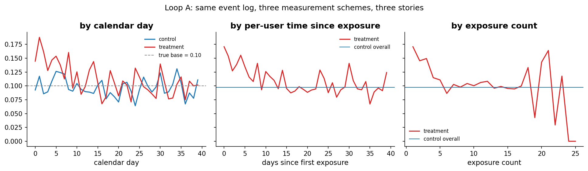
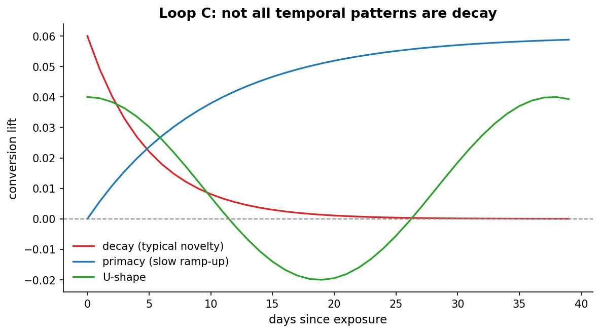

# Chapter 14: Novelty effects

- Carried from Chapter 13
  - The lie evolves over time. The most famous form: novelty.

# Loop A: three views of one event log

- Try
  - Simulate a treatment whose true long-run lift is 0. The first day a user sees the new feature, they over-engage by +6pp; this excitement decays with a 5-day half-life. Run for 40 days, 2,000 users with random arrival.
  - Now read the same event log three different ways:
    - by calendar day from launch
    - by per-user days since first exposure
    - by per-user exposure count
- Observe
  - Calendar day view: the early days show a treatment lift; the lift fades by day ~20 because by then most treatment users have been exposed for a while. By day 40 the curves cross.
  - Days-since-exposure view: starts at +6pp on day-1, decays to ~0 by day 20. The shape of the decay is visible directly.
  - Exposure-count view: 1st exposure shows the maximum lift; later exposures show progressively less. Same story, different x-axis.
  - 
- Hunch
  - The same event log can support "treatment is great!" or "treatment did nothing" depending entirely on the chosen aggregation axis.

# Loop B: which view is "right"?

- Observe
  - Calendar-day is what dashboards typically show. The confound is not calendar time itself, it is cohort-tenure mixing. Each calendar day is a mixture of users at different per-user exposure-tenures (a user who arrived on day 1 has 30 days of exposure by day 30, a user who arrived on day 25 has 5 days). The calendar-day average mixes those cleanly different states, and that mixture, not the calendar, is what shifts the curve.
  - Days-since-exposure is the cleanest read of what each individual user experiences. But it requires per-user start-date tracking, and the right tail is a survival/selection subsample. Late-arriving users cannot contribute to the long-exposure tail, so by the time the x-axis reads "day 30 of exposure" the only users in that bucket are the early arrivers (with 40 days and arrivals throughout, the day-30 bucket is populated only by users whose first exposure landed in the first 10 calendar days). If those early arrivers differ systematically (eager early adopters), the tail mis-estimates the asymptote (this is a missing-data problem, not a SUTVA violation, but it shows up in the same kinds of observational analyses).
  - Exposure-count cleans out time entirely. Useful for asking "do users habituate?". Caveat: in real data, exposure count is a function of arrival rate, so heavy users dominate the high-count bins. The simulator uses a uniform arrival rate so this does not bite here, but in production the curve conflates "users habituate" with "frequent users had a different baseline lift to begin with."
- Hunch
  - There is no single right view. Different views answer different questions. Pretending one is the answer is the source of most novelty-related disagreements.

# Loop C: it's not always decay

- Try
  - Simulate three different shapes: decay (the classic novelty effect), primacy (a slow ramp-up as users learn the feature), and a U-shape (initial curiosity, then a confused dip, then recovery).
- Observe
  - All three are plausible. Real-world data often looks like a mixture.
  - These three shapes are illustrative, not exhaustive or canonical. Real-world effects can also be linear ramps, oscillations, regime-shifts after a UI tweak, or something with no closed form at all. And populations are usually mixtures of users with different shapes, so a flat population-mean curve is consistent with many users showing strong individual decay or ramp that cancel in the average.
  - 
- Hunch
  - "Wait until novelty wears off" is fine if the truth is exhibit A. Catastrophic if the truth is exhibit B (you ship too early) or exhibit C (you give up too early).

# Two-lens commentary

- Frequentist: typically tries to estimate the asymptote by truncating the early days. Sensitive to where you cut. The principled fix is to fit an exponential decay with per-user random effects on initial lift and asymptote, by nonlinear least squares on a per-user random-intercept model (in Python, statsmodels.MixedLM for the linearized case, or scipy.optimize wrapped around a per-user-parameters likelihood for the full nonlinear fit). "Random effects" here means each user gets their own intercept and asymptote drawn from a population-level distribution, rather than estimating a separate free parameter per user.
- Bayesian: the same structural model, fit hierarchically. Each user has a latent decay shape with population-level priors on initial lift, asymptote, and time-to-asymptote. The posterior over the asymptotic effect marginalizes over decay-shape uncertainty. Canonical implementation: PyMC.
- Both lenses agree on the structural model (exponential decay with per-user random effects), they only disagree on inference. Both are more honest than truncate-and-average. The Bayesian version is the one to reach for when the experiment is short, because it carries the asymptote uncertainty through to the decision.
- The decision rule that closes the loop here is asymptote vs MMU: ship if the posterior on the asymptotic effect exceeds the minimum meaningful uplift introduced in Chapter 8. Truncate-and-average gives a point estimate of the asymptote; the hierarchical model gives a posterior, which is the right input to the MMU comparison.

# The big question that opens Chapter 15

- We just assumed every user actually saw the new feature. They don't. Most users in an experiment don't visit the page where the change happens.
- Big question: what happens when "in the experiment" doesn't mean "exposed to the change"?

# Notebook and data

- Companion notebook: [`notebook.ipynb`](notebook.ipynb)
- Generation script: [`generate.py`](generate.py)
