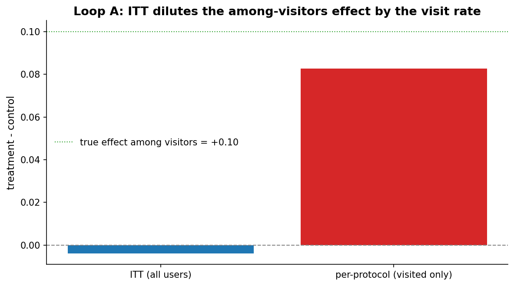
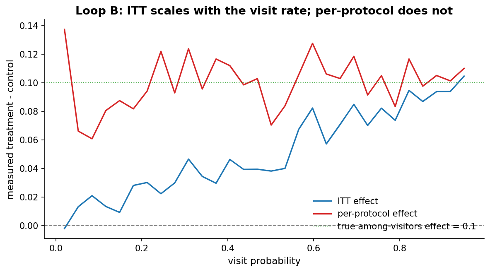
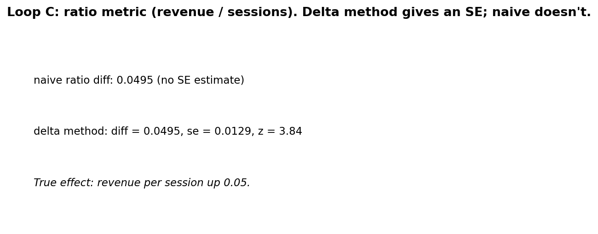

# Chapter 15: Dilution

- Carried from Chapter 14
  - Most users in an experiment never actually see the change. Their data is null evidence about the treatment. Mixing them in dilutes the effect.

# Loop A: ITT vs per-protocol

- Try
  - Simulate a feature on a settings page. 20,000 users randomized 50/50. Only 12% of all users visit settings during the experiment window. Among visitors, treatment lifts the outcome by 10pp.
  - Exposure-rate from Chapter 14 and visit-rate here are the same operational concept: the fraction of users who actually got the treatment. We use it to read what share of the assigned arm received the change.
- Observe
  - Intent-to-treat (ITT, all users counted), seed 150: treatment - control comes out to -0.0039, with SE around 0.0057. The expected ITT is roughly 0.12 * 0.10 = 0.012, so a single 20k-user draw can easily land at zero or slightly negative purely from sampling noise.
  - Per-protocol (visited only), same draw: treatment - control among visitors is +0.0826, with SE around 0.018. The true among-visitors effect is +0.10. The visited subsample is small (around 2,400 users total), so per-protocol is noisy too.
  - Why is ITT so much smaller than per-protocol? Only 12% of treatment users actually got the treatment effect, the rest got nothing. ITT averages the +0.10 effect over the 12% who visited and the 88% who did not, giving a population-mean lift around +0.012.
  - 
- Hunch
  - ITT is a *real* and well-defined estimand: the effect of being in the treatment group, regardless of compliance. Per-protocol is also well-defined but its interpretation hinges on whether compliance is independent of potential outcomes.

# Loop B: dilution scales with visit rate

- Try
  - Sweep the visit probability from 0.02 to 0.95. For each, run several seeds and measure ITT and per-protocol effects with their analytical CIs.
- Observe
  - ITT scales roughly linearly with the visit rate. At 100% compliance, ITT = per-protocol.
  - Per-protocol stays near +10pp regardless, but its CI is wide at low visit rates because the visited subsample is small.
  - The CI band on ITT is narrow at low visit rates (most users contribute zero signal but also low variance) and widens as the visited share grows. The point at 0.02 visit probability is barely distinguishable from zero in a single run.
  - 
  - Caveat on linearity: ITT scales linearly with the visit rate only when the per-visitor effect is constant across compliance types. If compliers and would-be compliers differ in their treatment effect, the ITT-over-compliance ratio recovers the complier average causal effect (CACE), not the population average treatment effect on the treated, and the linear scaling is an approximation rather than an identity.
- Hunch
  - The classic correction is "rescale by 1/compliance" -- the CACE (complier average causal effect). It is valid under a specific set of identifying conditions, listed below.
  - Per-protocol naive subsetting is unbiased only when compliance is *exogenous*, that is, compliance status is independent of the potential outcomes given assignment. When compliance is *endogenous* (the users who comply differ in their potential outcome from non-compliers), the per-protocol contrast is biased for both the policy effect and the among-compliers effect.
  - Concrete example: motivated users are both more likely to visit settings and more likely to convert. Per-protocol then overstates the among-compliers effect, because the visited control group is a self-selected high-baseline subgroup.
- CACE: identifying conditions (Imbens and Angrist, 1994)
  - Random assignment of the instrument (the arm label).
  - Monotonicity: no defiers. Nobody is pushed *away* from settings by being assigned to treatment.
  - Exclusion restriction: assignment affects outcomes only through actual treatment uptake. A banner shown to the treatment arm that nudges behavior even for users who never click through *violates* this and is a common pitfall in software experiments.
  - SUTVA (Stable Unit Treatment Value Assumption): no interference between users, one version of treatment per user. Chapter 19 picks this up under "network effects" and discusses what to do when it fails.
  - Non-zero first stage: visit_prob_treatment differs from visit_prob_control. With one-sided non-compliance, this is just visit_prob > 0.
  - Under those conditions, the Wald or instrumental-variables estimator (ITT effect divided by compliance rate) identifies the complier average causal effect.

# Loop C: ratio metrics need the delta method

- Try
  - Outcome is revenue per session (a ratio). Naive: sum(revenue) / sum(sessions) for each arm, take the difference. The naive method gives a point estimate but no honest standard error -- the numerator and denominator are both random.
  - Delta method: compute the variance of the ratio analytically using the variances of and covariance between numerator and denominator.
- Observe
  - With per-session revenue lifted by 0.05, the delta method recovers diff = +0.0495, se = 0.013, z = 3.84. The naive ratio difference matches but offers no inference.
  - 
- Where the formula comes from
  - For a ratio R = X_bar / Y_bar with means mu_X and mu_Y, a first-order Taylor expansion of f(X, Y) = X / Y around (mu_X, mu_Y) gives df/dX = 1/mu_Y and df/dY = -mu_X/mu_Y^2. Plugging into Var(f(X, Y)) approximately equals (df/dX)^2 Var(X) + (df/dY)^2 Var(Y) + 2 (df/dX)(df/dY) Cov(X, Y) yields:
    - Var(R) approximately equals Var(X) / mu_Y^2 + mu_X^2 Var(Y) / mu_Y^4 - 2 mu_X Cov(X, Y) / mu_Y^3
  - For two arms, the variance of the difference is the sum of per-arm ratio variances under independence. Implementation lives in `expkit.metrics.delta`.
  - Regularity conditions: mu_Y bounded away from zero, finite second moments on X and Y, and n large enough for the linearization to dominate the truncation error. With heavy tails or near-zero denominators, fall back to a paired bootstrap.
- Hunch
  - Most online metrics are ratio metrics (revenue per user, clicks per session). Naive z-tests on them are systematically wrong about the standard error. Delta method or bootstrap fix this.

# Two-lens commentary

- Frequentist: ITT is the unbiased estimator of the policy effect. Per-protocol with proper CACE adjustment estimates the among-compliers effect. Both are answers to different questions.
- Bayesian: posterior over the per-visitor effect, marginalized over compliance. Cleanly expresses uncertainty in compliance. A small PyMC sketch:
  - `p_visit ~ Beta(1, 1)` -- prior on the compliance rate.
  - `delta_visitor ~ Normal(0, 0.1)` -- prior on the among-visitors effect.
  - `p_control ~ Beta(1, 1)` -- prior on the control-arm conversion rate among visitors.
  - For each user: `visited[i] ~ Bernoulli(p_visit)`, and observed conversion is `Bernoulli(p_control + visited[i] * arm[i] * delta_visitor)` where `arm[i]` is 0 or 1.
  - The posterior over `delta_visitor` carries the among-visitors effect with its credible interval, marginalizing over the latent compliance indicator and the compliance rate. Save the trace as `arviz` `InferenceData` to `data/itt_cace.nc`, consistent with the project policy.

# The big question that opens Chapter 16

- Even the metrics we trust have a problem: they wobble. The same A/A test gives different effects from week to week. How much of the wobble is real signal vs random noise?
- Big question: how do we make our metrics less noisy?

# Notebook and data

- Companion notebook: [`notebook.ipynb`](notebook.ipynb)
- Generation script: [`generate.py`](generate.py)
