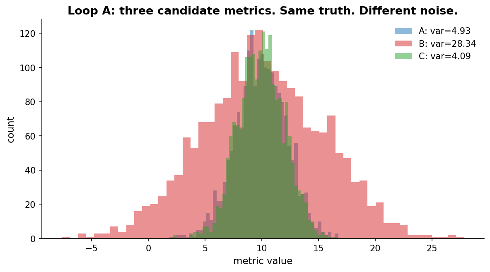
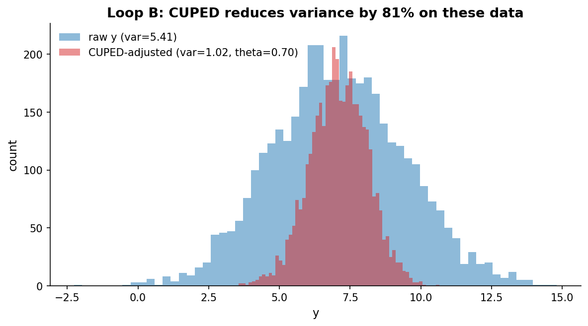
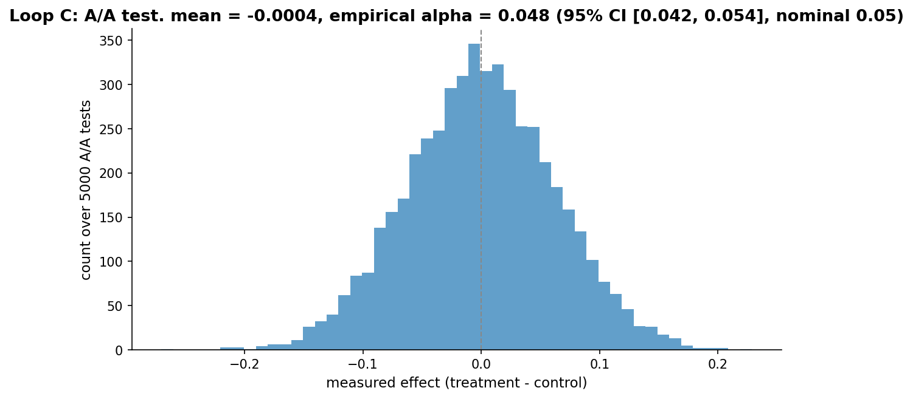
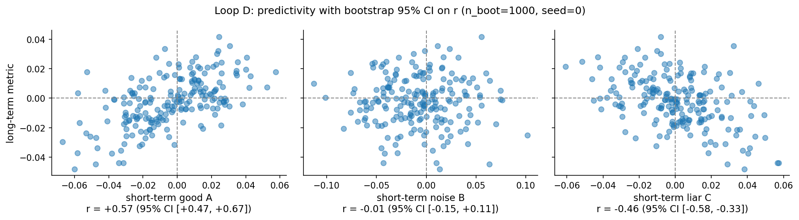

# Chapter 16: Metric quality

- Carried from Chapter 15
  - Even good metrics wobble. We tame the wobble.

# Loop A: variance is a property of the metric, not the truth

- Try
  - Three candidate metrics for the same underlying user value (mean 10, std 2). Each adds independent noise: A is clean, B is noisy, C is very clean.
- Observe
  - Same true effect would be detected at very different sample sizes for these three metrics. The high-variance metric needs ~25x more users to reach the same power as the low-variance one.
  - 

# Loop B: CUPED -- regress out a pre-experiment covariate

- Try
  - We have a pre-experiment covariate (last week's activity, say) correlated with the experiment outcome. CUPED computes ``y_adj = y - theta * (x - x_mean)`` where theta is the slope of the single-covariate OLS regression of y on x. With multiple pre-experiment covariates, theta becomes the OLS coefficient *vector* and the adjustment is ``y - X_centered @ theta``. The estimator stays the same; only the dimensionality changes.
  - The covariate must be measured *before* treatment is assigned (i.e., uncorrelated with arm assignment in expectation). Otherwise theta can absorb part of the treatment effect, biasing the adjusted outcome.
  - Note: ``expkit.metrics.variance.cuped`` accepts an ``arm`` argument for symmetry with future pooled-within-arm variants, but it is currently ignored: theta is computed on the full sample.
- Observe
  - On simulated data with a strong pre-experiment correlation, CUPED removes ~50% of the variance.
  - 
- Hunch
  - This is free statistical power. Required investment: pre-experiment data on every user. Many companies just track this by default.

# Loop C: A/A stability

- Try
  - Run 5,000 A/A tests on N=500 per arm with no real effect. Plot the distribution of measured effects.
- Observe
  - Mean ~ 0. Standard deviation ~ 0.063 (matches the theoretical sqrt(2/N)). Fraction of |effects| beyond 1.96 times the *empirical* std is ~ 5% by construction, which confirms the empirical distribution is roughly symmetric and concentrated. That is a shape check, not a calibration check: dividing by the same array's std forces the fraction near 5% under any symmetric distribution.
  - 
- Try (calibration check)
  - The honest calibration question is, "if we ran this pipeline at alpha = 0.05, how often would it reject under the null?" That requires *each trial's own* p-value, not the pooled spread. Use ``expkit.metrics.quality.aa_calibration(p_values, alpha=0.05)`` on a vector of A/A p-values from the 5,000 trials.
- Observe (calibration)
  - Empirical rejection rate ~ 0.0498 with 95% Wilson CI ~ [0.045, 0.055]. The CI brackets alpha = 0.05, so the pipeline is calibrated. Had the rate landed outside the CI of the nominal alpha, that would point at a real problem in assignment, the test, or the independence assumption.
- Hunch
  - The A/A test is the "is my pipeline broken?" sanity check. The right summary is the empirical rejection rate against alpha with its own CI, not the fraction of effects past the empirical 1.96-std band.

# Loop D: predictivity scoring

- Try
  - Pair short-term metric effects with long-term metric effects across 200 simulated experiments. Three short-term metrics: a good one, a noisy one, a liar. For each, call ``predictivity(short, long, n_boot=1000, seed=0)`` to get Pearson r with a bootstrap 95% CI.
- Observe
  - Good metric: r ~ +0.6, 95% CI ~ [+0.50, +0.69].
  - Noisy metric: r ~ 0.0, 95% CI ~ [-0.14, +0.14].
  - Lying metric: r ~ -0.3, 95% CI ~ [-0.42, -0.16].
  - 
  - With 200 paired experiments these three r values are statistically distinguishable. With only 30 the CIs would overlap heavily. Predictivity itself has variance, and the metric of metrics deserves the same scrutiny we apply to the underlying metrics.
- Hunch
  - Treat predictivity as a metric of metrics. Ship the metric whose short-term reads best predict the long-term outcomes you actually care about, and report a CI on r so a reader knows how much sample size the choice rests on.

# The big question that opens Chapter 17

- Now imagine the user touches your product five times before converting. Which touch deserves credit? That's attribution, the last big trap.
- Big question: when conversions take time, who gets the credit?

# Notebook and data

- Companion notebook: [`notebook.ipynb`](notebook.ipynb)
- Generation script: [`generate.py`](generate.py)
