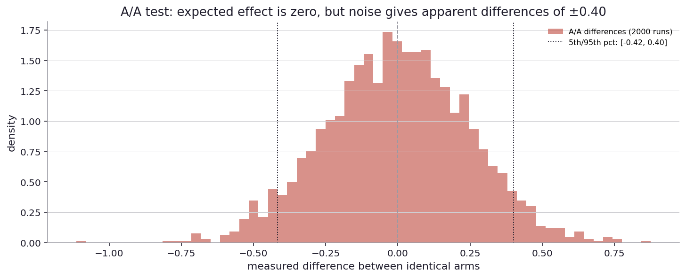

# How do I make my tests more sensitive without more data?

I left the last chapter with a question about reducing noise in A/B tests without simply running more users. The math of detection (Chapter 3) said that to halve the smallest detectable effect, I needed to quadruple the sample size. That is the scaling law for the simplest version of the problem. But there is a class of techniques that beat that scaling law by being smarter about what variation I am subtracting.

Real-world stage first.

Microsoft's experimentation team published in 2013 a technique called CUPED (Controlled-experiment Using Pre-Experiment Data) that reduced the variance of their A/B tests by 30 to 50 percent without adding any users. The trick was to use each user's pre-experiment behavior as a control. If I know a user converted at 8 percent in the month before the test, and during the test they converted at 9 percent, the 1-percentage-point delta is what is informative. The 8-percent baseline is noise that I do not need to carry into the analysis.

Sports analytics has a related idea. To compare two basketball players' shooting percentages, I can compute the raw percentages or I can adjust for the difficulty of shots taken. A player who takes only easy shots will have a higher raw percentage. Adjusting for shot difficulty (using a model trained on historical data) gives a "true skill" estimate that is much less noisy than raw percentage.

Clinical trials have used "stratified randomization" for decades. If I know that age is a strong predictor of the outcome, I randomize within age strata so each arm has the same age distribution. This eliminates age as a source of noise in the comparison.

In each of these places, the trick is the same: subtract out variation that does not need to be there. The noise reduction is a free lunch in the sense that no new data is collected, but a better-structured analysis gives a more sensitive answer.

Back to the simulator.

Imagine I am running an A/B test on revenue per user. Each user has a baseline revenue level (some are big spenders, some are small, this varies enormously across users). The treatment shifts every user's revenue by some small amount. The test compares mean revenue in treatment arm to mean revenue in control arm.

Most of the variance in user-level revenue is between-user, not within-user. A single big spender contributes more variance to the comparison than ten small spenders contribute. With enough users, the per-user variance averages out and the effect becomes detectable. But the convergence is slow.

The CUPED idea is to use the pre-experiment revenue of each user as a covariate. For each user, compute the difference between their during-experiment revenue and their pre-experiment revenue. Compare these differences between arms instead of raw revenues.

The math says: if user-level revenue is highly correlated across time (which it usually is), the variance of the differences is much smaller than the variance of the raw values. The correlation determines the variance reduction. Empirically in big tech A/B tests, correlations of 0.5 to 0.7 are common, giving variance reductions of 25 to 50 percent.

There is one sharp rule to keep the trick honest. The covariate has to be measured before treatment is assigned. If I use a covariate that was itself affected by the treatment, the adjustment can absorb part of the effect I am trying to measure and the comparison becomes biased. Pre-experiment revenue is safe because the experiment had not started yet. Mid-experiment engagement is not safe, even if it looks tempting and predictive.

A 25 percent variance reduction is equivalent to running a 33 percent larger experiment. A 50 percent reduction is equivalent to doubling the sample. In a context where each test is constrained by available traffic, the savings are significant.

The technique generalizes. Anything that predicts the user-level outcome and is measured before the experiment can be used as a covariate. Pre-experiment revenue, demographics, prior engagement level, account tenure, geo. The more covariates that explain the outcome variance, the more the comparison's variance shrinks. Modern variants include stratification, regression adjustment, and machine-learning-based residual prediction.

A different angle on metric quality is stability. Some metrics are intrinsically noisier than others. Conversion rate (binary outcome on a fixed denominator) has a known variance. Revenue per user (continuous, often skewed) has variance that depends on the distribution. Highly skewed metrics can have variance that grows with sample size in ways that simple formulas miss. the bootstrap is the safer tool for these.

A practical metric-quality check: run the same A/B test with two arms drawn from the same population (an A/A test). The expected effect is zero, with noise determined by the metric's variance. If the noise is too high to make any A/B test useful at the available sample size, the metric is not appropriate for the test. Some metrics fail A/A tests routinely (because of selection effects, time-of-day variation, or other non-random structure), and trying to run an A/B test on them is hopeless until the noise is understood.

Mature programs run A/A tests as part of their experimentation pipeline. They check that the metric system reports zero effects when there is no real effect, and they characterize the noise distribution. A metric that fails its A/A tests is not a metric I can use, no matter how much I want to.

There are two different questions buried inside an A/A check, and it is easy to answer the easier one and think I answered the harder one. The easier question is, "does the measured-effect distribution look roughly symmetric around zero?" I can eyeball a histogram and answer that in seconds. The harder question is, "if I run this pipeline at a five percent significance level, does it actually reject about five percent of the time under the null?" That second question is the calibration check, and it demands each trial's own p-value, not just the pooled spread. If I pool effects and then ask what fraction falls beyond about two pooled standard deviations, I will get something near five percent by construction, no matter how the pipeline is built. Useful shape check. Not a calibration check.

So the real A/A report is the empirical rejection rate with a confidence interval around it. If five thousand A/A trials produce roughly two hundred fifty rejections, the empirical rate is about 0.050 with a 95 percent interval of roughly [0.045, 0.055]. That interval brackets the nominal alpha of 0.05, so the pipeline is calibrated. If it did not bracket alpha, I would have a real problem with assignment, the test, or the independence assumption, and I would not trust any A/B result coming out of the same pipeline until I understood why.

There is a third dimension of metric quality: predictivity, which I touched on in the metric-tree chapter. A metric is high-quality if it is also high-validity (predicting the long-term thing I care about). A metric can be low-noise and irrelevant, or high-noise and important. The combination of low noise and high validity is what makes a metric useful for decision-making.

The way to actually measure predictivity is to line up many past experiments. For each experiment I have a short-term metric effect and a long-term metric effect. The correlation between the two columns is the predictivity score of that short-term metric. At a backlog of two hundred paired experiments the three kinds of short-term metric come cleanly apart: a good proxy lands near r equals plus 0.6 with a 95 percent bootstrap interval of roughly [0.50, 0.69], a noisy proxy lands near zero with an interval of roughly [-0.14, 0.14], and a lying proxy (one that moves opposite the long-term outcome) lands near minus 0.3 with an interval of roughly [-0.42, -0.16]. At thirty paired experiments those three intervals would overlap heavily and I could not tell the good proxy from the noise. Predictivity itself has variance, and I need a reasonable number of past experiments before I can use it to pick a metric.

Why would a short-term proxy ever have negative predictivity? Because of Goodhart's law. When I turn a proxy into the target, the cheapest way to move the proxy is often not the way that also moves the outcome I care about. Clickbait lifts clicks and burns brand. Forced pop-ups lift engagement and bounce users. The proxy rises, the long-term outcome falls, and predictivity comes back negative. The structural fix is to weight short-term metrics by their measured predictivity instead of optimizing them directly.

Two lenses, same verdict, for the A/A check.

If I treat "did this trial reject?" as a coin with unknown rejection rate and put a weak Beta(1, 1) prior on the rate, I can update it with the five thousand A/A outcomes and read off a posterior. That is the Bayesian version of the same calibration check. The posterior mean for the rejection rate comes out to about 0.050 with a 95 percent credible interval of roughly [0.044, 0.056], and the posterior probability that the true rate is above 0.05 is near 0.49, right on the fence. Frequentist Wilson and Bayesian Beta-binomial agree here because the data is plentiful and the prior is weak. At fifty A/A trials instead of five thousand the two would still point the same direction but the Wilson CI would be wide and the posterior would still speak in calibrated belief. The agreement in this chapter is not automatic. It is a consequence of running enough trials.

Now look up from the simulator.

Microsoft's CUPED is now standard at most large tech companies running A/B tests at scale. The expected variance reduction is built into the test platform. the analyst does not have to think about it. The cost is the engineering complexity of pulling in pre-experiment data for every user.

Stratified randomization in clinical trials is standard for variables strongly associated with the outcome. Phase 3 cancer trials almost always stratify on prior treatment history, performance status, and disease stage. The arms are balanced on these variables not because randomization fails, but because the analysis is more sensitive when they are.

A baseball analytics team adjusts for park effects, opponent quality, and pitcher hand. Raw batting averages overstate good hitters in hitter-friendly parks and understate good hitters in pitcher-friendly parks. Adjusted statistics correct for these and are noticeably more predictive of the next season's performance.

In each of these places, the technique is to use information that is available but unused, structuring the analysis so that the comparison is between like-and-like rather than between everything-and-everything. The noise that would have come from the unmodeled variation is now modeled away.

There is a forward question that opens the next chapter. Most of the techniques in this chapter are about reducing noise around an effect I am trying to measure. But for many real applications, I do not just want to measure an effect. I want to attribute it. A user converted. which marketing touch caused it? A patient recovered. which treatment was responsible? A search result was clicked. which feature of the result drove the click? Attribution is a different kind of question.

When something good happens, who gets the credit?
