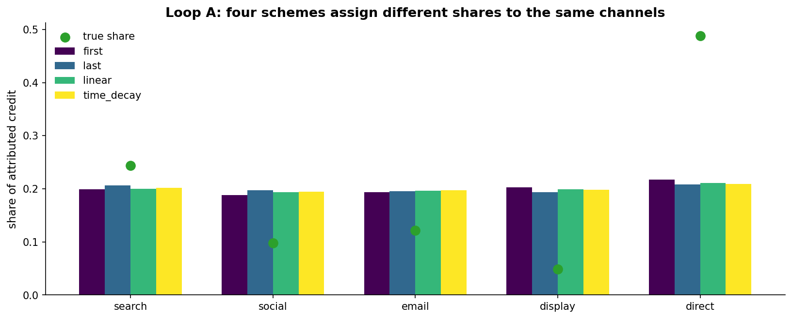
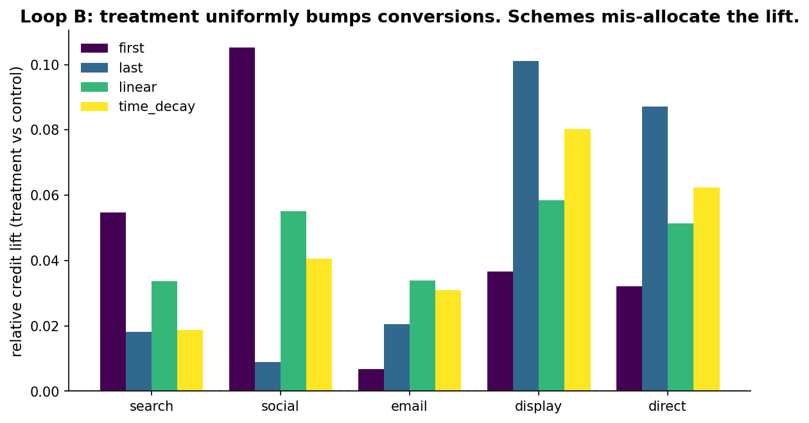
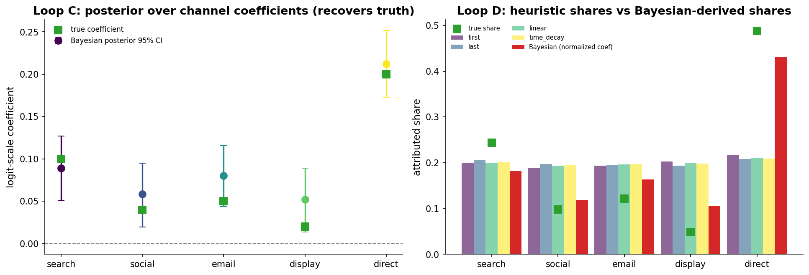

# Chapter 17: Attribution

- Carried from Chapter 16
  - Conversions take time. Users touch your product through several channels. Whose channel deserves the credit?

# Loop A: four schemes, same data

- Try
  - Simulate 20,000 user journeys with up to 5 channel touches each (search, social, email, display, direct). True channel coefficients: direct (0.20) is most influential, search (0.10) second, then email (0.05), social (0.04), display (0.02). Conversion is logistic in the sum.
  - Apply four attribution schemes -- first-touch, last-touch, linear, time-decay -- and see how each allocates credit.
- Observe
  - First-touch overweights "discovery" channels (search, social) because journeys often start there.
  - Last-touch overweights "closing" channels (direct) because journeys often end there.
  - Linear divides credit evenly. Tends to look closest to the true share but blurs important differences.
  - Time-decay leans toward last-touch but softer.
  - 
- Hunch
  - There is no "correct" scheme. Each is an answer to a slightly different question. The differences between them are large enough to flip channel-investment decisions.

# Loop B: treatment that uniformly bumps conversions

- Try
  - Simulate a treatment that boosts conversion probability by a fixed amount, regardless of which channels were touched. Apply each scheme. Look at the *change* in credit per channel.
- Observe
  - The truth: every channel should look like it gained the same share.
  - First-touch: assigns the lift mostly to whichever channel users started on. Channels that tend to start journeys gain disproportionate credit.
  - Last-touch: assigns the lift to the closer. Direct gains more credit than it deserves.
  - Linear and time-decay: closer to the truth, but still distort.
  - 
- Hunch
  - Even when the truth is "everything got better equally", schemes mis-allocate. This is why attribution is its own subject (and an entire industry of consultants).

# Two-lens commentary

- Frequentist: attribution is a deterministic accounting choice. There is no statistical answer. The only test is "does my model recover the true coefficients on simulated data?".
- Bayesian: model the conversion likelihood explicitly with channel coefficients, fit posterior over coefficients, and inspect. PyMC handles this directly. The posterior over coefficients is the right object to budget against.

# Loop C: the Bayesian model

- Try
  - Logistic regression in PyMC: P(convert) = sigmoid(intercept + sum_c coef[c] * count[c]) where count[c] is the number of times user touched channel c. Weakly informative priors on the coefficients (Normal(0, 0.5) on the logit scale). Sample with NUTS over the 20,000 simulated journeys.
  - The model spec, in the Chapter 6 idiom:
    - ```
    - with pm.Model():
    - intercept = pm.Normal("intercept", 0, 2)
    - coef = pm.Normal("coef", 0, 0.5, shape=K)
    - p = pm.math.invlogit(intercept + pm.math.dot(counts, coef))
    - pm.Bernoulli("y", p=p, observed=converted)
    - idata = pm.sample(draws=1000, tune=1000, chains=4)
    - ```
  - Because we generated journeys from a logistic-additive model and fit a logistic-additive model, this is a recovery check, not a test of the method against real journeys. Real customer journeys violate the assumption that channels combine additively in their touch counts. Sequence matters in practice, channels can interact, and the linear-additive form discards both.
- Observe (coefficient recovery)
  - The posterior 95% credible intervals on the channel coefficients bracket the true values for every channel. direct's coefficient sits highest (true 0.20), search second (0.10), email (0.05), social (0.04), display (0.02). The model recovers the underlying causal structure.
  - At n = 20,000 the 95% CI half-width is roughly 0.040 for the strongest channel (direct) and around 0.036 to 0.038 for the weaker channels (email, social, display). The two lowest-coefficient channels (display at true 0.02, social at true 0.04) sit with posterior means at 0.052 and 0.058 and HDIs that exclude zero, so the recovery is not borderline. Bulk ESS is roughly 2,500 to 3,300 across coefficients with R-hat at 1.00, so the diagnostic is clean.

# Loop D: scheme comparison via posterior

- Observe (heuristics vs posterior shares)
  - Take the posterior coefficient means, clip to non-negative, normalize, and treat as a relative-weight comparison. Compare to first-touch, last-touch, linear, and time-decay shares.
  - The Bayesian relative weights match the *true* relative weights closely. The four heuristics each diverge: first-touch overweights first-channel-of-journey distributions (search and social), last-touch overweights direct (the closer), linear blurs everything toward equal, time-decay sits between linear and last-touch.
  - Footnote on scales: heuristic shares partition observed credit on the probability scale, while the Bayesian column normalises non-negative logit-scale coefficients. The two are comparable in spirit as relative weights, but the chart should be read as a comparison of relative weights rather than identically scaled probabilities.
  - 
- Hunch
  - When you have data and a willingness to write down a likelihood, the Bayesian model gives you the *causal* attribution under that likelihood. The heuristics give you accounting choices. Different objects.
  - Caveat on order-blindness: touch-count covariates collapse the journey to a bag of channels. First-touch and last-touch heuristics are answering a question the Bayesian model literally cannot see, since the design matrix discards order. If the analyst believes first-touch or last-touch positions carry information, add binary first_is_X and last_is_X columns to the design matrix. The model can then estimate a position effect on top of the count effect. This is a forward direction rather than a fix applied here.
  - Caveat on multicollinearity: when channels co-occur strongly in journeys (for example email and direct in lifecycle messaging), individual coefficient posteriors widen and may overlap zero even though the joint effect is large. The Bayesian model surfaces this in the posterior. Heuristic schemes give a single number per channel and silently split credit anyway.
  - Caveat on specification: the Bayesian model is only as good as its specification. We assumed channels combine linearly on the logit scale and that touch counts are the right covariate. If the true mechanism is "the SEQUENCE matters" or "channels interact", the linear model is wrong. The same critique applies to all attribution. The Bayesian version just makes the assumptions explicit.

# The big question that opens Chapter 18

- We have spent 17 chapters teaching both lenses on inference questions. Attribution had no frequentist inference at all, only deterministic accounting versus a Bayesian likelihood. The capstone question goes the other way: across the inference chapters, where the two lenses both apply, would two teams have actually shipped different products?
- Big question: across the 17 chapters of inference work, would a frequentist team and a Bayesian team have reached different shipping decisions, and where, and how often?

# Notebook and data

- Companion notebook: [`notebook.ipynb`](notebook.ipynb)
- Generation script: [`generate.py`](generate.py)
