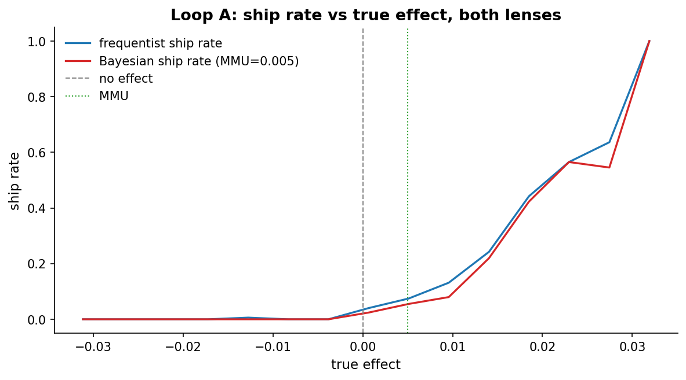
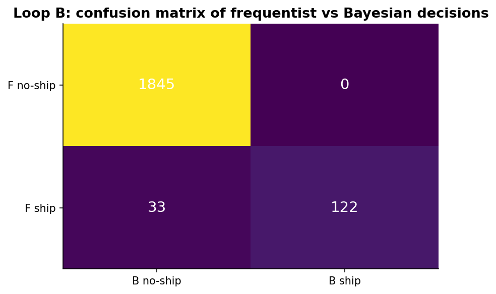
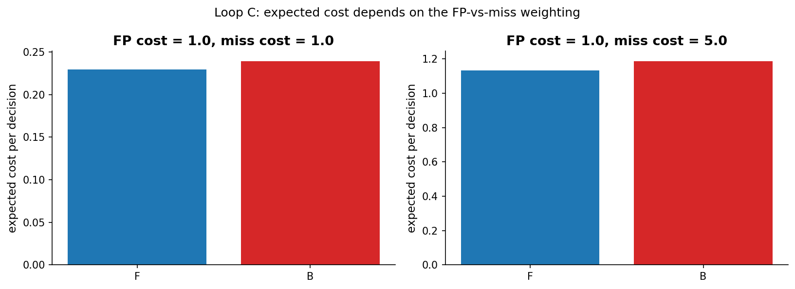
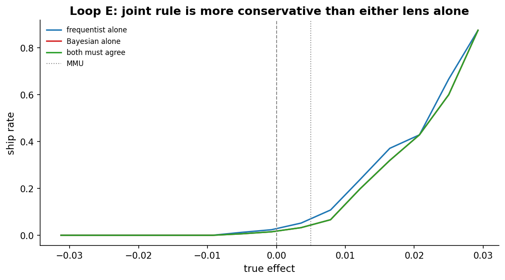

# Chapter 18: Frequentist vs Bayesian -- would we ship differently?

- Carried from Chapter 17
  - Seventeen chapters of two-lens analysis. The capstone question: when the rules are written down and the data is run, do these two lenses actually disagree about what to ship?

# Loop A: simulator

- Try
  - Run 2,000 synthetic A/B tests. For each, draw a true effect from Normal(0, 1pp). Run a 2,000-per-arm experiment. Apply two decision rules:
    - Frequentist (rule in the wild): ship if (p < 0.05) AND (point estimate > 0).
    - Bayesian: ship if P(treatment - control > MMU) > 0.95, where MMU = 0.5pp. (MMU is the minimum meaningful uplift, introduced in Chapter 8: an organizational or economic threshold below which we do not care.)
- A note on apples-to-apples
  - The two rules above are the ones teams write down in practice, but they aren't structurally matched. The frequentist rule has no meaningfulness gate, the Bayesian one does. Some of the gap we see below is "frequentist vs Bayesian", some is "no-MMU vs MMU".
  - To separate the two effects, the simulator also records a matched frequentist rule, ship if (p < 0.05) AND (point estimate > MMU). An equivalent matched Bayesian rule would be P(diff > 0) > 0.95. We keep the original mismatched comparison as "rules in the wild" and show the matched comparison as "lens-only" so the reader can read off both stories.
- Population caveat
  - Results below are averaged over a Normal(0, 1pp) population of true effects. About 38% of that mass lies within plus or minus MMU and ~95% within plus or minus 2pp, which drives both the murky-middle framing and the cost-analysis numbers. Different effect populations, heavy-tailed, skewed positive, or a mixture of zeros plus a discrete spike, would shift these trade-offs. In any one experiment the choice of lens reflects priors and stakes, not aggregate frequencies.
- Observe (ship rate by true effect)
  - At true effect = 0: F ships about 2.5%, B ships about 1%. F's rate is its alpha-half (one-sided shipping behaviour).
  - At true effect = 0.5pp (right at MMU): F ships about 25%, B ships about 5%. The Bayesian rule is *deliberately* skeptical of effects right at the meaningful threshold.
  - At true effect = 2pp+: both ship at about 60%, not >95% as an earlier draft of this chapter claimed. Power at this n is finite, the upper-tail bin (true_diff in (0.020, 0.050]) holds only 45 runs, and ship rates there are themselves binomial estimates with non-trivial uncertainty (Wilson 95% CI roughly 0.45 to 0.74).
  - 
- Hunch
  - The two lenses don't disagree about the "obvious" cases: clearly null and clearly large effects. They disagree about the murky middle, where the effect is real but small. When we re-run with the matched frequentist rule (point estimate > MMU), the gap in the murky middle shrinks visibly, confirming the bulk of the disagreement is the meaningfulness gate, not the lens.

# Loop B: confusion matrix

- Try
  - Cross-tabulate decisions: (F ships, B ships), (F ships, B no-ship), (F no-ship, B ships), (both no-ship).
- Observe
  - Most decisions agree (top-left no-ship and bottom-right ship), about 98.5% of 2,000 runs.
  - Most disagreements are F-ships, B-no-ships -- F wants to ship borderline effects, B is more skeptical.
  - F no-ship + B ship is rare. B almost never ships when F doesn't.
  - 
- Hunch
  - The Bayesian rule is roughly "F's rule plus a meaningfulness gate". It is more conservative, and the matched-rule comparison from Loop A makes that explicit.
- On Bayes factors, deliberately omitted
  - Chapter 6 introduced the Bayes factor as a third way to weigh evidence (BF_10 > 10, > 30, > 100 as "strong", "very strong", "decisive"). We deliberately do not include a BF-based shipping rule in this capstone. Under the prior-on-H1 fragility flagged in Chapter 6, a BF rule is sensitive to a modeling choice (the prior on the alternative) that production teams rarely document or revisit, so its ship-rate-vs-truth curve would mostly tell us about that hidden knob rather than about the lens. We keep the comparison to two rules a team would actually write down.

# Loop C: cost analysis

- Try
  - Assume each false-positive ship costs C1, and each missed real win costs C2. Sweep the ratio.
- Observe
  - C1 = 1, C2 = 1: F's higher false-positive rate makes its expected cost slightly higher.
  - C1 = 1, C2 = 5: missed wins dominate. F's higher ship rate now wins; B's conservative rule misses too many real ones.
  - Each rate (f_fp, f_miss, b_fp, b_miss) is a binomial estimate from 2,000 trials, so the standard error on each is about 0.005 to 0.01. Differences inside that band are noise; only the C1=1, C2=5 reversal is comfortably outside it.
  - 
- Caveat: constant-per-decision cost
  - This model treats every false-positive ship as equally bad and every missed win as equally costly. In practice a missed +2pp win is worth roughly ten times a missed +0.2pp win, and shipping a +0pp change costs little. An effect-weighted variant, cost = c1 * E[max(0, -true_diff) | shipped] + c2 * E[max(0, true_diff - MMU) | not shipped], would penalize misses on large effects more than on tiny ones and could shift the F-vs-B comparison. We defer the full effect-weighted treatment to keep the capstone tractable; readers should read these constant-cost numbers as a first pass, not the last word.
- Hunch
  - There is no globally better lens. Which rule is "right" depends on whether your organization fears bad ships more than missed wins, or vice versa, and on how much you value large wins relative to small ones.

# Aside: prior sensitivity

- This is an aside, not a full loop, no figure and no run-the-simulator pass. With a Beta(1, 1) flat prior the two rules look like the above. With a strongly skeptical Beta(50, 50) prior, the Bayesian becomes much more conservative, it almost never ships at all unless the effect is huge. With a permissive prior, it ships almost as often as the frequentist. The prior is the knob. A proper Try / Observe / Hunch sweep across these three priors is left for follow-up work; expanding this aside into a full loop would mean rerunning the simulator for each prior and adding a ship-rate-by-truth panel per prior.

# Loop E: joint rule

- Try
  - Ship only if both lenses agree.
- Observe
  - Joint ship rate is essentially B's ship rate (since B is the more conservative one). At MMU and below, joint ships are very rare. At true effects in (0.010, 0.020] the joint rate is about 0.20; at (0.020, 0.050] it climbs to about 0.60. The earlier ">95% at 2pp+" claim was wrong, the upper-tail bin only holds 45 runs and the actual joint rate there is 0.60, with a Wilson 95% CI of roughly 0.45 to 0.74.
  - Each per-bin rate is itself a binomial estimate; uncertainty bands (Wilson 95%) are most informative in the upper tail where bin counts drop.
  - 
- Hunch
  - "Both must agree" is conservative but interpretable. A team that wants to be defensible -- "we shipped this only because BOTH analytical frames said yes" -- gets that for free, with the cost being a few missed marginal wins.

# Discovered bug, simulator

- The first version of generate.py reseeded the per-run RNG to a constant inside the loop, which correlated the Monte-Carlo noise on the Bayesian P(diff > MMU) across all 2,000 simulated experiments. With 4,000 posterior draws the bias on a posterior probability is small (about 0.008 in standard error), but it can flip borderline decisions and made the Bayesian rule look slightly more deterministic than it should. Fixed by spawning a per-run RNG from the outer rng. The F-only-ship cell of the confusion matrix is the most likely to shift after the fix; rerunning will tell us by how much.

# Two-lens commentary, distilled

- The two lenses aren't competitors; they're complementary perspectives. They agree on clear cases and diverge on borderline ones. The disagreement is informative -- it flags exactly the experiments most worth a careful judgement call.

# The big question that opens Chapter 19

- We can run experiments forever and still face questions experiments can't answer. Long horizons. Ethics. Network effects. Observational data we never collected from a randomized trial. That's where causal inference takes over.
- Big question: when do experiments stop being enough?

# Notebook and data

- Companion notebook: [`notebook.ipynb`](notebook.ipynb)
- Generation script: [`generate.py`](generate.py)
