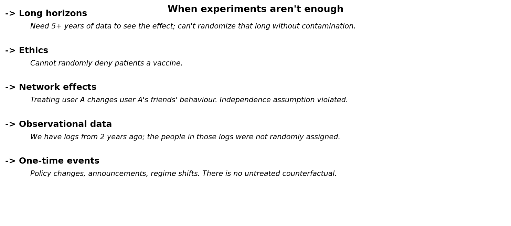
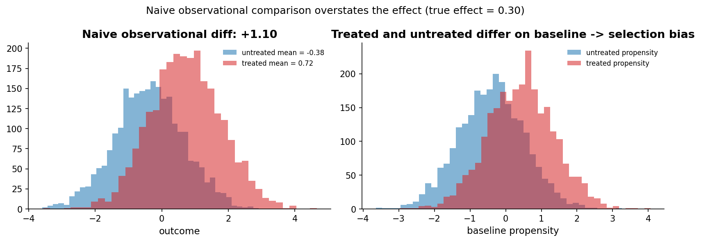

# Chapter 19: When experiments aren't enough

- Carried from Chapter 18
  - Eighteen chapters of experiments. We can still hit walls. The walls are where experimentation hands the baton to causal inference.

# Loop A: when experiments don't work

- Long horizons. We can't randomize over 5 years without losing too many users to contamination, attrition, or environment changes. Yet some questions only make sense at 5-year horizons (career outcomes, public-health interventions).
- Ethics. We can't randomly deny vaccinations, education, or basic income to a control arm.
- Network effects. Treating user A changes user A's friends' behaviour. The "independence" assumption built into our z-tests, t-tests, and Bayesian models is violated. We need cluster randomization, partial-interference designs, or graph-based methods.
- Observational data. We have years of historical logs. The people in those logs were not randomly assigned. There is no clean control arm.
- One-time events. A regime change, a competitor pivot, a global pandemic. There is no untreated counterfactual.
- 

# Loop B: the trap of naive observational comparison

- Try
  - Simulate 5,000 users with a latent "propensity" attribute. Treatment is more likely when propensity is high (sigmoid in propensity). True treatment effect = +0.30. Outcome = propensity + 0.30 * treated + noise.
- Observe
  - Naive comparison (treated mean minus untreated mean): about +1.0. Way bigger than the true effect of 0.30.
  - Why: treated users had higher propensity; they would have had higher outcomes anyway. The naive comparison conflates the treatment effect with the selection effect.
  - 
- Hunch
  - This is the central problem causal inference solves. Even when randomization is impossible, we have tools (potential outcomes, instrumental variables, regression discontinuity, difference-in-differences, propensity scoring, synthetic controls) for unbiased effect estimation under explicit assumptions.

# Loop C: a brief vocabulary

- Potential outcomes (Rubin causal model). Each unit has Y(0) and Y(1). We see one or the other, never both.
- Average treatment effect (ATE): E[Y(1) - Y(0)] over the population.
- Selection bias: E[Y(0) | treated] - E[Y(0) | untreated]. The "would have been higher anyway" effect.
- Identification: whether the data + assumptions are enough to recover the causal estimand.

# Handoff

- The serious treatment lives in a sibling repo. It uses the Mixtape Sessions framework (Scott Cunningham), runs labs (potential outcomes, perfect doctor vs random assignment, the Thornton HIV experiment), and walks through the methods at proper depth.
- Repo: [/home/k1/public/statistics/causal_inference](/home/k1/public/statistics/causal_inference)

# Closing thought

- Statistical machinery in this repo: enough to design, run, and interpret experiments end-to-end. Both lenses, side by side.
- Statistical machinery in the causal-inference repo: enough to ask "what would have happened?" without running an experiment.
- Together they cover most of the analytical problems an organization will face. Knowing when to reach for which is the actual skill.

# Notebook and data

- Companion notebook: [`notebook.ipynb`](notebook.ipynb)
- Generation script: [`generate.py`](generate.py)
